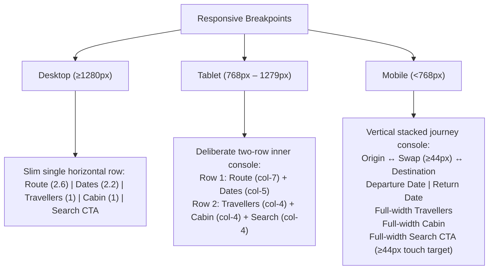

# Booking Search Console Redesign

## 1. Overview & Reference Provenance

This document specifies the responsive flight-search console architecture implemented on design branch `design/booking-search-console-redesign-02`.

### 1.1 Owner Design References (Design-Only Status)
The redesign reconstructs the hierarchy, layout, and composition of three visual design references provided by the project owner:
- **Desktop (PC)**: `images_assets_to_be_used_in_website_after_proper_placement_and_compression/Booking Card/PC Version of Booking Card.png`
- **Tablet**: `images_assets_to_be_used_in_website_after_proper_placement_and_compression/Booking Card/Tablet View Version of Booking Card.png`
- **Mobile**: `images_assets_to_be_used_in_website_after_proper_placement_and_compression/Booking Card/Mobile Vertical Version of Booking Card.png`

**Important Asset Invariant**: In accordance with the project contract, these three PNG files are **design references only**. They are never imported into source code, converted, staged, committed, or shipped.

### 1.2 Production Asset Reuse
The outer journey shell reuses the single existing canonical production asset:
- `src/assets/media/decorative/cards/ticket-world-map.webp`

No new raster images, duplicate WebPs, or font assets were introduced.

---

## 2. Responsive 3-Tier Hierarchy

The console adapts across viewport breakpoints to preserve high utility and clarity without horizontal overflow or tiny typography.



### 2.1 Desktop Layout (≥1280px / `xl`)
- Renders as a **slim, single horizontal instrument console**.
- Proportions:
  - **Route group** (`flex-[2.6]`): Dominant visual anchor with prominent IATA codes, cities, airport names, and centralized interactive Swap button (`size-9` on desktop).
  - **Dates** (`flex-[2.2]`): Paired departure and return date triggers with calendar icon, contiguous non-breaking short date (`dayMonth` with `\u00A0` and `whitespace-nowrap`), and quiet weekday underneath.
  - **Travellers** (`flex-1`): Dedicated trigger displaying localized passenger count and breakdown.
  - **Cabin** (`flex-1`): Dedicated trigger displaying selected cabin class with chevron.
  - **Search CTA** (`shrink-0`): Deep brand-olive button with search icon, localized label, directional arrow, and full-height alignment.

### 2.2 Tablet Layout (768px – 1279px / `md` to `lg`)
- Solves horizontal crowding on intermediate viewports (iPad, tablets, small laptops) by rendering a **deliberate two-row grid**:
  - **Row 1**: Route zone (`col-span-7`) alongside Dates zone (`col-span-5`).
  - **Row 2**: Travellers zone (`col-span-4`), Cabin zone (`col-span-4`), and Search CTA (`col-span-4`).
- Avoids the squished, unreadable text common in generic responsive conversions.

### 2.3 Mobile Layout (<768px down to 320px)
- Vertically stacked journey console framed within the red ticket shell:
  - Connected Origin ↔ Swap ↔ Destination row with stacked IATA code, city name, and airport name within triggers to guarantee zero horizontal clipping at 320px.
  - Central Swap button with a comfortable minimum $44\times 44\text{px}$ touch target (`size-11 md:size-8 xl:size-9` with `min-h-[44px] min-w-[44px]`) and inner $16\times 16\text{px}$ icon, ensuring $\ge 44\times 44\text{px}$ throughout 320–767px mobile widths.
  - Trip-type toggle buttons with minimum $44\times 44\text{px}$ touch targets (`min-h-[44px] min-w-[44px] md:min-h-0 md:min-w-0`) across 320–767px mobile widths, returning to compact height on desktop/tablet.
  - Paired departure and return dates side-by-side with non-breaking date unit and quiet weekday underneath.
  - Full-width Travellers row.
  - Full-width Cabin row.
  - Full-width Search CTA with minimum 44px touch target.
- Verified on viewports: 390px (modern smartphones), 360px (compact Android), and 320px (minimum supported width) with 0px horizontal document or container overflow, and confirmed bounding-box containment of codes and cities.

---

## 3. Component Architecture & Split Controls

The redesigned console decomposes flight search into clean, single-responsibility components:

| Component | File Path | Role |
| :--- | :--- | :--- |
| `FlightSearchForm` | `src/components/flight-search-form.tsx` | Main orchestrator, form submission, layout grid, context awareness, validation banner |
| `AirportCombobox` | `src/components/airport-combobox.tsx` | Route selector supporting `variant="console"` with prominent IATA code, city, airport name |
| `AirlineDatePicker` | `src/components/airline-date-picker.tsx` | Date picker supporting `variant="console"`, short date + weekday formatting, one-way removal |
| `TravellersPicker` | `src/components/travellers-picker.tsx` | Standalone passenger stepper (Adults 1-9, Children 0-8, Infants 0-4, infants ≤ adults) |
| `CabinPicker` | `src/components/cabin-picker.tsx` | Standalone cabin class picker (Economy, Premium Economy, Business) |

### 3.1 Split Travellers & Cabin Controls
In previous versions, passenger count and cabin class shared a single composite dropdown trigger. The redesign splits them into two independent, accessible controls:
1. **`TravellersPicker` (`#search-travellers`)**:
   - Displays label, total passenger count, and concise breakdown (e.g. `1 passenger · 1 adults · 0 children · 0 infants`).
   - Opens a desktop Popover or mobile bottom sheet Dialog containing stepper controls.
   - Preserves business rules: infants cannot exceed adults; decrementing adults automatically clamps infants.
2. **`CabinPicker` (`#search-cabin`)**:
   - Displays label and active cabin name (Economy, Premium Economy, Business).
   - Opens a desktop Popover or mobile bottom sheet Dialog with semantic radio options.

### 3.2 One-Way Removal & Round-Trip Restoration
- When the user selects **One way** via the trip-type toggle:
  - The return date trigger (`#search-return`) is removed from the active layout with **no dead field, placeholder gap, or awkward whitespace**.
  - The departure date expands to fill the available date zone cleanly.
- When the user switches back to **Round trip**:
  - The return date trigger is restored immediately with its previously remembered draft date.

---

## 4. Context API & Route Sharing

The redesigned console is shared across all flight search touchpoints via the `FlightSearchFormProps` interface:

```typescript
export type FlightSearchConsoleContext = "home" | "standard";

export interface FlightSearchFormProps {
  /** @deprecated use context="home" instead. */
  variant?: "panel" | "inline";
  /** @deprecated use context="home" instead. */
  treatment?: "ticket-map";
  /** Explicit console context: "home" | "standard" (default). */
  context?: FlightSearchConsoleContext;
  initial?: Partial<SearchCriteria>;
}
```

The three call sites across the application integrate the console cleanly:
- **Home Route (`src/routes/{-$locale}.index.tsx`)**: Calls `<FlightSearchForm variant="panel" treatment="ticket-map" />` (retained deprecated props resolve internally to `context="home"`). Renders `data-flight-search-console="home"` and the owner-specified ticket marker `data-decorative-asset="home-flight-search-ticket"`.
- **Booking Wizard (`src/routes/{-$locale}.book.tsx`)**: Calls `<FlightSearchForm />` (defaults to `context="standard"`). Renders the exact same redesigned family without home-specific markers (`data-flight-search-console="standard"`).
- **Destination Detail (`src/routes/{-$locale}.destinations.$code.tsx`)**: Calls `<FlightSearchForm initial={{ origin: GZA.code, destination: destination.code }} />` (defaults to `context="standard"` with authoritative route prefill `GZA → destination` that takes precedence over any stored booking draft).

---

## 5. Bilingual Parity & Directionality (RTL / LTR)

Full parity between English (`/`) and Arabic (`/ar`) is maintained:
1. **No Image Mirroring**: The decorative background world map asset (`ticket-world-map.webp`) is **never mirrored in RTL** (`scaleX(-1)` is strictly forbidden so geographical landmasses remain accurate).
2. **Technical LTR Isolation**: Technical identifiers remain strictly LTR in both locales:
   - IATA airport codes: rendered within `<span dir="ltr">` with tabular monospace styling (`GZA`, `AMM`)
   - Numeric dates: Western Latin digits (`0–9`) formatted via `ar-u-nu-latn`
   - Technical identifiers (flight numbers, booking references, dates, times) maintain LTR presentation
3. **Directional Wayfinding**:
   - Route swap button indicates direction with flight icons that adapt appropriately.
   - Search CTA button features an arrow pointing right (`ArrowRight`) in English (LTR) and left (`ArrowLeft`) in Arabic (RTL).
4. **Independent Localization**: No composite strings (e.g. no "From / من"). All copy is delivered cleanly through `useI18n()`.

---

## 6. Accessibility & Compliance

- **WCAG 2.2 AA Contrast**: High-contrast text on warm limestone surfaces (`--foreground` over `--card`).
- **Touch Targets**: All interactive elements maintain touch targets ≥44px on mobile viewports (<768px), including the central route Swap button (`size-11 md:size-8 xl:size-9`) and trip-type toggle buttons (`min-h-[44px] min-w-[44px] md:min-h-0 md:min-w-0`), verified across 320–767px.
- **Keyboard Navigation**:
  - Full tab order across trip type, origin combobox, swap button, destination combobox, departure/return dates, travellers, cabin, and search CTA.
  - Dropdowns and dialogs dismiss on `Escape` and restore focus to triggers.
- **Screen Reader Semantics**:
  - Trip types use semantic `<fieldset>` with `<legend>` and `aria-pressed` buttons.
  - Comboboxes, date pickers, and steppers have descriptive `aria-label` and `aria-expanded` attributes.
  - Form validation errors render within an accessible `role="alert"` live region.
