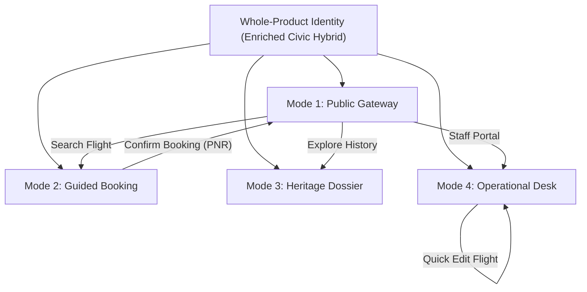
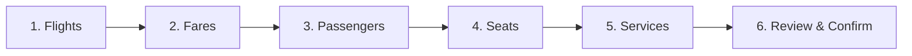
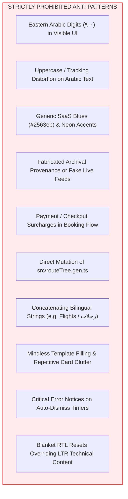

# Gaza International Airport & Palestinian Airlines — Unified Design System Contract

> **Document Status**: Accepted Whole-Product Design-Direction Contract — Stage 2<br>
> **Applicability**: Whole-product design direction for Public Gateway, Guided Booking, Heritage Dossier, and Station Operations<br>
> **Normative Scope**: Canonical design rules, visual tokens, bilingual invariants, component behaviors, form workflows, Arabic composition, and Phase 3B implementation contracts<br>
> **Source Baseline Commit**: `0912d7645127f64a2a2646ee11746a58c3e8de56`

---

## 1. Principles & Grounding

### 1.1 Selected Direction: The Enriched Civic Hybrid `[Selected Owner Direction]`
The foundational user experience architecture builds upon the eight Phase 3A owner directions recorded in the Phase 3A checkpoint and decision pack ([`PHASE_3A_OWNER_DECISION_PACK.md`](PHASE_3A_OWNER_DECISION_PACK.md)). The **Enriched Civic Hybrid** master design direction and its overarching Stage 2 quality requirements were supplied directly by the Product Owner in the subsequent Whole-Product Design-Direction Shaping instruction in this working session:
1. **Civic Limestone & Aeronautical Wayfinding Foundation**: Warm, tactile, Mediterranean limestone palette (`--sand`, `--sand-deep`) serving as an authentic civic gateway, paired with sharp, disciplined international aviation wayfinding.
2. **Operational Airfield Precision Where Useful**: High-density operational data tables, sticky pinned headers, inline single-click status and gate actions, contextual side-sheet inspection, and keyboard-driven command navigation (`Cmd+K` / `Ctrl+K`) embedded within administrative flight-control surfaces.
3. **Living Archival & Editorial Restraint in Heritage**: A documentary-grade, museum-standard dossier presentation for historical materials, employing neutral provenance schemas (`[CATALOG-ID-FIELD]` and `[PROVENANCE]`), warm parchment surfaces, and accessible focus-contained media lightboxes.

*Owner Authority & Design Contract Provenance*: The eight foundational UX decisions originated in the Phase 3A decision pack, whereas the master Enriched Civic Hybrid direction and core non-negotiable quality rules (civic limestone foundation, immediately available homepage flight search, guided booking flow, hybrid admin editing, neutral archival provenance schemas, Western Latin `0–9` digits across English and Arabic, and cursive Arabic ligature protection) were established by the Product Owner during Whole-Product Design-Direction Shaping. Specific component geometries, layout formulas, duration vector designs, sticky docket containers, catalog placeholder syntax, and typographic pairings represent proposed design contracts and illustrative study patterns rather than immutable owner mandates.

### 1.2 Authentic Heritage & Identity Grounding `[Product Truth & Archival Boundary]`
The product represents **Gaza International Airport (Yasser Arafat International Airport, IATA: GZA, ICAO: LVGZ)** and the national flag carrier **Palestinian Airlines (IATA: PS, ICAO: PNW)**.
- **Atmosphere**: Warm limestone, Mediterranean sunlight, terraced hills, olive groves, terracotta clay pottery, and dark ink editorial framing.
- **Visual Restraint**: Strictly zero generic SaaS blues (`#2563eb`), arbitrary purples (`#7c3aed`), or saturated neon utility accents. All colors stem from natural Palestinian geology and historical aeronautical materials.
- **Strict Archival Boundary**: In accordance with [`PRODUCT.md`](../PRODUCT.md), authentic historical photographs, architectural blueprints, and certified archival provenance will be provided by the owner in a dedicated asset phase. Until official assets are ingested, all archival displays must use transparent neutral placeholders (`[PROVENANCE]`, `[CATALOG-ID-FIELD]`). No simulated records may ever masquerade as authentic provenance, and no unverified historical fleet or route claims may be asserted as factual authority.

### 1.3 Core Resolved Tensions `[Proposed Design Contract]`
| Tension | Resolution in Enriched Civic Hybrid |
| :--- | :--- |
| **Civic Dignity vs Aeronautical Speed** | Public journeys use spacious typography and warm limestone surfaces; operational tools use compact rows, monospace tabular data, and immediate tactile controls. |
| **Warm Tactility vs Digital Crispness** | Warm stone canvases (`--sand`, `--background`) frame high-contrast crisp white cards (`--card`) with precise hairline borders (`--border`). |
| **Bilingual Parity vs Technical Identifiers** | Full visual, emotional, and structural parity across English (LTR) and Arabic (RTL). Universal LTR isolation for all IATA codes, flight numbers, timestamps, and numerals. |
| **Historical Archive vs Active Service Prototype** | Clear visual separation: the Heritage Dossier is marked with neutral archival schemas; operational flight schedules and booking tools are explicitly framed as prototype/simulated data. |

### 1.4 Authored Design & Anti-Template Contract `[Proposed Design Contract]`
The Enriched Civic Hybrid rejects mindless template filling, generic dashboard boilerplate, and off-the-shelf consumer SaaS aesthetics. Every screen, section, and container must demonstrate **authored rhythm, structural alignment, purposeful density, visual proportion, and disciplined restraint**:
1. **Explicit Hierarchy & Task Rationale**: No container, card, or visual partition may be introduced without a direct information architecture, workflow, or user comprehension rationale. Every element must earn its place on the screen.
2. **Rejection of Template Clichés**:
   - **No Repetitive Equal Cards**: Avoid endless grids of identical card boxes that flatten content hierarchy and induce visual fatigue.
   - **No Nested Card Clutter**: Avoid cards inside cards inside cards that waste horizontal space and produce visual claustrophobia.
   - **No Gratuitous Pills & Icon Spam**: Badges, status pills, and iconography must serve distinct status-communication or wayfinding roles; do not decorate every label with an icon or pill container.
   - **No Arbitrary Glassmorphism or Gradients**: Strictly avoid trendy backdrop-blur panels, ungrounded color fades, or cosmetic effects that degrade contrast and legibility.
   - **No KPI Wall Boilerplate**: Admin screens must prioritize dense, actionable operational data rows over superficial summary metric tiles that displace primary flight tables.
   - **No Generic Marketing Triads**: Public landing layouts must reject generic 3-card marketing sections ("Why Choose Us", generic feature lists) in favor of authentic civic wayfinding, scheduled connectivity, and cultural archival depth.
   - **No Wasteful Whitespace & Empty Hero Space**: Whitespace must be structured and authored, not an accidental byproduct of centered containers that push critical tasks and search inputs below the fold.
3. **Permissible Primitives**: Standard UI primitives (cards, pills, containers, summary bars) are fully permitted and encouraged whenever they genuinely clarify information grouping, improve touch targets, or streamline operator tasks. They must simply be applied with intentional editorial authorship rather than as prefabricated default patterns.

---

## 2. Unified Identity & The 4 Operating Modes

The system defines four distinct, highly cohesive operating modes across the application lifecycle:



### 2.1 Mode 1: Public Gateway `[Proposed Design Pattern]`
- **Primary Objective**: Civic welcome, immediate flight discovery, route connectivity, and historical pride.
- **Key Characteristics**:
  - Warm limestone background (`--background`, `--sand`) with deep olive brand accents (`--brand`).
  - Integrated, single-container Flight Search Console positioned prominently above the fold.
  - Passenger Quick Services strip (Flight Status, Online Check-in, Baggage Rules, Airport Guide).
  - Curated Daily Flight Matrix preview displaying scheduled regional connectivity.
  - Living Heritage Spotlight bridging contemporary civil aviation to cultural documentary history.
  - Purposeful compact status indicator or disclosure providing ambient flight context without dominating mobile screens or misrepresenting live radar feeds.
  - Generous touch targets (min 44×44px on mobile) and clear typographic hierarchy.

### 2.2 Mode 2: Guided Booking (Transactional Prototype) `[Proposed Design Pattern]`
- **Primary Objective**: Transparent, stress-free, step-by-step flight reservation concluding at booking confirmation.
- **Key Characteristics**:
  - Horizontal milestone stepper (`Flights -> Fares -> Passengers -> Seats -> Services -> Review & Confirm`) with non-destructive step state.
  - **No Payment Step**: In accordance with [`PRODUCT.md`](../PRODUCT.md), the booking journey concludes at review and confirmation with booking reference (PNR) issuance. There is no mock payment, credit card form, or checkout transaction.
  - Illustrative 3-tier prototype fare matrix: **Essential**, **Classic**, and **Flex** (with provisional baseline prices such as $140, $190, and $260). These values, routes, and cabin layouts represent changeable test baselines from current mock data rather than immutable policy.
  - Aeronautical duration vector: `GZA ─── 01h 15m ───▶ AMM` featuring strict LTR directional isolation.
  - Sticky limestone Itinerary Docket displaying continuous line-item breakdowns (base fare, estimated taxes/fees, baggage extras, and total).

### 2.3 Mode 3: Heritage Dossier (Curatorial) `[Proposed Design Pattern]`
- **Primary Objective**: Archival preservation, educational documentation, and cultural remembrance.
- **Key Characteristics**:
  - Curated documentary layout with warm parchment surfaces and dark ink editorial framing (`--ink`).
  - Strict neutral catalog schemas: `[CATALOG-ID-FIELD]` and `[PROVENANCE]` pending official asset ingest.
  - Accessible modal lightbox with focus containment (`Tab`/`Shift+Tab`), `Escape` dismissal, focus restoration, and scroll lock.
  - Metadata ribbons displaying date/era of origin, medium, and provisional catalog reference.

### 2.4 Mode 4: Operational Desk (Airfield Admin) `[Proposed Design Pattern]`
- **Primary Objective**: High-density fleet coordination, flight dispatch, and rapid operational updates in a simulated station environment.
- **Key Characteristics**:
  - Current mock data sources workspace: Clear data provenance indicator (`PROVISIONAL STATION SIMULATION · CURRENT MOCK DATA SOURCES · PRE-OPERATIONAL TEST ENVIRONMENT`). No fabricated meteorological feeds or live radar claims.
  - Productive wide-screen space utilization: Wide viewports combine the high-density flight schedule board with useful secondary context: an illustrative Operations Attention bar (identifying flights needing gate allocation or revised departure times as study fixtures for evaluating alert ergonomics) and a contextual Flight Inspector displaying selected flight parameters and static administrative activity from current mock data sources (`src/lib/admin-mock.ts`). Dedicated turnaround milestones and per-flight event telemetry represent a possible future capability only if later product requirements and a supporting data model are approved.
  - Calm, dense data workspace (compact row heights, tight cell padding, monospace tabular metrics).
  - Pinned table header (`thead` sticky to container top) with horizontal scroll containment.
  - Inline single-click status mutators (Scheduled, Boarding, Departed, Delayed, Cancelled) and gate selectors.
  - Non-modal contextual quick-edit side-sheet allowing rapid parameter tuning without losing table context.
  - Bilingual command-and-jump palette (`Cmd+K` / `Ctrl+K`) for instant entity lookup (flights, PNRs, destinations, archival records), route navigation, frequent actions, quick-create, and diacritic-normalized Arabic/English search.
  - Mobile task-oriented reflow: Transforms into high-density flight cards with inline controls, avoiding horizontal table clipping.

---

## 3. Typography Architecture & Verification Boundaries

### 3.1 Proposed Typography Pairing `[Proposed Design Contract]`
The Enriched Civic Hybrid establishes a refined typographic hierarchy balancing editorial dignity with technical precision:

| Role | Latin Typeface | Arabic Typeface | Fallback Stack | Usage & Context |
| :--- | :--- | :--- | :--- | :--- |
| **Editorial Headings** | `Newsreader` | `Noto Serif Arabic` | `Georgia, "Times New Roman", serif` | Public hero titles, section headings, heritage narrative, memorial titles |
| **Interface / Body** | `Manrope` | `IBM Plex Sans Arabic` | `system-ui, -apple-system, sans-serif` | Navigation, form labels, buttons, body copy, cards, docket items |
| **Technical / Monospace** | `IBM Plex Mono` | `IBM Plex Mono` | `ui-monospace, "SF Mono", monospace` | Flight numbers (`PS 204`), IATA codes (`GZA`), PNRs, times, prices, gates |

### 3.2 Incumbent Typography Baseline `[Incumbent Evidence]`
Currently configured in [`../src/styles.css`](../src/styles.css) and [`DESIGN_SYSTEM.md`](DESIGN_SYSTEM.md):
- Display: `"Bricolage Grotesque", "IBM Plex Sans Arabic", system-ui, sans-serif`
- Body: `"Manrope", "IBM Plex Sans Arabic", system-ui, sans-serif`
- Mono: `"IBM Plex Mono", ui-monospace, monospace`

### 3.3 Pre-Phase-3B Font Verification Gates `[Phase 3B Verification]`
Before activating `Newsreader` and `Noto Serif Arabic` in the product codebase during Phase 3B, the following engineering gates must be verified:
1. **Licensing Verification**: Confirm SIL Open Font License (OFL 1.1) compliance for self-hosting in static cPanel environments (`public_html/`).
2. **Footprint & Subsetting Strategy**: Target optimized WOFF2 font subsets containing Latin-1 Supplement and standard Arabic glyph ranges, auditing font file sizes prior to deployment.
3. **Layout Shift Prevention**: Declare `<link rel="preload" as="font" type="font/woff2" crossorigin>` in `index.html` for primary weights; configure `font-display: swap` and test font metrics to avoid jarring layout shifts during font swap.
4. **No Stage 2 Mutation**: In accordance with Stage 2 boundaries, no font binary files are downloaded or committed during this phase.

---

## 4. Western-Digit & Number-Formatting Invariant

### 4.1 Non-Negotiable Core Rule `[Owner Invariant]`
> **All visible decimal numbers across the entire application—in BOTH English (LTR) and Arabic (RTL)—MUST be rendered using Western Latin digits (`0, 1, 2, 3, 4, 5, 6, 7, 8, 9`) / ASCII decimal digits (`0–9`, Unicode `U+0030` through `U+0039`).**<br>
> **Under NO circumstances may Eastern Arabic / Arabic-Indic digits (`٠, ١, ٢, ٣, ٤, ٥, ٦, ٧, ٨, ٩`) or Persian variants appear in user-facing UI, including browser/OS chrome of native controls.**

This is a mandatory product invariant established by the Product Owner to ensure uncompromised clarity and safety in civil aviation identifiers, flight numbers, schedules, ticketing references, and operational telemetry.

### 4.2 Technical Enforcement in TypeScript / JavaScript `[Proposed Design Contract]`
When formatting currency, numbers, dates, or times using standard `Intl` APIs, engineers MUST explicitly specify `numberingSystem: "latn"`:

```typescript
// Explicit Latin numbering system enforcement for Arabic locale
export function formatCurrencyArabic(amount: number): string {
  return new Intl.NumberFormat("ar", {
    style: "currency",
    currency: "USD",
    numberingSystem: "latn", // Enforces $140, never ١٤٠$
  }).format(amount);
}

export function formatTimeArabic(date: Date): string {
  return new Intl.DateTimeFormat("ar", {
    hour: "2-digit",
    minute: "2-digit",
    hour12: false,
    numberingSystem: "latn", // Enforces 14:30, never ١٤:٣٠
  }).format(date);
}

export function formatDateArabic(date: Date): string {
  return new Intl.DateTimeFormat("ar", {
    year: "numeric",
    month: "short",
    day: "numeric",
    numberingSystem: "latn", // Enforces 18 Sep 2026
  }).format(date);
}
```

### 4.3 Technical Enforcement in CSS & Typography Isolation `[Incumbent Evidence & Proposed Contract]`
Technical identifiers and numeric values are wrapped in dedicated utility classes defined in [`../src/styles.css`](../src/styles.css):

```css
@utility code-id {
  font-family: var(--font-mono-family);
  direction: ltr;
  unicode-bidi: isolate;
  font-variant-numeric: tabular-nums;
  letter-spacing: 0.02em;
}

@utility numeral {
  font-variant-numeric: tabular-nums;
  direction: ltr;
  unicode-bidi: isolate;
}
```

*LTR Technical Content Boundary*: Any element styled with `direction: ltr;`, `unicode-bidi: isolate;`, `.code-id`, `.numeral`, or `[dir="ltr"]` (and its nested descendants) is strictly isolated from the cursive Arabic typography reset. Technical content retains its monospace or interface typography, standard letter spacing, LTR directionality, and Latin ASCII digits, reconciling with incumbent styling in [`../src/styles.css`](../src/styles.css) and [`DESIGN_SYSTEM.md`](DESIGN_SYSTEM.md).

### 4.4 Native Platform & Browser Controls Contract `[Proposed Design Contract]`
1. **Platform Chrome Scope**: The Latin ASCII digit invariant applies without exception to the visible browser and OS chrome of native input elements, including native date pickers (`<input type="date">`), time pickers (`<input type="time">`), and numeric spinners (`<input type="number">`).
2. **Device / Browser Testing Imperative in Phase 3B**: Setting `lang="ar"` on the document root and configuring JavaScript `Intl` with `numberingSystem: "latn"` controls application rendering, but does **not** guarantee that the underlying mobile OS or browser chrome (such as iOS Safari date wheels or Android Chrome calendar dialogs) will render Latin digits when the device system locale is set to Arabic. Phase 3B engineering must empirically test representative Arabic browsers and physical devices.
3. **Controlled Fallback Strategy**:
   - **Prefer Native Where Verified**: Where a platform/browser's native picker is verified to display Latin ASCII digits `0–9` in an Arabic context, native controls are preferred for their touch fidelity and accessibility.
   - **Accessible Controlled Fallback**: If a platform or browser engine renders Eastern Arabic digits (`٠-٩`) within its native picker chrome, engineering must fall back to the smallest accessible controlled representation for that specific platform (e.g. structured text inputs with `inputmode="numeric"` or an accessible custom calendar popover).
   - **No Preemptive Replacement**: Native controls must not be discarded preemptively across all platforms; native implementation remains the primary choice wherever verified compliant.
4. **Technical Strings vs Localized Quantities**: Technical aviation identifiers—flight numbers (`PS 204`), booking references / PNRs (`GZA-7K8P`), IATA and ICAO codes (`GZA`, `AMM`, `LVGZ`), gate codes (`Gate 02`), seat designations (`12A`), telephone numbers (`+970 8 282 0000`), 24-hour timestamps (`14:30`), and keyboard shortcuts (`Cmd+K`)—are **LTR-isolated technical character strings** (`unicode-bidi: isolate; direction: ltr;`). They are never treated as locale-localized numeric values and must never be passed through formatters that could swap glyphs or alter directional flow.

### 4.5 Comprehensive Surface Inventory `[Audited UI Touchpoints]`
The following surfaces are audited to guarantee Latin digit purity:
- Flight numbers (`PS 204`, `PS 702`)
- Booking references / PNRs (`GZA-7K8P`, `PS-9021`)
- IATA & ICAO codes (`GZA`, `AMM`, `CAI`, `LVGZ`)
- 24-hour departure and arrival timestamps (`08:30`, `14:45`)
- Flight durations (`01h 15m`, `02h 40m`)
- Prototype ticket and fare prices (`$140`, `$190`, `$260`)
- Airport gate numbers (`Gate 02`, `Gate 04`)
- Seat rows and designations (`12A`, `14C`)
- Baggage allowances (`23 kg`, `2 × 23 kg`)
- Calendar dates and picker grids (`2026-09-18`)
- Passenger count selectors (`1 Adult`, `2 Children`)
- Station flight counts and capacity indicators (e.g. `6 movements`, `84/96 pax`, `Gate G01–G04`)
- Telephone numbers (`+970 8 282 0000`) and contact identifiers

---

## 5. Color System, Semantic Proportions & Status Tokens

### 5.1 Palette Architecture (OKLCH Tokens) `[Incumbent Evidence]`
All colors are defined as perceptual OKLCH tokens in [`../src/styles.css`](../src/styles.css), providing uniform lightness and contrast predictability across themes:

| Token Name | Incumbent OKLCH Value | Visual Role | WCAG 2.2 AA Target (Verification Target) |
| :--- | :--- | :--- | :--- |
| `--background` | `oklch(0.985 0.006 95)` | Primary canvas (warm limestone off-white) | Base canvas |
| `--foreground` | `oklch(0.22 0.02 160)` | Primary text (deep olive-charcoal ink) | Target ≥ 4.5:1 vs background |
| `--card` | `oklch(1 0 0)` | Structured surface (crisp white) | Card base |
| `--card-foreground`| `oklch(0.22 0.02 160)` | Card text | Target ≥ 4.5:1 vs card |
| `--sand` | `oklch(0.96 0.015 92)` | Warm limestone surface / secondary container | Structural tint |
| `--sand-deep` | `oklch(0.9 0.028 88)` | Deeper limestone trim / docket background | Structural shade |
| `--border` | `oklch(0.9 0.012 95)` | Hairline container borders / card outlines | Structural delimiter |
| `--input` | `oklch(0.88 0.014 95)` | Input field border | UI boundary |
| `--brand` (`--primary`) | `oklch(0.42 0.085 158)` | Deep national olive green (brand primary) | Target ≥ 4.5:1 vs background/card |
| `--brand-deep` | `oklch(0.3 0.06 162)` | Darker olive for active / hover interactions | High-emphasis hover |
| `--brand-soft` | `oklch(0.93 0.03 158)` | Light olive wash for active pills & table selection | Decorative tint |
| `--clay` | `oklch(0.54 0.13 42)` | Terracotta / clay accent (highlights, primary CTA) | Target ≥ 3.0:1 UI boundary (Pending measurement) |
| `--clay-soft` | `oklch(0.94 0.035 55)` | Light clay wash for urgent notifications | Decorative tint |
| `--ink` | `oklch(0.21 0.024 165)` | Editorial dark ink background (hero banners, footer) | Dark background |
| `--ink-foreground` | `oklch(0.96 0.01 95)` | Editorial text on dark ink | Target ≥ 4.5:1 vs `--ink` |
| `--ink-muted` | `oklch(0.74 0.015 120)` | Secondary text on dark ink | Supporting text |
| `--ink-border` | `oklch(1 0 0 / 14%)` | Subtle separator on dark ink | Decorative delimiter |

### 5.2 Visual Proportions & Palette Application `[Proposed Design Contract]`
To prevent visual fatigue and maintain civic elegance, compositions balance warm natural tones with high-contrast functional elements:
- **Dominant Limestone Canvas**: Light, breathable space (`--background`, `--sand`) establishes the civic architectural foundation.
- **Crisp Structured Cards**: Form containers, search modules, data tables, and itinerary dockets utilize clean white surfaces (`--card`) framed with delicate hairline borders (`--border`).
- **Focused Olive Branding**: Deep olive (`--brand`) anchors navigation headers, key titles, primary action buttons, and active stepper nodes.
- **Selective Terracotta Accents**: Terracotta (`--clay`) is reserved for high-salience moments: booking CTA triggers, active boarding indicators, and important flight changes.

### 5.3 Operational Flight Status Tokens `[Proposed Design Contract]`
Flight operational statuses require immediate visual comprehension across departures, arrivals, and admin boards:

| Status Code | Semantic Meaning | Background Token | Text Token | Visual Rendering |
| :--- | :--- | :--- | :--- | :--- |
| `SCHEDULED` | On schedule / future flight | `var(--sand-deep)` | `var(--foreground)` | Neutral limestone pill |
| `BOARDING` | Gate open, boarding active | `var(--clay-soft)` | `var(--clay)` | Warm terracotta wash |
| `DEPARTED` | Airborne / en route | `var(--sand)` | `var(--foreground)` | Subtle olive-charcoal pill |
| `DELAYED` | Schedule revised | `oklch(0.96 0.04 70)` | `oklch(0.48 0.14 70)` | Warm amber wash with updated time |
| `CANCELLED` | Flight withdrawn | `oklch(0.95 0.04 25)` | `oklch(0.45 0.15 25)` | Muted brick wash with strike indicator |

### 5.4 Surface-Aware Focus System `[Proposed Design Contract]`
Focus indicators must not rely on a single global outline color, as a fixed `--brand` ring becomes invisible on deep olive buttons and can be clipped on dense admin grids. The design system establishes surface-aware semantic focus tokens guaranteeing WCAG 2.2 AA non-text contrast (≥ 3.0:1) across all backgrounds:

| Surface Context | Background Token | Focus Ring Specification | Contrast Rationale |
| :--- | :--- | :--- | :--- |
| **Limestone Canvas** | `--sand`, `--background` | `outline: 2px solid var(--brand); outline-offset: 2px;` | Deep olive against light limestone yields > 4.5:1 contrast. |
| **Crisp White Card** | `--card` (`#ffffff`) | `outline: 2px solid var(--brand); outline-offset: 2px;` | Deep olive against white card yields > 5.0:1 contrast. |
| **Brand Olive Surface** | `--brand`, `--brand-deep` | `outline: 2px solid var(--sand); outline-offset: 2px;` | Warm limestone on dark olive yields > 4.5:1 contrast. |
| **Terracotta Clay Accent** | `--clay` | `outline: 2px solid var(--sand); outline-offset: 2px;` | Light limestone on warm terracotta yields > 3.5:1 contrast. |
| **Dark Ink Editorial** | `--ink` | `outline: 2px solid var(--sand); outline-offset: 2px;` | High-contrast limestone on dark ink yields > 7.0:1 contrast. |
| **Admin Table & Dense Grid** | `--card`, `--sand`, table cells | `outline: 2px solid var(--brand); outline-offset: -1px;` | Inset focus ring (`-1px` offset) prevents clipping by adjacent table cells, scroll containers, or sticky headers. |

- **Visibility & Contrast Rule**: Interactive elements must exhibit a visible focus indicator on keyboard navigation (`:focus-visible`). Ring offset, color, and inset behavior adapt to the enclosing surface to guarantee unclipped visibility and strong contrast in both light and dark modes.

---

## 6. Spacing, Rhythm & Modular Scale

### 6.1 Baseline Grid & Scale `[Proposed Design Contract]`
The design system operates on a **4px baseline rhythm** and **8px primary layout grid**:

| Step | Size | Tailwind Equivalent | Usage & Context |
| :--- | :--- | :--- | :--- |
| `space-1` | 4px | `p-1`, `gap-1` | Micro spacing: icon-to-text, badge padding, status dots |
| `space-2` | 8px | `p-2`, `gap-2` | Compact gaps: button group spacing, table cell inner padding |
| `space-3` | 12px | `p-3`, `gap-3` | Medium density: form field gaps, table cell vertical padding |
| `space-4` | 16px | `p-4`, `gap-4` | Standard content gap: card padding, input field spacing |
| `space-6` | 24px | `p-6`, `gap-6` | Card padding, column gaps, search console inner padding |
| `space-8` | 32px | `p-8`, `gap-8` | Major section gap, modal dialog padding |
| `space-12` | 48px | `p-12`, `gap-12` | Page section spacing, hero vertical padding |
| `space-16` | 64px | `p-16`, `gap-16` | Major editorial breaks, landing hero framing |

### 6.2 Typographic Vertical Rhythm `[Proposed Design Contract]`
Line-heights are locked to consistent multiples to prevent layout jitter:
- 12px text (`type-label`, `type-th`) -> 16px line-height
- 14px text (`body-sm`) -> 20px line-height
- 16px text (`body`) -> 24px line-height
- 20px text (`title-sm`) -> 28px line-height
- 24px text (`title-md`) -> 32px line-height
- 32px text (`title-lg`) -> 40px line-height
- 40–48px text (`display`) -> 48–56px line-height

---

## 7. Layout, Containers, Responsive Fluidity & Space Use

### 7.1 Responsive Fluidity & Verification Anchors (320px to 1920px+) `[Proposed Design Contract]`
The specified viewport widths (320px, 360px, 375px, 390px, 414px, 768px, 1024px, 1280px, 1440px, 1920px+) serve as **verification anchors** for testing and assurance, NOT rigid universal layout breakpoints:
- **Intrinsic & Content-Driven Fluidity**: Layouts prioritize intrinsic content-driven transitions using CSS Grid (`minmax()`, auto-fit/auto-fill), `clamp()` fluid typography/spacing, and container queries (`@container`). Systems must not assume all tablets reflow to rigid 2-column grids or all mobile viewports to naive vertical stacks. Intermediate viewports (e.g. 480px, 600px, 900px, 1100px) must degrade gracefully without clipping or unauthored awkwardness.
- **Mobile Handheld Anchors** (320px, 360px, 375px, 390px, 414px): Prioritize essential tasks, single-column reflow for complex inputs, touch-friendly tap targets (minimum 44×44px), and elimination of unintended horizontal page scrolling.
- **Tablet & Foldable Anchors** (768px, 1024px): Balanced multi-column arrangements where information density warrants it, collapsed drawer navigation where header real estate is constrained, and contained horizontal scrolling for data-dense grids.
- **Desktop & Laptop Anchors** (1280px, 1440px): Full multi-column workflows, sticky itinerary dockets, and high-density operational tables.
- **Wide & Ultra-Wide Anchors** (1440px to 1920px+): Productive utilization of horizontal canvas via secondary contextual panels (operations attention bar, contextual flight inspector, station activity logs) rather than excessive empty side margins or unnatural centering.
- **Booking Mobile Progress Representation Flexibility**: On compact mobile screens, the guided booking progress indicator must remain clear, legible, and safely navigable without clipping. However, its exact representation is intentionally flexible and will be selected during Phase 3B based on user-testing and visual validation rather than permanently mandated now. Viable patterns include:
  - Compact current-step counter with total (e.g. `Step 2 of 6: Select Fares` / `الخطوة 2 من 6: اختيار الفئات`)
  - Progressive disclosure / collapsible milestone overview
  - Horizontally scrollable milestone stepper with non-clipping fade edges
  - Sticky bottom progress bar with forward/backward controls

### 7.2 Container Max-Width Constraints `[Proposed Design Contract]`
```css
/* Container Fluid Constraints */
.container-public    { max-width: 1240px; margin-inline: auto; padding-inline: clamp(16px, 4vw, 32px); }
.container-booking   { max-width: 1160px; margin-inline: auto; padding-inline: clamp(16px, 3vw, 24px); }
.container-heritage  { max-width: 1320px; margin-inline: auto; padding-inline: clamp(16px, 4vw, 40px); }
.container-admin     { max-width: 100%;   margin-inline: auto; padding-inline: clamp(16px, 2vw, 32px); }
```

### 7.3 Productive Wide-Screen Ergonomics & Secondary Context `[Proposed Design Pattern]`
Wide displays (≥ 1440px) must use information space productively rather than having large empty margins or artificial centering. In the administrative operational workspace, this is achieved by combining the primary flight board with useful secondary context grounded in current mock data sources and clear prototype fixtures:
1. **Actionable Operations Attention Bar**: Highlighting items requiring dispatcher review (such as unassigned gates or schedule revisions, rendered as illustrative fixtures in design studies to test alert ergonomics) alongside flight filters.
2. **Main Dispatch Flight Board**: High-density operational schedule table with pinned headers, inline single-click status mutator dropdowns, and inline gate editors. Fixed rows, times, and counts in design studies serve as illustrative layout fixtures for evaluating visual density.
3. **Contextual Flight Inspector & Activity Panel**: Docked secondary panel displaying selected flight parameters (route, scheduled/revised times, aircraft, booked capacity) supported by the flight data model, alongside static administrative activity from `src/lib/admin-mock.ts`. Per-flight turnaround milestones and event telemetry represent a possible future capability only if later product requirements and a supporting data model are approved.
4. **Mobile Reflow**: On mobile screens (< 768px), the operational table transforms into task-oriented cards with inline status and gate controls, eliminating unconstrained horizontal table overflow.

---

## 8. Surfaces, Elevation, Radii & Shape

### 8.1 Elevation Stack `[Proposed Design Contract]`
Surfaces rely on delicate border definition and soft, natural shadows:
- **Layer 0 (Canvas)**: `--background` (`oklch(0.985 0.006 95)`).
- **Layer 1 (Subtle Tints)**: `--sand` (`oklch(0.96 0.015 92)`) for utility bars, steppers, and docket backgrounds.
- **Layer 2 (Elevated Cards)**: `#ffffff` (`--card`) with 1px border (`--border`) and `box-shadow: 0 1px 3px rgba(0, 0, 0, 0.04)`.
- **Layer 3 (Overlays & Sheets)**: Modals, side-sheets, and dropdowns with `box-shadow: 0 12px 32px -4px rgba(27, 43, 34, 0.12)`.

### 8.2 Border Radii Taxonomy `[Incumbent Evidence]`
- `radius-sm` (calc(var(--radius) - 4px) / ~4px): Inline table controls, monospace chips, tiny badges.
- `radius-md` (calc(var(--radius) - 2px) / ~6px): Standard form inputs, buttons, dropdown menus, flight cards.
- `radius-lg` (var(--radius) / 8px): Major cards, search console container, dialog windows, lightbox media.
- `radius-full` (9999px): Status pills, step milestone indicators, round avatar marks.

---

## 9. Component Families & Interactive States `[Comprehensive Experience Contract]`

The system defines clear visual specifications and state transitions for all shared component families:

### 9.1 Action Controls (Buttons & Links)
- **Primary Button**: Deep olive background (`--brand`), white text (`oklch(0.98 0.008 95)`), 8px radius.
  - *Hover*: Darker olive (`--brand-deep`), subtle elevation.
  - *Active*: Scale 0.99, deep olive background.
  - *Focus-visible*: Surface-aware focus indicator as defined in §5.4 (e.g. `outline: 2px solid var(--sand); outline-offset: 2px;` when resting on dark olive or ink; `outline: 2px solid var(--brand); outline-offset: 2px;` on limestone or card).
- **Accent Button**: Terracotta background (`--clay`), white text. Used selectively for primary search and booking confirmation triggers. Focus ring uses high-contrast limestone (`outline: 2px solid var(--sand); outline-offset: 2px;`).
- **Secondary Button**: Warm limestone background (`--sand`), subtle border (`--border`), dark text (`--foreground`). Focus ring: `outline: 2px solid var(--brand); outline-offset: 2px;`.
- **Ghost / Utility Button**: Transparent background, text hover tint (`--sand-deep`), border none.
- **Inline Table Action**: Compact height (28px), padding `2px 8px`, 4px radius, clear icon + text label. Focus ring uses inset border (`outline: 2px solid var(--brand); outline-offset: -1px;`) to prevent clipping within dense table containers.
- **Differentiated Inactive & Unavailable Controls Architecture**:
  The system establishes two distinct patterns for non-actionable controls, chosen based on whether explanatory feedback benefits the user:
  - *Option 1: Standard Inactive Controls (Native `disabled`)*: For controls that are unconditionally inactive or where preserving individual focus stops would create severe keyboard clutter and fatigue (e.g. boundary pagination buttons, past calendar dates, or occupied seats in a dense 100-seat cabin map where tabbing through every occupied seat would impede navigation), use the native HTML `disabled` attribute (`<button disabled>`). The browser natively removes the element from the keyboard tab sequence and suppresses click/key events, rendered with opacity 0.45 and `cursor: not-allowed`.
  - *Option 2: Purposeful Explanatory Unavailable Actions (`aria-disabled="true"`)*: For controls where discovering the action and understanding why it cannot be activated provides meaningful operational or user value (such as administrative dispatch actions restricted by role permissions, flight controls requiring prerequisite inputs, or high-level workflow buttons), the control **may** remain discoverable and focusable via the appropriate keyboard pattern (e.g. standard `Tab` order or composite widget arrow keys). When this pattern is chosen, native `disabled` is omitted, blanket `pointer-events: none` is avoided so mouse/touch users can still hover or tap to inspect the explanation, activation is intercepted and prevented in component logic, and an accessible reason is communicated via tooltip, popover, or message linked via `aria-describedby`. This preserves valuable administrative and workflow discoverability without forcing all inactive controls into the global tab order.

### 9.2 Form Input Fields
- **Text & Select Inputs**:
  - *Default*: 1px border (`--border`), background `#ffffff`, 14px text, 40px height (48px on mobile).
  - *Focus*: 2px border (`--brand`), background `#ffffff`, outline none.
  - *Invalid*: 2px border (`--destructive`), associated with accessible error text via `aria-describedby`.
  - *Disabled*: Background `var(--sand)`, opacity 0.6, cursor not-allowed.
  - *Read-only*: Background `var(--sand)`, border `var(--border)`, text `var(--muted-foreground)`.
- **Segmented Controls & Tabs**:
  - Border-bottom or pill-indicator design; active state highlighted with `--brand` text and accent underline/pill.

### 9.3 Selection Controls & Steppers
- **Milestone Stepper**:
  - Numbered circular badge (24px diameter).
  - *Active Step*: Filled `--brand` circle with white Latin digit.
  - *Completed Step*: Subtle olive outline or checkmark with Latin digit.
  - *Upcoming Step*: Muted limestone circle (`--sand-deep`) with muted text.
  - *Mobile Overflow*: Horizontally scrollable container with touch swipe support.

### 9.4 Overlays, Sheets & Lightboxes
- **Contextual Side-Sheet**:
  - Slides from viewport end edge (right in LTR, left in RTL).
  - Fixed width (380–440px on desktop; 100% on mobile).
  - High-elevation drop shadow, non-modal or modal depending on task criticality.
- **Accessible Lightbox**:
  - Modal overlay (`role="dialog"`, `aria-modal="true"`) with backdrop blur and darkened wash.
  - Traps keyboard focus (`Tab`/`Shift+Tab`); closes on `Escape` or backdrop click; restores focus to triggering element.

---

## 10. Form Workflows & Task Ergonomics `[Experience Contract]`

### 10.1 Labeling & Accessible Grouping
- **Explicit Labels**: Every interactive input must feature an explicit `<label htmlFor="...">` with readable contrast. No placeholder-only inputs.
- **Logical Fieldsets**: Related inputs (such as Trip Type, Cabin Class, Passenger Types, or Fare Tiers) must be wrapped in `<fieldset>` elements with descriptive `<legend>` text.

### 10.2 Validation, Error Association & State Preservation
- **Validation Timing**: Validate on blur for completed fields; validate on submission for whole forms.
- **Error Association**: Form errors must be programmatically linked to their inputs using `aria-invalid="true"` and `aria-describedby="field-error-id"`.
- **State Preservation**: Navigating backward through booking milestones (e.g. from Passengers back to Fares) MUST preserve all previously entered data downstream.

### 10.3 Keyboard, Autocomplete & Input Modes
- **Input Modes**:
  - Telephone inputs: `type="tel"`, `inputmode="tel"`, `autocomplete="tel"`.
  - Date inputs: `type="date"` or masked text with `inputmode="numeric"`.
  - Passenger counts: `inputmode="numeric"`.
  - Names: `autocomplete="given-name"`, `autocomplete="family-name"`.
  - Emails: `type="email"`, `autocomplete="email"`.
- **Keyboard Tab Navigation**: Logical DOM order matching visual layout; modal overlays contain focus; inline table actions accessible via Tab.

### 10.4 Passenger, Document & Contact Tasks
- **Passenger Allocation**: Support adult, child, and infant passenger categories. Adult-lap infant linking must be explicitly represented in summary dockets.
- **Document Validation**: Passport and national ID fields must support standard alphanumeric input with universal LTR isolation and clear expiration validation.
- **Contact Ergonomics**: Phone inputs must support international dialing prefixes with explicit LTR directionality for the number string (e.g. `+970 8 282 0000`).

### 10.5 Date & Date-Range Selection Experience `[Proposed Design Contract]`
In direct continuity with Phase 3A's accepted direction, the date selection experience balances high-quality desktop ergonomics with native mobile touch controls:
1. **Foundation & Library Neutrality**:
   - **No Calendar Built From Scratch Mandate**: Avoid writing custom low-level calendar grid math or focus management from scratch.
   - **Library Neutrality in Stage 2**: Stage 2 defines behavioral and visual requirements without selecting or mandating a third-party library. Phase 3B will evaluate already installed packages (such as `react-day-picker`) or lightweight headless alternatives against accessibility (WCAG 2.2 AA), bundle footprint, and RTL Arabic support.
2. **Trip Type State (One-Way vs Round-Trip)**:
   - *One-Way Journey*: The control manages a single departure date. The return date input is visually hidden or disabled, and the calendar popover displays a single selected day.
   - *Round-Trip Journey*: The control manages an interconnected date range (departure date and return date).
   - *State Transitioning & Draft Preservation*: Switching from round-trip to one-way retains the departure date and preserves the previously chosen return date as a draft in component state, rather than quietly discarding it merely because the return field is hidden. If the user toggles back from one-way to round-trip, the earlier return choice is restored as an active selection (provided it remains temporally valid) or surfaced for user confirmation, preventing accidental loss of entered trip details.
3. **Departure & Return Date Relationship & State Preservation**:
   - **Temporal Order**: Return date cannot precede departure date (`returnDate >= departureDate`). Search submission and booking progression are blocked while the selected pair is invalid.
   - **Auto-Advance Focus**: Upon selecting a departure date in round-trip mode, focus or prompt state automatically advances to the return date selection.
   - **Invalid Pair Handling (No Silent Mutation)**: If the user changes an existing departure date to a day later than the currently selected return date, the system MUST NOT silently erase, reset, or advance the entered return date. Such silent alteration risks destroying passenger plans without consent. Instead, the invalid date pair is preserved in the form fields, clearly explained with an inline field-associated validation notice (e.g. "Return date cannot precede departure date" / "تاريخ العودة لا يمكن أن يسبق تاريخ المغادرة"), and highlighted with invalid field states (`aria-invalid="true"`). The existing return choice remains visible and available for correction or is adjusted only by an explicit user selection; search submission is blocked until a valid combination is established. An accessible announcement (`aria-live="polite"`) communicates the temporal constraint without overwriting user data.
4. **Range Visual Specifications**:
   - *Departure Day (Start)*: Deep olive filled circular pill (`--brand` background, white Latin digit text).
   - *Return Day (End)*: Deep olive filled circular pill (`--brand` background, white Latin digit text).
   - *Connecting Range Days*: Continuous, subtle limestone tint (`--sand` or `--brand-soft`) spanning the days between departure and return, with zero vertical borders to create a cohesive ribbon.
   - *Hover / Keyboard Focus Preview*: A soft, dashed or tinted wash displays provisional range boundaries as the user hovers or tabs across candidate return dates.
5. **Disabled Dates & Invalid Combinations**:
   - *Past Dates*: Days prior to the current station calendar date are disabled (`opacity: 0.35`, `cursor: not-allowed`, `aria-disabled="true"`).
   - *Non-Flight Days*: Days without scheduled flights in the flight schedule are non-selectable and marked with distinct visual cues.
   - *Screen Reader Announcement*: Disabled dates announce their unavailability and reason (e.g. `14 September 2026, date in past, unavailable`).
6. **Keyboard Navigation & Focus Management**:
   - `ArrowLeft` / `ArrowRight`: Move focus backward/forward by one day (reversed in RTL context to follow natural reading flow).
   - `ArrowUp` / `ArrowDown`: Move focus up/down by one week (7 days).
   - `PageUp` / `PageDown`: Navigate to previous / next month.
   - `Shift+PageUp` / `Shift+PageDown`: Navigate to previous / next year.
   - `Home` / `End`: Jump to the first / last day of the current month.
   - `Enter` / `Space`: Select the currently focused day.
   - `Escape`: Close calendar popover without applying invalid selections; restores focus to the triggering date input.
7. **Month Navigation & Localized Wording**:
   - Accessible Previous and Next Month icon buttons with unambiguous labels: `aria-label="Previous month, August 2026"` / `aria-label="الشهر السابق، آب 2026"`.
   - **Arabic Month & Day Wording**: Authentic Levantine/regional and standard Arabic month names (e.g. أيلول / سبتمبر, تشرين الأول / أكتوبر), paired strictly with Western Latin ASCII digits (`0–9`, e.g. `18 أيلول 2026`), and standard weekday abbreviations (`السبت`, `الأحد`, `الاثنين`, `الثلاثاء`, `الأربعاء`, `الخميس`, `الجمعة`).
8. **Desktop vs Mobile Behavior**:
   - **Desktop Devices**: Rendered as an accessible popover dropdown anchored to the search console or booking input. Dual-month or single-month views display range highlights and keyboard shortcuts.
   - **Mobile Handhelds**: Evaluate native OS controls (`<input type="date">`) where native touch wheels and calendar dialogs provide superior tactile ergonomics, **provided** that representative device testing in Phase 3B verifies that the browser/OS chrome renders **Latin ASCII digits `0–9`**. If a mobile browser renders Eastern Arabic digits (`٠-٩`) in its native picker, engineering will fall back to the smallest accessible controlled representation (such as structured numeric inputs or a compact accessible calendar sheet) for that platform.

---

## 11. Arabic Composition & RTL Typography Invariants `[Comprehensive Design Contract]`

Arabic design requires holistic editorial and ergonomic composition beyond a simple CSS layout mirror:

### 11.1 Arabic Cursive Ligature Protection & Isolated LTR Boundary `[Non-Negotiable Rule]`
Arabic script is cursive; letters change shape based on position and connect to neighboring glyphs. Applying letter-spacing (tracking) or uppercase transformation breaks ligatures and corrupts legibility:
- **Scoped Arabic Reset**: All Arabic-script text elements MUST have `text-transform: none !important;` and `letter-spacing: normal !important;`. This applies across Arabic headings, navigation links, buttons, form labels, status pills, table headers, and badges.
- **Strict Prohibition of Blanket `[dir="rtl"] *` Reset**: Under NO circumstances may engineering apply a blanket recursive CSS selector (such as `[dir="rtl"] *` or `html[dir="rtl"] body *`) that strips letter-spacing, transforms, font families, or directionality from technical elements.
- **Isolated LTR Technical Content Exception**: Elements bearing `dir="ltr"`, `unicode-bidi: isolate`, `.code-id`, `.numeral`, or their relevant descendants/technical identifiers (such as flight codes `PS 204`, PNRs `GZA-7K8P`, IATA codes `GZA`, phone numbers, and timestamps) are strictly exempt from the Arabic cursive reset. They must retain their monospace or tabular typography, technical letter-spacing (e.g. `letter-spacing: 0.02em;` on codes), LTR directionality, and Latin ASCII digits `0–9`.
- **Reconciliation with Codebase Baseline**: This contract reconciles directly with existing rules in [`../src/styles.css`](../src/styles.css) and [`DESIGN_SYSTEM.md`](DESIGN_SYSTEM.md), which define `.code-id` and `.numeral` with explicit `direction: ltr; unicode-bidi: isolate;`.

### 11.2 Typographic Hierarchy & Line-Height Adaptation
- Arabic typefaces (`Noto Serif Arabic`, `IBM Plex Sans Arabic`) require slightly taller vertical line-heights (1.4–1.6) than Latin counterparts to prevent clipping of diacritics, ascenders, and descenders.
- Font sizes for body text should be scaled by approximately +1px relative to Latin (e.g. 15px body instead of 14px) to ensure optical weight parity.

### 11.3 Surface-by-Surface Arabic Composition Rules
1. **Navigation & Headers**:
   - Logo lockup placed on the right (start); primary navigation links flow right-to-left; CTA placed on the left (end).
   - Breadcrumbs and chevrons reversed: `‹` indicates forward progression in RTL.
2. **Search Console & Forms**:
   - Field labels aligned to the right (`text-align: start`).
   - Placeholder text aligned to the right.
   - Prefix icons (e.g. calendar, search glass) placed on the right edge of inputs; dropdown chevrons placed on the left edge.
3. **Prices & Numeric Formatting**:
   - Numbers rendered in Western Latin digits (`$140` or `140 دولار`).
   - Currency descriptors placed naturally according to Arabic grammatical flow.
4. **Flight Vectors & Timelines**:
   - Directional vectors representing flight progression (`GZA ──▶ AMM`) must maintain technical LTR isolation so the origin is on the left and destination on the right, or use explicit verbal labels (الإقلاع: غزة / الوصول: عمّان) when arranged in RTL context.
5. **Data Tables & Admin Grids**:
   - Columns flow right-to-left: Flight identifier (LTR isolated) -> Destination -> Scheduled Time -> Status -> Actions.
   - Status pills aligned start-ward. Action buttons docked at the left end.
6. **Command Surfaces & Keyboard Shortcuts**:
   - Shortcut indicators (`Cmd+K`, `Ctrl+K`) wrapped in LTR isolation containers.

---

## 12. Guided Booking Journey & State Ergonomics

### 12.1 Milestone Stepper Architecture `[Proposed Design Contract]`
Fulfilling the owner's guided multi-step booking direction, the booking flow is structured into six discrete, URL-synchronized milestones:


- **Pre-Operational Commercial Boundary**: The booking flow concludes at **Step 6: Review & Confirm**, generating a mock booking reference (PNR, e.g. `GZA-7K8P`). In strict compliance with [`PRODUCT.md`](../PRODUCT.md), there is **no payment card processing, checkout step, or financial transaction**.
- **State Preservation**: Stepping back to an earlier milestone does not destroy downstream state.
- **URL Synchronization**: Route changes (e.g. `/book?step=fares`) reflect active milestone, enabling native browser back/forward navigation.

### 12.2 Illustrative Prototype Fare Tiers `[Changeable Prototype Baseline]`
In the current prototype, three illustrative fare tier examples are displayed: **Essential**, **Classic**, and **Flex** (with provisional baseline prices such as $140, $190, and $260 from the current mock store). These demonstrate layout patterns, comparison matrices, and baggage allowance badge positions. They represent illustrative prototype examples and do not establish binding commercial fees, change policies, or refund rules.

### 12.3 Aeronautical Duration Vector `[Proposed Design Contract]`
Route timing is displayed via a standardized duration vector with strict LTR isolation:
```
GZA ──────── 01h 15m (Direct) ────────▶ AMM
08:30                                   09:45
```

### 12.4 Sticky Limestone Itinerary Docket `[Proposed Design Contract]`
- Positioned in the right column on desktop (width 320–340px) with `position: sticky; top: 96px`.
- Renders real-time line items: Base Fare, Estimated Taxes/Fees, Baggage Extras, and Total.
- Collapses cleanly into a docked summary card or bottom bar on viewports < 960px.

---

## 13. Operational Workspace, Admin Table Density & Ergonomics

### 13.1 Flight Operations Desk Architecture `[Proposed Design Pattern]`
The admin operational workspace balances high information density with human-error prevention:
- **Pinned Table Header**: `thead` is locked to container top (`position: sticky; top: 0; z-index: 10; background: var(--sand);`).
- **Dense Row Scale**: Compact row height with tight vertical padding for fast visual scanning.
- **Inline Single-Click Controls**: Status pill acts as a direct dropdown trigger; gate cell allows quick reassignment without modal navigation.
- **Contextual Quick-Edit Side-Sheet**: Clicking a flight row opens a 380–440px wide side-sheet to modify flight timings, gates, or remarks without losing table context.
- **Secondary Flight Inspector & Activity Context**: Displays selected flight properties (route, scheduled/revised times, gate, aircraft, booked load) from current flight fields, alongside static administrative activity from `src/lib/admin-mock.ts`. Dedicated per-flight turnaround milestone checklists and event telemetry represent a possible future capability only if later product requirements and a supporting data model are approved, rather than current required components.

### 13.2 Bilingual Command & Jump Palette (Cmd/Ctrl+K) `[Proposed Design Contract]`
The administrative station workspace incorporates a universal bilingual command-and-jump palette (`Cmd+K` on macOS, `Ctrl+K` on Windows/Linux), providing operators with immediate, keyboard-driven navigation, search, and dispatch actions:
1. **Shortcut & Trigger**: Accessible from any view within the Operational Desk via `Cmd+K` / `Ctrl+K`, or via an explicit search & command button in the station utility header. Modal overlay features focus trapping, `Escape` dismissal, and focus restoration to the prior element.
2. **Comprehensive Entity Lookup**:
   - *Flights*: Search by flight number (`PS 204`, `PS 702`), destination (`AMM`, `Amman`, `عمّان`), origin, aircraft type, or assigned gate.
   - *Bookings & PNRs*: Direct lookup of booking references (`GZA-7K8P`, `PS-9021`).
   - *Passengers*: Search by passenger name across active manifests (mock data sources).
   - *Destinations & Aerodromes*: Search by IATA/ICAO code (`GZA`, `AMM`, `CAI`, `LVGZ`) or city name in English and Arabic.
   - *Archival Records*: Direct search into historical dossier catalog entries (`[CATALOG-ID-FIELD]`).
3. **Station Navigation & View Jumps**:
   - Instant routing to existing working routes: Gateway Overview (`/`), Guided Booking (`/book`), Airport Heritage (`/airport`), Gallery (`/gallery`), Admin Flight Operations (`/admin/flights`), Recurring Schedules (`/admin/schedules`), Create Booking (`/admin/bookings/new`), Check-In Desk (`/admin/check-in`), Station Activity Log (`/admin/activity`), and Settings (`/admin/settings`).
4. **Frequent Operational Actions & Filters (Current Table Scope)**:
   - Table view filters executing against active table state: *Show All Flights*, *Departures Only*, *Arrivals Only*, *Delayed Flights*, *Show Movements Requiring Attention*.
   - Filter by specific gate or aircraft type where those fields are available.
   - Filter state management: *Reset All Filters* returning to standard table view.
   - *Conditional / Future Capabilities*: Actions requiring external export engines or background telemetry polling (such as *Export Flight Schedule to CSV/PDF* or *Live Telemetry Refresh*) are designated as conditional future capabilities for post-convergence phases; no enabled command in the palette may be pretend or toast-only.
5. **Appropriate Quick-Create Capabilities**:
   - *Create Recurring Schedule*: Triggers the recurring schedule draft/creation flow supported in `src/routes/{-$locale}.admin.schedules.tsx` via `patchOps("schedules", ...)`.
   - *Create Booking*: Routes directly to the active booking creation form at `/admin/bookings/new`.
   - *Ad-Hoc Flight Movement Dispatch*: Arbitrary dynamic flight movement insertion outside the recurring schedule template requires the Phase 4 converged mock repository; Phase 3B routes quick-create actions exclusively to working flows supported by current source architecture.
6. **Role-Sensitive & Context-Sensitive Commands**:
   - When a specific flight row is selected or inspected, the palette surfaces contextual commands: *Assign Gate to PS 204*, *Update Status to Boarding*, *Open Flight Inspector for PS 204*.
   - Commands reflect current operator permissions (e.g. read-only viewer vs active dispatcher).
   - **No Pretend Commands Rule**: Every enabled palette command must perform a genuine route transition or real mock state mutation; purely decorative or toast-only action stubs are strictly prohibited.
7. **Strong English & Arabic Search with Diacritic Normalization**:
   - Query parser normalizes Arabic orthography: strips all diacritics/tashkeel (`ً ٌ ٍ َ ُ ِ ّ ْ`), normalizes variant alef forms (`أ`, `إ`, `آ` -> `ا`), normalizes teh marbuta (`ة` -> `ه`), and normalizes alef maqsura (`ى` -> `ي`).
   - Supports seamless dual-script search: entering English ("Amman") or Arabic ("عمان") matches the same route entity.
   - Technical identifiers (`PS 204`, `GZA`) match case-insensitively with automatic LTR text alignment in the search input.
8. **Phase 3B vs Phase 4 Architectural Boundary**: Phase 3B implements the command palette UI, keyboard bindings, and search filtering over current mock data sources (`src/lib/admin-mock.ts`, `src/lib/admin-ops.ts`) and existing routes. Phase 4 provides unified store convergence across public and admin data.

### 13.3 Architecture Boundaries: Phase 3B vs Phase 4
- **Phase 3B Scope**: Responsible for designing and implementing the UI components, layout structures, and localized visual contracts across public and admin interfaces.
- **Phase 4 Scope**: Responsible for unifying public (`useStore()`) and admin (`admin-ops`, `admin-mock`) data layers into a converged mock repository layer. Phase 3B does not own backend or mock-store convergence.

---

## 14. Feedback, Loading, Error, Empty & Success States

### 14.1 Feedback Architecture & Hierarchy `[Proposed Design Contract]`
The design system enforces a strict four-tier feedback hierarchy, preventing loss of critical information:
1. **Field-Associated Validation Errors**:
   - Errors, constraints, and field guidance must be rendered immediately adjacent to the relevant input field.
   - Programmatically associated using `aria-invalid="true"` and `aria-describedby="field-error-id"`.
   - Persists until the user edits or corrects the field; never placed on a dismiss timer.
2. **Persistent Inline Failure Banners & Notices**:
   - Used for critical form-level failures, table update errors, workflow blocks, operational warnings, and authorization rejections (e.g. "Flight PS 204 update failed: Gate 04 conflict").
   - **Persistence Rule**: Critical information and operational failures MUST NEVER disappear on an automatic timer. They remain persistently visible until the operator takes corrective action or explicitly dismisses the notice.
   - Rendered at the top of the affected section, form, or table card with high-contrast alert styling and clear action triggers.
   - Connected to assistive technologies using `role="alert"` and `aria-live="assertive"`.
3. **Transient Ephemeral Feedback (Toasts)**:
   - Strictly reserved for **noncritical confirmations** and low-urgency background events (e.g. "Flight schedule draft saved", "Filters cleared", "PNR copied to clipboard").
   - Located at bottom-end of viewport (`bottom: 24px; inset-inline-end: 24px;`).
   - Styled in deep olive or dark ink with high-contrast text and an explicit manual dismiss button.
   - Auto-dismiss after 4000ms; stays open on mouse hover or keyboard focus.
   - Connected to assistive technologies using `role="status"` and `aria-live="polite"`.
4. **Accessible Screen Reader Live Regions**:
   - Dynamic UI mutations must route to the appropriate ARIA live region based on criticality:
     - `aria-live="polite"`: Noncritical background updates, status pill adjustments, and toast confirmations (announced when screen reader is idle).
     - `aria-live="assertive"`: Form validation submission failures, critical flight alert banners, and destructive confirmation prompts (interrupts immediately).

### 14.2 Skeleton Screens `[Proposed Design Contract]`
- Skeletons must precisely replicate target card and table row geometry (`height`, `border-radius`).
- Animated with subtle shimmer (`rgba(0,0,0,0.04)` to `rgba(0,0,0,0.08)`).
- Minimizes visual jumpiness and layout shifts during asynchronous state transitions.

### 14.3 Empty & Error States `[Proposed Design Contract]`
- Framed in warm limestone containers (`--sand`).
- Accompanied by supportive, unambiguous copy and an actionable primary button (e.g. *Reset filters*, *Try again*).

---

## 15. Archival Integrity & Provenance Metadata

### 15.1 Archival Standards & Neutral Schemas `[Proposed Design Contract]`
1. **Neutral Catalog Schemas**: All temporary or uningested archival media cards must employ the standardized placeholders `[CATALOG-ID-FIELD]` and `[PROVENANCE]`.
2. **Historical Authenticity**: Under no circumstances may AI-generated or synthetic imagery be presented as genuine historical documentation of Gaza International Airport.
3. **Provenance Attribution**: Archival records will display verified metadata once official assets are ingested:
   - Date / Era of origin (e.g. `Nov 1998`)
   - Curatorial catalog field (e.g. `[CATALOG-ID-FIELD]`)
   - Source provenance (e.g. `[PROVENANCE: HISTORICAL ARCHIVE]`)

### 15.2 Accessible Media Lightbox `[Proposed Design Contract]`
When inspecting historical photographs or blueprints:
- Modal dialog rendered with accessible overlay semantics (`role="dialog"`, `aria-modal="true"`).
- Background scroll locked (`overflow: hidden` on `body`).
- Focus trapped within lightbox; `Escape` key closes modal; focus restored to activating thumbnail.
- High-resolution caption, catalog field, and provenance metadata displayed alongside the image.

---

## 16. Motion Language & Reduced-Motion Contract

### 16.1 Duration & Easing Scales `[Proposed Design Contract]`
- **Public & Booking Transitions**: 200ms–250ms with natural deceleration curve (`cubic-bezier(0.16, 1, 0.3, 1)`).
- **Admin & Operational Controls**: 140ms–180ms snappy response for instant tactical feedback.
- **Side-Sheet Slide**: 220ms ease-out on open, 180ms ease-in on close.

### 16.2 Reduced Motion Fallback `[Incumbent Evidence]`
To support users with vestibular sensitivities, all animations and transitions must respect user system preferences:

```css
@media (prefers-reduced-motion: reduce) {
  *,
  *::before,
  *::after {
    animation-duration: 0.01ms !important;
    animation-iteration-count: 1 !important;
    transition-duration: 0.01ms !important;
    scroll-behavior: auto !important;
  }
}
```

---

## 17. Logical Properties & Bidirectional Layout

### 17.1 Logical Layout Properties `[Incumbent Evidence]`
All spatial styling must use CSS logical properties to eliminate bidirectional bugs:
- Use `margin-inline-start` / `margin-inline-end` (`ms-*`, `me-*`), not `ml-*` / `mr-*`.
- Use `padding-inline-start` / `padding-inline-end` (`ps-*`, `pe-*`), not `pl-*` / `pr-*`.
- Use `border-inline-start` / `border-inline-end` (`border-s`, `border-e`), not `border-l` / `border-r`.
- Use `text-align: start` / `text-align: end` (`text-start`, `text-end`), not `text-left` / `text-right`.

---

## 18. Accessibility Standards (WCAG 2.2 AA)

### 18.1 Compliance Criteria `[Proposed Design Contract]`
The entire application is engineered to target **WCAG 2.2 Level AA** compliance across all pages and viewports:
1. **Color Contrast**: Target minimum 4.5:1 for standard body copy; target minimum 3.0:1 for large display text and essential UI component boundaries.
2. **Keyboard Navigation & Operability**: All interactive elements are fully operable using standard keyboard controls (`Tab`, `Shift+Tab`, `Enter`, `Space`, arrow keys, `Escape`). In accordance with §9.1, standard inactive controls use native `disabled` and are removed from the tab sequence to prevent keyboard clutter, while purposeful `aria-disabled="true"` explanatory actions may remain discoverable via appropriate keyboard patterns with clear accessible explanations.
3. **Surface-Aware Visible Focus Rings**: Interactive elements feature high-contrast visible focus indicators adhering to the Surface-Aware Focus System (§5.4): deep olive rings on light surfaces, warm limestone rings on dark olive, clay, and ink surfaces, and inset rings (`outline-offset: -1px;`) on dense admin data tables to prevent clipping.
4. **Accessible Landmarks**: Clear semantic HTML5 landmarks (`<header>`, `<nav>`, `<main>`, `<aside>`, `<footer>`) on every route.
5. **Screen Reader Live Regions**: Status changes and operational updates announce dynamically via differentiated live regions (§14.1), using `aria-live="polite"` for noncritical feedback and `aria-live="assertive"` for critical alerts and error banners.

---

## 19. Canonical Interaction Patterns

### 19.1 Search & Flight Booking Flow `[Proposed Design Contract]`
1. **Search Initiation**: User selects route, date, and passenger count on the Gateway Console; hits *Find Flights*.
2. **Flight Selection**: User reviews outgoing flights, comparing departure times and durations; selects flight card.
3. **Fare Comparison**: Fare tiers (Essential, Classic, Flex) expand; user chooses tier; Itinerary Docket updates instantly.
4. **Passenger Details**: User inputs traveler names, contact phone, and passport information with inline validation.
5. **Seat Selection**: Cabin map allows user to choose available seats; seat assignments update docket.
6. **Review & Confirm**: Review complete itinerary docket; click *Confirm Booking*; instant issuance of mock booking reference (PNR, e.g. `GZA-7K8P`) without payment processing.

### 19.2 Operations Admin Workflow `[Proposed Design Contract]`
1. **Board Inspection & Quick Jump**: Operator views flight schedule board with sticky header, actionable attention bar, and contextual flight inspector, or taps `Cmd+K` / `Ctrl+K` to search flights (`PS 204`), bookings (`GZA-7K8P`), or destinations (`AMM`).
2. **Inline Tweak**: Operator clicks status badge on `PS 204` to trigger inline status picker (e.g. change to `BOARDING`).
3. **Side-Sheet Inspection**: Operator clicks edit trigger; quick-edit side-sheet slides open from end edge.
4. **Parameter Adjustment**: Operator modifies gate (`Gate 02` -> `Gate 04`) and revised departure time; clicks *Save Changes*.
5. **Immediate Reflection**: Main board updates synchronously; ephemeral toast confirms dispatch (or persistent inline banner alerts if validation fails).

---

## 20. Explicit Anti-Patterns

The following design and engineering patterns are **strictly prohibited** across the codebase:



1. **No Eastern Arabic Digits**: Never render `٠, ١, ٢, ٣, ٤, ٥, ٦, ٧, ٨, ٩` in user-facing UI, including browser/OS chrome of native controls.
2. **No Arabic Ligature Distortion**: Never apply `uppercase` or `tracking-*` to connected Arabic script.
3. **No Unbranded SaaS Colors**: Never introduce generic blues, purples, or neon accents.
4. **No Dishonest Archival Claims or Fake Telemetry**: Never fabricate historical dates, codes, or archive provenance; never present simulated mock feeds as live telemetry.
5. **No Payment Flow in Booking**: Never introduce credit card or checkout steps; booking ends at confirmation.
6. **No Hand-Editing Generated Routes**: Never edit `src/routeTree.gen.ts` manually.
7. **No Bilingual String Fusion**: Never merge English and Arabic into a single label; use `useI18n()` / `t()`.
8. **No Mindless Template Filling (Anti-Template Contract)**: Never deploy repetitive equal cards, nested cards, gratuitous pills/icons, arbitrary gradients/glass, KPI walls, generic 3-card marketing sections, or unauthored empty hero space. Every visual container must have an explicit workflow or hierarchy rationale (§1.4).
9. **No Disappearing Critical Feedback**: Never place critical form validation errors, workflow blocks, or operational failure notices on auto-dismissing toast timers; critical feedback must remain persistent until resolved (§14.1).
10. **No Blanket RTL Technical Overrides**: Never apply recursive `[dir="rtl"] *` resets that strip typography, direction, or mono styling from isolated LTR technical content (`.code-id`, `.numeral`, `[dir="ltr"]`) (§11.1).

---

## 21. Implementation Boundaries & Pre-Phase-3B Gates

### 21.1 Phase 3B Readiness Checklist `[Phase 3B Verification]`
Before entering implementation Phase 3B, the following gates must be formally satisfied:
- [x] Whole-product design direction selected by owner (Enriched Civic Hybrid).
- [x] Master Design System Contract (`docs/DESIGN.md`) authored and aligned with product truth.
- [x] Four canonical HTML studies authored and visually verified across viewports and locales.
- [x] Visual evidence captured via headless Chrome for Desktop, Tablet, and Mobile.
- [x] Western Latin digit invariant verified across all test fixtures and mock models.
- [ ] Font licensing and subsetting strategy approved for static deployment during Phase 3B.
- [ ] Real museum-grade archival assets and high-resolution photography delivered by owner in dedicated asset phase.
- [ ] Unified mock repository architecture designed for Phase 4 convergence.

---

## 22. Fluid Canvas, Architectural Skin & Shell Modernization

### 22.1 Fluid Canvas & Page Shell (`--page-max`, `--page-width`, `.page-shell`) `[Proposed Design Contract]`
To accommodate high-resolution widescreen monitors (1440px–1920px+) while retaining comfortable line lengths and generous margins on laptops and tablets, the layout transitions from rigid breakpoint wrappers to a fluid canvas:
- **Tokens**:
  - `--page-max: 108rem` (1728px maximum bounding ceiling)
  - `--page-width: 90vw` (fluid width yielding dynamic side margins)
  - `--space-section: clamp(3.5rem, 3rem + 2vw, 5.5rem)` (responsive vertical section rhythm)
- **Container Utility**: `.page-shell` (`width: min(var(--page-width), var(--page-max)); margin-inline: auto;`) provides consistent horizontal alignment and margins across public and admin interfaces.
- **Fluid Display Typography**:
  - `.type-title-hero`: `clamp(2.5rem, 3.2rem + 1.5vw, 5.25rem)` with tracking and uppercase suppression in Arabic.
  - `.type-title-lg`: `clamp(2rem, 1.5rem + 1.4vw, 3.5rem)`.
  - `.type-title-md`: `clamp(1.5rem, 1.25rem + 0.8vw, 2.25rem)`.

### 22.2 Unified Public Header `[Proposed Design Contract]`
The dual-deck navigation (dark institutional utility bar stacked atop an ivory navbar) is unified into a single, cohesive, sticky row:
- **Height & Surface**: 64–72px on desktop, 60–64px on mobile, set on `bg-card/95 backdrop-blur` with hairline border (`border-border`).
- **Direct Alternate Language Switch**: Replaces dropdown or segmented toggles with a single-click button (`DirectLanguageButton`). In English, it directly displays `العربية` (or `AR` on compact viewports); in Arabic, it directly displays `English` (or `EN`). Includes comprehensive `aria-label` declaring the exact target language.
- **Restrained Navigation & Active Indicators**: Primary links use subtle 2px bottom borders (`border-brand`) on active state, avoiding distracting pill boxes or noisy background fills.
- **Mobile Drawer Streamlining**: Opens a clean slide-over drawer with the primary Book action at top, followed by full vertical navigation, legal links, and status info, avoiding duplicate language controls.

### 22.3 Ambient Architectural Skin & Hero Patterns `[Proposed Design Contract]`
To evoke authentic Palestinian architectural heritage (limestone masonry, arched gateways, structured stonework) without visual distraction:
- **Hero Patterns & Portable Registry**: Sourced from Steve Schoger's Hero Patterns under CC BY 4.0 (`pie-factory`, `architect`, `graph-paper`, `rails`, `connections`, `signal`, `topography`, `steel-beams`, `overlapping-diamonds`, `floor-tile`, `circuit-board`). Built as a pure TypeScript portable registry in `src/design/patterns/` with strict ID whitelisting, color validation, and opacity/scale clamping.
- **Accepted Default Skin (`DEFAULT_SITE_SKIN`)**:
  - `.bg-ambient`: Applied to public canvas (`#FBFAF6` base) with deep olive `#073724` at **6.5%** opacity (`fill-opacity='0.065'`) using `pie-factory`.
  - `.bg-ambient-sand`: Applied to hero and section headers (`#F5F2E7` base) with deep olive `#195B3B` at **5.5%** opacity (`fill-opacity='0.055'`) using `pie-factory`.
  - `.bg-ambient-admin`: Applied to station operations desk (`#FCF9F2` base) with olive `#073724` at **3.5%** opacity (`fill-opacity='0.035'`) using `pie-factory`.
- **Preview-Only Boundary**:
  - The Admin Appearance Lab (`/admin/settings` Appearance tab) allows live inspection of pattern, intensity, and scale combinations.
  - Selections are stored locally under `gza.skin.preview.v1` and applied **only** when `?skinPreview=1` is present in the query string.
  - Normal URLs always render `DEFAULT_SITE_SKIN` identically during SSR and hydration with zero flash, zero layout shift, and zero client mismatch.
- **Phase 4 Publication Path**:
  - Current skin preview is browser-local and intentionally uncommitted to shared data layers.
  - In Phase 4, the skin schema will integrate into the unified repository layer with optional CardSkin extensions, allowing audited administrative publishing.
- **Contrast & Legibility**: Subtle geometric linework sits entirely below content text and interactive controls, fully preserving WCAG 2.2 AA contrast compliance. All decorative patterns are suppressed in print (`@media print`) and high-contrast modes (`@media (forced-colors: active)`).

### 22.4 Semantic Restraint Standard `[Proposed Design Contract]`
In alignment with the anti-template contract (§1.4), UI chrome is disciplined to avoid visual noise and badge clutter:
1. **Elimination of Decorative Pills**: Uppercase category pills, badge containers, and redundant status labels above headings are systematically removed. Hierarchy is conveyed through scale, weight, and spatial grouping.
2. **Plain Operational Disclosures**: Pulsing "radar" badges and simulated station protocol pills are replaced with quiet, honest prose: `Pre-operational prototype; schedules are illustrative.`
3. **Airport Dossier Chapter Rail**: Replaces card-like capsules with an editorial text rail (`Overview · 01 Past · 02 Present · 03 Future`) and clean directional pagination (`← Prev` and `Next →`) with automatic RTL glyph handling.
4. **Archive & Future Vision Demarcation**: Historical and documentary records remain strictly in the Archive (`/gallery`), while illustrative AI concept studies reside solely in the Future Vision chapter (`/airport/future`), completely removing catalog tags (`[CATALOG-ID-FIELD]`) and provenance badges from thumbnail cards.

### 22.5 Admin Operational Desk Architecture `[Proposed Design Contract]`
The administrative workstation embodies an authentic airport Operations Desk: calm, dense, precise, warm, and distinctly Gaza:
1. **Semantic Palette Tokens**:
   - `--admin-nav: #18271F` (deep forest night foundation)
   - `--admin-nav-active: #23372D` (distinguished active surface)
   - `--admin-nav-foreground: #F7F2E8` (warm ivory primary text)
   - `--admin-nav-muted: #CEC5B7` (warm grey secondary typography)
   - `--admin-nav-accent: #C7A46A` (refined gold operational indicator)
   - `--admin-workspace: #FCF9F2` (warm limestone canvas background)
2. **Viewport-Sticky Sidebar & Independent Nav Scroll**:
   - The desktop sidebar is `sticky top-0 h-dvh self-start flex flex-col` with a non-scrolling workspace header/monogram, an independently scrolling navigation container (`overflow-y-auto [scrollbar-width:thin]`), and no bottom buttons.
   - The main workspace document retains standard browser window scroll (no nested-scroll containers).
3. **Responsive Widths & Persistent Workstation Preference**:
   - `<1024px`: Mobile slide-over drawer triggered by a minimum 44px topbar `Menu` button; persistent rail is never exposed.
   - `1024–1279px`: Default collapsed rail (`72px`, `w-[72px]`) for visitors without saved preference.
   - `>=1280px`: Default expanded sidebar (`268px`, `w-[268px]`) for visitors without saved preference.
   - Persisted under `gza.admin.sidebar.collapsed` in `localStorage` without hydration mismatch.
4. **Active Indicator & Tooltip System**:
   - Active nav item features `--admin-nav-active` background, `--admin-nav-foreground` text, `--admin-nav-accent` icon, and a 3px logical `border-inline-start` gold rail that mirrors correctly in RTL.
   - Collapsed rail links feature full accessible names (`aria-label`), `aria-current="page"`, and Radix Tooltips on hover and keyboard focus, opening towards the workspace (`side="right"` in LTR, `side="left"` in RTL).
   - Mock unread enquiries display as a clean inline counter when expanded and a subtle corner dot when collapsed.
5. **Dashboard Single Summary Surface Principle**:
   - The 9 disparate KPI cards are unified into a single operational summary surface presenting Departures, Arrivals, Bookings, and Passengers with monospace numbers and subtle dividers (1 row on desktop, 2×2 on mobile).
   - Irregularities (delays/cancellations) are reported in a single restrained line.
   - Today's flight operation board is the dominant operational surface, paired with an attention rail and recent bookings/content below; redundant generic quick-actions panels are removed.

---

### 22.6 Gaza Surface Grammar (`src/design/surfaces/`) `[Proposed Design Contract]`
To eliminate visual fatigue and generic white-card SaaS boilerplate across the application, the **Gaza Surface Grammar** defines an authored, semantic structural system replacing default cards with authentic Mediterranean civic and aeronautical surfaces:
1. **The 6 Semantic Surface Families**:
   - `operational`: Active flight options, schedule boards, turnaround status cards (`limestone` tone, `rail` frame with 4px `--primary` Gaza Rail, `runway-datum` or `connections` motifs).
   - `fare`: Cabin tier comparison cards, ancillary upgrade panels (`chalk` tone for unselected, `limestone` for selected, `rail` frame with 4px `--brand` / `--clay` Gaza Rail, `gza-lattice` motif).
   - `dossier`: Flight manifests, price breakdown dockets, booking review summaries (`sand-deep` tone, `dossier` frame with dashed docket divider, subtle 2px rail, `runway-datum` or `graph-paper` motifs).
   - `form-sheet`: Passenger detail inputs, contact forms, administrative modal drawers (`chalk` tone, `panel` frame, no rail, crisp input contrast).
   - `guide`: Passenger travel advice, baggage rules, accessibility guidance (`limestone` tone, `panel` frame, `gza-lattice` or `architect` motifs).
   - `editorial`: Airport historical chapters, Future Vision concept cards (`sand-deep` or `ink` tone, `hairline` or borderless frame, `gza-lattice` or `runway-datum` motifs).
2. **Material Tone Palette**:
   - `chalk`: Clean high-contrast white (`#FFFFFF`) for active input and decision surfaces.
   - `limestone`: Warm civic Mediterranean stone (`#FBF8F1`) for operational and guide plates.
   - `sand-deep`: Sun-baked clay stone (`#F2ECE1`) for dockets, manifests, and historical essays.
   - `ink`: Deep forest night foundation (`#18271F`) for curatorial night studies and media framing.
3. **The Structural Gaza Rail**:
   - A 4px (or 5px selected) leading-edge rail using logical `border-inline-start` (`border-s-[4px]`), ensuring automatic physical mirroring between English (left) and Arabic (right).
   - Accent tokens: `brand` (deep olive), `clay` (terracotta), `gold` (aeronautical gold), and `subtle` (limestone border).
4. **Authored Project Motifs**:
   - `gza-lattice`: Original project motif (source `gza`, license `project`), inspired by architectural brise-soleil sunscreens and passenger concourse trusses. Strictly non-tatreez.
   - `runway-datum`: Original project motif (source `gza`, license `project`), inspired by airfield centerline and threshold markings. Strictly non-tatreez.
   - Controlled Placements: `header-band` (top 28-36px), `rail-strip` (vertical 32px inline-start strip), `accent-corner` (64×64px corner vignette), `full` (large editorial cards only), or `none`.
5. **Preview-Only Boundary & Baseline Invariant**:
   - Production URLs without `?skinPreview=1` retain the exact baseline production appearance with zero visual drift.
   - Admin Appearance Lab (`/admin/settings` Appearance tab) provides live configuration and side-by-side comparison (`baseline`, `grammar`, `compare`) across all 7 production archetypes.

---

*Authored for the Gaza International Airport & Palestinian Airlines Engineering Project.*
