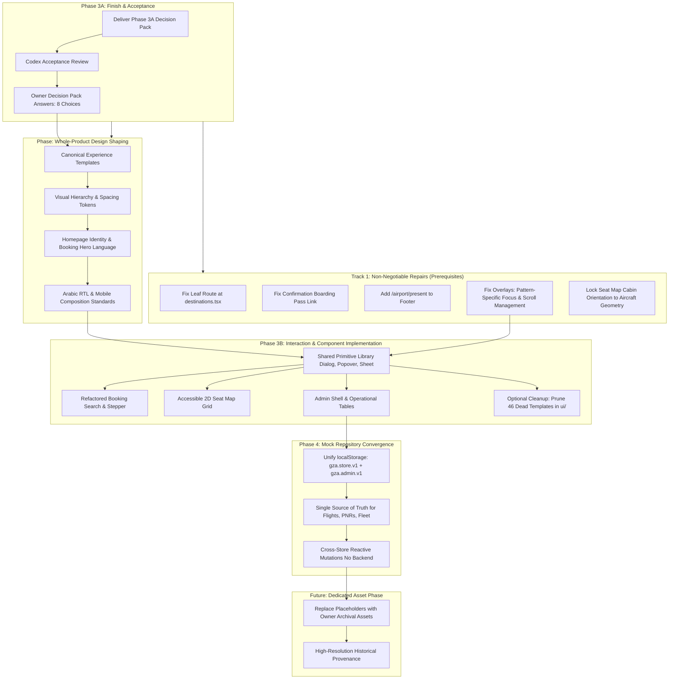

# Phase 3A: Whole-Product Synthesis and Owner Decision Pack

**Document ID**: `docs/PHASE_3A_OWNER_DECISION_PACK.md`  
**Run ID**: `20260918-phase-3a-synthesis` → updated by `20260918-phase-3a-owner-decisions`  
**Baseline Git Commit**: `4a7b9dea6b2502b748d00c011c0067f8c35be33c` on branch `main`  
**Decision Date**: September 18, 2026  
**Status**: Owner Decisions Recorded — Eight Direction Choices Accepted  
**Authority References**: [PRODUCT.md](../PRODUCT.md), [AGENTS.md](../AGENTS.md), [PHASE_3A_CHECKPOINT.md](PHASE_3A_CHECKPOINT.md), and Phase 3A Synthesis & Owner Decision Handoffs

---

## Executive Summary & Context

This document is the fifth and final deliverable of **Phase 3A: System Audits and Owner Decision Pack**. It synthesizes the findings of the four previously completed and accepted independent audit workstreams:

1. **Public Domain Audit**: [PHASE_3A_PUBLIC_AUDIT.md](PHASE_3A_PUBLIC_AUDIT.md) (`20260918-phase-3a-public`)
2. **Heritage & Memorial Domain Audit**: [PHASE_3A_HERITAGE_AUDIT.md](PHASE_3A_HERITAGE_AUDIT.md) (`20260918-phase-3a-heritage`)
3. **Admin Operations Domain Audit**: [PHASE_3A_ADMIN_AUDIT.md](PHASE_3A_ADMIN_AUDIT.md) (`20260918-phase-3a-admin`)
4. **Interaction System & Primitives Audit**: [INTERACTION_SYSTEM_AUDIT.md](INTERACTION_SYSTEM_AUDIT.md) (`20260918-phase-3a-interaction-system`)

### Purpose of this Pack
This decision pack bridges the completed discovery audits and the upcoming visual/interaction design phase. It explicitly avoids jumping straight into code implementation, creating premature backend abstractions, or treating provisional prototype aesthetics as permanent brand guidelines. Instead, it:
- Diagnoses the whole product’s structural strengths and architectural shortcomings based on confirmed empirical evidence.
- Provides an exhaustive, traceable findings register across all four domains, grounded in the run's [evidence-ledger.json](evidence/phase-3a/20260918-phase-3a-synthesis/evidence-ledger.json).
- Clearly separates non-negotiable bug repairs from strategic owner design choices and future architecture phases.
- Equips the product owner with **14 bounded decision cards** containing concrete options, trade-offs, and **8 explicit owner questions** (Cards 01, 02, 04, 06, 07, 11, 13, and 14).
- Maps out implementation dependencies and proposes a candidate interaction architecture for Phase 3B.
- Details the scope and prerequisites of the mandatory next step: the **Whole-Product Design-Direction Shaping Phase**.

---

## Section 1: Whole-Product Diagnosis

Across all four domains, the prototype demonstrates an impressive foundational vision. The visual atmosphere established by the bespoke OKLCH palette—warm limestone and sand (`--sand`, `--sand-deep`), deep olive brand tones (`--brand`, `--primary`), terracotta clay accents (`--clay`), and dark editorial ink (`--ink`)—successfully communicates dignity, cultural memory, and national pride. However, empirical testing reveals systemic workflow, architectural, and usability bottlenecks that cannot be resolved merely by patching individual components.

```
┌─────────────────────────────────────────────────────────────────────────────┐
│                       WHOLE-PRODUCT DIAGNOSIS SUMMARY                       │
├──────────────────────┬──────────────────────┬───────────────────────────────┤
│ Domain               │ Genuine Strengths    │ Architectural & UX            │
│                      │ (Must Preserve)      │ Bottlenecks (Must Address)    │
├──────────────────────┼──────────────────────┼───────────────────────────────┤
│ Public & Passenger   │ • Dignified branding │ • Route occlusion at /destinations │
│                      │ • Fluid bento cards  │ • Broken boarding-pass links  │
│                      │ • 7-step client mock │ • Form sprawl on small viewports│
│                      │   booking validation │ • Decoupled public/admin state │
├──────────────────────┼──────────────────────┼───────────────────────────────┤
│ Heritage & Memorial  │ • Evocative tone     │ • Incomplete footer chapter nav│
│                      │ • Working lightbox   │ • Lightbox focus leak & lack  │
│                      │   arrow navigation   │   of background scroll lock   │
│                      │ • Clear disclaimers  │ • Missing URL query params     │
├──────────────────────┼──────────────────────┼───────────────────────────────┤
│ Admin Operations     │ • Functional Cmd+K   │ • LocalStorage overrides do   │
│                      │   command palette    │   not reach public flights     │
│                      │ • Accessible sheets  │ • Dense tables lack sticky    │
│                      │   and popover traps  │   columns on mobile (390px)   │
├──────────────────────┼──────────────────────┼───────────────────────────────┤
│ Interaction System   │ • Bespoke kit tokens │ • 46 dead starter components  │
│                      │ • Clean RTL CSS      │ • 73-tab sequential seat map   │
│                      │   logical properties │ • Popover missing outside-    │
│                      │ • Working alertdialog│   click and Escape dismiss     │
└──────────────────────┴──────────────────────┴───────────────────────────────┘
```

### 1.1 Public Domain & Passenger Journey
- **Genuine Strengths**:
  - The public passenger flow possesses a cohesive aesthetic identity. Typography choices (Cinzel, Amiri, Plus Jakarta Sans, IBM Plex Sans Arabic) give Palestinian Airlines a sovereign editorial feel.
  - The booking flow (`/book` in `src/routes/{-$locale}.book.tsx`) is genuinely functional in client-side state: multi-step progression across 7 in-page steps (`search`, `results`, `fare`, `passengers`, `seats`, `extras`, `review`), dynamic passenger count updates, seat selection, add-on calculations, booking reference generation (`GZA-XXXX`), and confirmation summaries operate smoothly without runtime crashes.
  - Fluid responsive grid structures and Tailwind CSS logical property utilization ensure good layout resilience across English (LTR) and Arabic (RTL).
- **Core Workflow & Information Architecture Bottlenecks**:
  - **Fatal Route Occlusion**: The file `src/routes/{-$locale}.destinations.tsx` defines a leaf component rather than an `<Outlet />` wrapper. As a result, child destination routes like `/destinations/AMM` update document metadata (`<title>`) but render the general destination grid in the DOM, making individual destination detail pages completely unreachable.
  - **Broken Confirmation Route Target**: The confirmation screen (`src/routes/{-$locale}.booking-confirmation.$ref.tsx`) generates boarding-pass links with a 2-segment path (`/boarding-pass/GZA-7K8P/0`) instead of the router’s registered 3-segment path (`/boarding-pass/$ref/$leg/$pax`), immediately triggering TanStack Router 404 errors.
  - **Booking Form Ergonomic Friction**: The flight search widget on the homepage (`src/routes/{-$locale}.index.tsx`) occupies substantial vertical space. Dropdown inputs crowd small mobile viewports (320px–390px), and the passenger selector popover ignores outside clicks and keyboard `Escape`.

### 1.2 Heritage & Memorial Architecture
- **Genuine Strengths**:
  - The historical narrative spanning Gaza International Airport's 1998 opening, Palestinian Airlines flight operations, and the subsequent destruction is handled with sobriety and reverence. Explicit notices correctly inform users that images and timeline badges are provisional placeholders awaiting primary archival verification.
  - Narrative timelines across `/airport/past`, `/airport/present`, and `/airport/future` structure complex chronologies clearly.
  - The gallery lightbox (`src/routes/{-$locale}.gallery.tsx`) features functional keyboard navigation: `Escape` closes the viewer, and `ArrowLeft` / `ArrowRight` navigate smoothly between archival items.
- **Core Workflow & Information Architecture Bottlenecks**:
  - **Structural Navigation Blindspot**: The global site footer (`src/components/site-footer.tsx`) lists `/airport`, `/airport/past`, and `/airport/future`, but completely omits `/airport/present` (The Ruin / الصمود والواقع), severing the core narrative bridge between historical operation and future vision.
  - **Lightbox Focus Containment & Scroll Leaks**: While keyboard arrows navigate items, initial focus does not move inside the lightbox upon opening; pressing `Tab` leaks to the underlying page elements behind the overlay; closing the viewer after moving focus inside drops focus to `document.body` instead of returning to the trigger; and background page scrolling remains unlocked.
  - **Flat Filtering**: The archive gallery filter buttons do not synchronize with URL query parameters (`?category=`, `?era=`), preventing users from bookmarking or deep-linking specific collections.

### 1.3 Admin Operations & Ground Control
- **Genuine Strengths**:
  - The admin suite (`/admin/*`) provides a thorough airport operations dashboard covering 11 registered sections across 7 logical groups (Overview, Operations, Commercial, Website, Airport, Engagement, Administration).
  - High-density operational data tables make effective use of screen real estate on desktop monitors (1440px–1920px).
  - **Active Command Palette (`Cmd+K`)**: `AdminSearch` (`src/components/admin/admin-search.tsx`) is a fully functional combobox dialog with fuzzy Arabic/English normalization, keyboard arrow traversal, `Escape` dismissal, and instant search across flights (`PS151`), bookings, customers, destinations, and content.
  - **Operational Chrome**: The top-bar `AccountMenu` supports real role switching (admin, editor, viewer) and signs out cleanly; the `AttentionBell` popover derives real alerts from mock operational signals (cancelled flights, delays, unassigned gates, unpublished drafts). Both properly handle `Escape` and outside clicks.
- **Core Workflow & Information Architecture Bottlenecks**:
  - **State Decoupling from Public Store**: Flight status overrides initiated in the admin flight board (`localStorage["gza.admin.v1"]`) have zero connection to public flight schedules (`localStorage["gza.store.v1"]`). In empirical testing, changing flight `PS 151` to `Boarding` at Gate `A3` in Admin left public `/flights` showing `Scheduled` at Gate `A4`. Public bookings created at `/book` never appear in the admin booking manifest (`src/lib/admin-mock.ts`).
  - **Mobile Shell Ergonomics**: On mobile devices (320px–390px), dense tables horizontally overflow without pinned headers or sticky action columns, requiring excessive horizontal panning to reach row action buttons.

### 1.4 Interaction System & Component Foundations
- **Genuine Strengths**:
  - The project maintains custom design token primitives in `src/components/kit.tsx` and `src/components/admin/admin-kit.tsx` styled directly with CSS OKLCH tokens.
  - Technical identifiers (flight codes, PNRs, dates, times, phone numbers) are rigorously preserved as LTR across Arabic viewports via `dir="ltr"` and `unicode-bidi: isolate`.
  - Modal components like `ConfirmDialog` and `AdminSheet` implement strict keyboard focus trapping and return focus to triggering elements upon dismissal.
- **Core Workflow & Information Architecture Bottlenecks**:
  - **Unused Starter Kit Debris**: 46 unreferenced component templates reside under `src/components/ui/` (from an initial starter kit), creating codebase ambiguity and confusion over component authority.
  - **Seat Map Accessibility & Keyboard Burden**: The aircraft seat map renders 108 interactive button elements (73 available, 35 occupied in the test fixture) in a flat sequential tab order. Navigating the cabin via keyboard requires sequential `Tab` key presses across every available seat rather than standard 2D arrow-key grid navigation (`role="grid"` with roving `tabindex`). On mobile, seat buttons measure 32px × 32px (satisfying WCAG 2.2 SC 2.5.8 24px minimum, but below the 44px ergonomic touch recommendation).
  - **RTL Cabin Geometry Inversion**: In Arabic RTL views, seat map columns mirror visually, inverting Port (Seat A) and Starboard (Seat F) relative to the physical aircraft cabin.
  - **Feedback System Divergence**: Admin notifications use `AdminToasts` with `aria-live="polite"` and 4500ms auto-dismiss, but lack a hover pause. The public site uses inline `<Notice>` and `<Field>` banners rather than floating toasts.

---

## Section 2: Traceable Findings Register

This register compiles all material findings across all four accepted Phase 3A audits. Every entry is categorized, assigned an explicit evidence nature, prioritized with rationale, and linked to its exact accepted audit section, raw test record, screenshot, and source file.

```
Evidence Nature Taxonomy:
• browser-confirmed: Directly observed, measured, or reproduced in a browser test session.
• source-explained: Verified by static code analysis of routes, components, or stores.
• inferred-burden: Statistically or logically derived from DOM structure and verified with targeted sampling.
```

### Master Findings Table

| ID | Finding Summary | Journey / Area | Category | Evidence Nature | Severity / Priority | Audit, Evidence & Source Citations |
| :--- | :--- | :--- | :--- | :--- | :--- | :--- |
| **PUB-01** | Leaf route at `destinations.tsx` lacks `<Outlet />`, occluding `/destinations/$code` child routes. | Public: Destinations | `CONFIRMED DEFECT` | `browser-confirmed` + `source-explained` | **P0 (Blocker)**: Child destination detail pages completely unreachable in DOM. | [PHASE_3A_PUBLIC_AUDIT.md](PHASE_3A_PUBLIC_AUDIT.md); screenshot `j1_08_destination_detail_en_1280.png`; [`src/routes/{-$locale}.destinations.tsx`](../src/routes/{-$locale}.destinations.tsx) |
| **PUB-02** | Booking confirmation screen links to 2-segment boarding pass URL, triggering TanStack 404. | Public: Confirmation | `CONFIRMED DEFECT` | `browser-confirmed` | **P0 (Blocker)**: Passengers cannot access generated boarding pass. | [PHASE_3A_PUBLIC_AUDIT.md](PHASE_3A_PUBLIC_AUDIT.md); [browser-test-records.json](evidence/phase-3a/20260918-phase-3a-public/browser-test-records.json) `:mutations.boardingPassLink.clickResult`; [`src/routes/{-$locale}.booking-confirmation.$ref.tsx`](../src/routes/{-$locale}.booking-confirmation.$ref.tsx) |
| **PUB-03** | Public site footer omits `/airport/present` link from chapter navigation. | Public: Global Footer | `CONSISTENCY ISSUE` | `source-explained` | **P1 (High)**: Core historical narrative chapter missing from global site discovery. | [PHASE_3A_HERITAGE_AUDIT.md](PHASE_3A_HERITAGE_AUDIT.md); [`src/components/site-footer.tsx`](../src/components/site-footer.tsx) |
| **PUB-04** | Passenger count selector popover ignores outside clicks and `Escape` dismissal. | Public: Homepage Search | `ACCESSIBILITY DEFECT` | `browser-confirmed` | **P1 (High)**: Violates WCAG 2.2 SC 1.4.13; overlay remains stuck open until Done is clicked. | [INTERACTION_SYSTEM_AUDIT.md](INTERACTION_SYSTEM_AUDIT.md); [browser-test-records.json](evidence/phase-3a/20260918-phase-3a-interaction-system/browser-test-records.json) `:passenger_picker_overlay.desktop.afterEscape`; screenshot `s2_01_pax_popover_open_1280.png`; [`src/components/flight-search-form.tsx`](../src/components/flight-search-form.tsx) |
| **PUB-05** | Public mobile drawer locks body scroll but lacks `Escape` dismissal, focus trap, and focus return. | Public: Mobile Navigation | `ACCESSIBILITY DEFECT` | `browser-confirmed` | **P1 (High)**: Violates WCAG 2.2 SC 2.4.3; keyboard focus leaks behind open mobile menu. | [INTERACTION_SYSTEM_AUDIT.md](INTERACTION_SYSTEM_AUDIT.md); [browser-test-records.json](evidence/phase-3a/20260918-phase-3a-interaction-system/browser-test-records.json) `:public_mobile_drawer`; screenshot `s1_01_public_mobile_drawer_open_390.png`; [`src/components/site-header.tsx`](../src/components/site-header.tsx) |
| **HER-01** | Gallery lightbox handles `Escape` and arrow navigation, but fails focus containment upon open and leaves body scroll unlocked; drops focus to body when closed after focus moved inside (immediate Escape without moving focus retains trigger focus). | Heritage: Lightbox | `ACCESSIBILITY DEFECT` | `browser-confirmed` | **P1 (High)**: Tabbing cycles background cards; closing after interaction drops focus to body. | [PHASE_3A_HERITAGE_AUDIT.md](PHASE_3A_HERITAGE_AUDIT.md); [browser-test-records.json](evidence/phase-3a/20260918-phase-3a-heritage/browser-test-records.json) `:deepA11yInspections.galleryLightbox`; screenshot `j2_18_gallery_lightbox_open_en_1280.png`; [`src/routes/{-$locale}.gallery.tsx`](../src/routes/{-$locale}.gallery.tsx) |
| **HER-02** | Gallery filter buttons do not synchronize with URL search parameters (`?category=`, `?era=`). | Heritage: Gallery | `DESIGN OPPORTUNITY` | `source-explained` | **P3 (Low)**: Historical categories cannot be deep-linked or shared externally. | [PHASE_3A_HERITAGE_AUDIT.md](PHASE_3A_HERITAGE_AUDIT.md); screenshot `j2_15_gallery_filtered_architecture_en_1280.png`; [`src/routes/{-$locale}.gallery.tsx`](../src/routes/{-$locale}.gallery.tsx) |
| **HER-03** | Historical media and `Verified` badges are provisional mock placeholders awaiting owner archival assets. | Heritage: Overall | `OWNER PREFERENCE` | `source-explained` + `browser-confirmed` | **P2 (Medium)**: Must avoid treating provisional timeline badges as historical provenance. | [PHASE_3A_HERITAGE_AUDIT.md](PHASE_3A_HERITAGE_AUDIT.md); [browser-test-records.json](evidence/phase-3a/20260918-phase-3a-heritage/browser-test-records.json) `:journey1_airport.timeline_analysis`; screenshot `j1_04_airport_past_timeline_en_1280.png`; [`src/routes/{-$locale}.gallery.tsx`](../src/routes/{-$locale}.gallery.tsx) |
| **ADM-01** | Admin flight overrides (`localStorage["gza.admin.v1"]`) do not sync with public flight schedule (`localStorage["gza.store.v1"]`). | Cross-Domain: Store Layer | `CONSISTENCY ISSUE` | `browser-confirmed` | **P1 (High)**: Decoupled stores mean admin operational changes are invisible to public passengers. | [PHASE_3A_ADMIN_AUDIT.md](PHASE_3A_ADMIN_AUDIT.md); [browser-test-records.json](evidence/phase-3a/20260918-phase-3a-admin/browser-test-records.json) `:store_boundaries.public_vs_admin_flight_overrides`; screenshots `w2_06_flight_board_after_mutation_1280.png` and `w2_07_public_flights_board_boundary_1280.png`; [`src/routes/{-$locale}.admin.flights.index.tsx`](../src/routes/{-$locale}.admin.flights.index.tsx) |
| **ADM-02** | Public bookings created at `/book` are not reflected in admin bookings table (architectural inference: reads static `mockBookings` in `admin-mock.ts`; `empiricalTestRun: false`). | Cross-Domain: Store Layer | `CONSISTENCY ISSUE` | `source-explained` | **P1 (High)**: Decoupled client store layers break cross-surface simulation. | [PHASE_3A_ADMIN_AUDIT.md](PHASE_3A_ADMIN_AUDIT.md); [browser-test-records.json](evidence/phase-3a/20260918-phase-3a-admin/browser-test-records.json) `:store_boundaries.public_vs_admin_bookings`; [`src/routes/{-$locale}.admin.bookings.index.tsx`](../src/routes/{-$locale}.admin.bookings.index.tsx) |
| **ADM-03** | Admin search palette (`Cmd+K`) is a working combobox (8+ results for "PS"), but unbuilt targets show toasts. | Admin: Search Shell | `USABILITY FRICTION` | `browser-confirmed` | **P2 (Medium)**: Search works well for flights/destinations; unbuilt booking targets show "arrives later" toasts. | [PHASE_3A_ADMIN_AUDIT.md](PHASE_3A_ADMIN_AUDIT.md); [browser-test-records.json](evidence/phase-3a/20260918-phase-3a-interaction-system/browser-test-records.json) `:admin_search_palette`; screenshot `s5_01_admin_search_palette_open_1280.png`; [`src/components/admin/admin-search.tsx`](../src/components/admin/admin-search.tsx) |
| **ADM-04** | Admin account menu and attention popover handle `Escape` and outside clicks, but trigger elements lack aria-expanded sync. | Admin: Top Bar | `ACCESSIBILITY DEFECT` | `browser-confirmed` + `source-explained` | **P2 (Medium)**: Screen readers are not informed when dropdown dialog opens or closes. | [PHASE_3A_ADMIN_AUDIT.md](PHASE_3A_ADMIN_AUDIT.md); [browser-test-records.json](evidence/phase-3a/20260918-phase-3a-admin/browser-test-records.json) `:interactive_a11y_directionality.account_menu_keyboard`; [`src/components/admin/admin-shell.tsx`](../src/components/admin/admin-shell.tsx) |
| **ADM-05** | Admin feedback uses `AdminToasts` with `aria-live="polite"`, 4500ms auto-dismiss, and explicit close button; public site uses inline notices. | Admin: Feedback | `CONSISTENCY ISSUE` | `source-explained` | **P2 (Medium)**: Separate feedback patterns across public and admin surfaces. | [PHASE_3A_ADMIN_AUDIT.md](PHASE_3A_ADMIN_AUDIT.md); [`src/components/admin/admin-kit.tsx`](../src/components/admin/admin-kit.tsx) |
| **ADM-06** | Admin tables lack pinned header rows and sticky action columns on mobile viewports (390px). | Admin: Mobile Tables | `USABILITY FRICTION` | `browser-confirmed` | **P2 (Medium)**: Operational tables require intense horizontal panning to reach "Quick edit". | [PHASE_3A_ADMIN_AUDIT.md](PHASE_3A_ADMIN_AUDIT.md); screenshot `s9_01_admin_tabs_flights_1280.png`; [`src/routes/{-$locale}.admin.flights.index.tsx`](../src/routes/{-$locale}.admin.flights.index.tsx) |
| **INT-01** | 46 unused shadcn/Radix component starter files reside under `src/components/ui/`. | Interaction: Codebase | `CONSISTENCY ISSUE` | `source-explained` | **P2 (Medium)**: Dead starter templates cause architectural ambiguity and maintenance waste. | [INTERACTION_SYSTEM_AUDIT.md](INTERACTION_SYSTEM_AUDIT.md); [inventory-analysis.json](evidence/phase-3a/20260918-phase-3a-interaction-system/inventory-analysis.json) `:uiDirectoryStats`; directory `src/components/ui/` |
| **INT-02** | Aircraft seat map renders 108 buttons (73 enabled, 35 occupied in fixture); first two sequential steps (11A → 11B → 11E) verified in browser; full 73-stop keyboard burden inferred from 73 enabled native buttons in flat DOM order. | Interaction: Seat Map | `ACCESSIBILITY DEFECT` | `browser-confirmed` + `inferred-burden` | **P1 (High)**: Sequential Tab navigation across cabin verified by targeted 2-step traversal; lacks 2D grid navigation. | [INTERACTION_SYSTEM_AUDIT.md](INTERACTION_SYSTEM_AUDIT.md); [browser-test-records.json](evidence/phase-3a/20260918-phase-3a-interaction-system/browser-test-records.json) `:seat_map_interaction.targetedTabSequence`; screenshot `s7_01_seat_map_tab_sequence_1280.png`; [`src/components/booking/seat-map.tsx`](../src/components/booking/seat-map.tsx) |
| **INT-03** | Seat map mobile button size is 32px × 32px, meeting WCAG 2.2 SC 2.5.8 (24px) but below 44px platform recommendation. | Interaction: Seat Map | `USABILITY FRICTION` | `browser-confirmed` | **P2 (Medium)**: Compact button size increases tap errors on mobile devices (320px–390px). Not a WCAG AA failure. | [INTERACTION_SYSTEM_AUDIT.md](INTERACTION_SYSTEM_AUDIT.md); [browser-test-records.json](evidence/phase-3a/20260918-phase-3a-interaction-system/browser-test-records.json) `:seat_map_interaction.mobile`; screenshot `s7_02_seat_map_mobile_390.png`; [`src/components/booking/seat-map.tsx`](../src/components/booking/seat-map.tsx) |
| **INT-04** | Aircraft seat map layout mirrors columns in Arabic RTL, flipping Port/Starboard orientation relative to aircraft. | Interaction: Seat Map | `USABILITY FRICTION` | `source-explained` | **P2 (Medium)**: Seat A should remain Port (Window) and Seat F Starboard (Window) regardless of UI language. | [INTERACTION_SYSTEM_AUDIT.md](INTERACTION_SYSTEM_AUDIT.md); [`src/components/booking/seat-map.tsx`](../src/components/booking/seat-map.tsx) |
| **INT-05** | Cancellation `ConfirmDialog` traps focus and handles `Escape`, but leaves background document body scroll unlocked. | Interaction: Dialogs | `USABILITY FRICTION` | `browser-confirmed` | **P2 (Medium)**: Users can scroll the underlying page while a blocking confirmation alertdialog is open. | [INTERACTION_SYSTEM_AUDIT.md](INTERACTION_SYSTEM_AUDIT.md); [browser-test-records.json](evidence/phase-3a/20260918-phase-3a-interaction-system/browser-test-records.json) `:cancellation_alertdialog`; screenshot `s4_01_confirm_dialog_open_1280.png`; [`src/components/confirm-dialog.tsx`](../src/components/confirm-dialog.tsx) |

---

## Section 3: Boundary Matrix: Repairs vs Choices vs Enhancements

To ensure disciplined execution, findings are separated into four cleanly delineated tracks. Confirmed behavioral and accessibility defects are separated from strategic design forks, established ergonomic best practices are handled as engineering repairs without burdening the owner, and optional template maintenance is deferred to later architecture planning.

```
┌─────────────────────────────────────────────────────────────────────────────┐
│                               BOUNDARY MATRIX                               │
├─────────────────────────────────────────────────────────────────────────────┤
│ TRACK 1: NON-NEGOTIABLE REPAIRS (Confirmed Behavioral & A11y Defects)       │
│ • Fix leaf route at destinations.tsx to render <Outlet />                   │
│ • Fix booking confirmation boarding pass link to 3-segment route target     │
│ • Add missing /airport/present link to public site footer                   │
│ • Modal dialogs & drawers: add focus containment, Escape, and scroll lock   │
│   (public mobile drawer, cancellation confirm dialog, gallery lightbox)     │
│ • Nonmodal popovers: add outside-click & Escape dismiss with focus return;  │
│   do not trap focus or lock background page (passenger selector, menus)     │
│ • Lightbox: set initial focus, contain tab focus, restore to trigger card   │
│ • Cabin seat map: lock columns to physical aircraft Port/Starboard geometry │
├─────────────────────────────────────────────────────────────────────────────┤
│ TRACK 2: OWNER CHOICES (Require Strategic Direction: Exactly 8 Choices)     │
│ • Decision 01: Global public navigation hierarchy & mobile drawer density   │
│ • Decision 02: Booking search form layout (hero-embedded vs standalone bar) │
│ • Decision 04: Booking wizard progression, step navigation & state sync     │
│ • Decision 06: Archive gallery layout and deep-link filtering               │
│ • Decision 07: Admin edit surface model (slide-out sheet vs modal/inline)   │
│ • Decision 11: Admin global search capability (expand vs focus scope)       │
│ • Decision 13: Date input strategy (enhanced native vs custom calendar)     │
│ • Decision 14: Admin operational table density, batch edits & stickiness    │
├─────────────────────────────────────────────────────────────────────────────┤
│ TRACK 3: RECOMMENDED REPAIRS / ENGINEERING CHOICES (No Owner Input Needed)  │
│ • Decision 03: Passenger selector (anchored desktop popover + mobile sheet) │
│ • Decision 05: Confirm dialog pattern (modal reset + inline popconfirm)     │
│ • Decision 08: Admin mobile nav (categorized accordions in drawer)          │
│ • Decision 09: Admin account menu (standardized menu button pattern)        │
│ • Decision 10: Attention popover (compact dropdown with deep links)         │
│ • Decision 12: Feedback architecture (inline banners + live-region toasts)  │
├─────────────────────────────────────────────────────────────────────────────┤
│ TRACK 4: ARCHITECTURE CLEANUP & LATER ENHANCEMENTS (Deferred Planning)      │
│ • Optional Maintenance: Prune 46 dead template files under components/ui/   │
│ • Phase 4: Mock Repository Convergence (unify public/admin local storage)   │
│ • Dedicated Asset Phase: Real high-resolution photography & verified logos  │
│ • Future Phase: True backend databases, Supabase, authentication, or SSR    │
└─────────────────────────────────────────────────────────────────────────────┘
```

---

## Section 4: Bounded Deduplicated Owner Decision Pack (14 Topics)

This section presents the **14 canonical decision cards**. Every card is grounded in verified source paths and empirical test records, completely free of false premises or invented software concepts. Exactly **8 cards** represent genuine strategic or aesthetic forks and are marked `Owner decision required? YES — DECIDED` with the owner's accepted direction. The remaining **6 cards** represent technical bug fixes, WCAG repairs, or established ergonomic best practices and are marked `Owner decision required? NO`.

---

### Decision Card 01: Global Public Navigation & Mobile Drawer

- **Current State & Evidence**:
  The public header (`src/components/site-header.tsx`) features a sticky limestone navbar with 5 primary links (Flights, Destinations, Airport, Gallery, Travel), 4 secondary links (About, Contact, Manage, Check-in), a locale switcher (`EN`/`AR`), and a mobile hamburger button. On mobile (390px), the hamburger opens a full-screen menu overlay (`role="dialog"`, `aria-modal="true"`). The drawer successfully locks body scroll (`document.body.style.overflow = "hidden"`), but lacks an `Escape` key listener, lacks a keyboard focus trap, and drops focus to `document.body` when closed. Verified in `INTERACTION_SYSTEM_AUDIT.md` and test record `public_mobile_drawer`; screenshot `s1_01_public_mobile_drawer_open_390.png`.
- **Strengths**:
  Clean brand aesthetic; proper LTR/RTL layout mirroring; body scroll locking already implemented.
- **Defects vs Opportunities**:
  - *Defect*: Violates WCAG 2.2 SC 2.4.3 (Focus Order): keyboard focus leaks to background elements; pressing `Escape` does nothing.
  - *Opportunity*: Establish a clearer information hierarchy separating operational passenger tasks (Flight Search, Manage Booking, Flight Status) from cultural heritage storytelling (Airport Story, Gallery, Fleet).
- **Option A (Preserve Flat Navigation & Repair Accessibility)**:
  Retain the current navigation link structure. Repair the accessibility defects: implement a strict keyboard focus trap, add an `Escape` key listener, and restore focus to the hamburger button upon dismissal.
- **Option B (Structured Task/Story Split with Dedicated Action Bar)**:
  Restructure the navigation into two distinct zones: a primary passenger utility bar (Book, Flights, Check-in) and a narrative menu (Airport Story, Gallery, Fleet). On mobile, introduce a persistent bottom utility bar for flight lookup alongside a rich full-screen storytelling drawer.
- **Antigravity Recommendation**:
  **Option B**. Palestinian Airlines is both an operational travel concept and a sovereign memorial institution. Separating active travel utilities from historical storytelling honors both missions without clashing.
  - *Trade-off*: Option B slightly increases mobile header implementation complexity.
- **Multi-Dimensional Impact**:
  - *Desktop*: Clearer visual grouping with primary CTA ("Book Flight") distinguished from narrative links.
  - *Mobile*: Drastically improved thumb ergonomics via bottom travel actions; uncluttered drawer.
  - *EN / AR*: Seamless layout reversal via Tailwind CSS logical properties (`ms-auto`, `space-x-reverse`).
  - *Accessibility*: Resolves focus containment, escape dismissal, and screen reader labelling defects; requires post-implementation keyboard and assistive-technology verification.
  - *Complexity*: Low to Moderate.
- **Owner Decision Required?**: **YES — DECIDED**
- **Owner Direction (accepted — 2026-09-18)**:
  **Option B for information hierarchy**: passenger and travel actions must be prominent and immediately understandable; airport heritage and storytelling are first-class but structurally distinct from operational utilities. **Do not lock in a persistent mobile bottom utility bar** — exact desktop and mobile composition is determined in the Whole-Product Design-Direction Shaping phase.
- ~~Explicit Question for the Owner~~: *(Answered — see above.)*

---

### Decision Card 02: Booking-Search Composition & Homepage Presence

- **Current State & Evidence**:
  The homepage (`src/routes/{-$locale}.index.tsx`) embeds a large flight search widget (`src/components/flight-search-form.tsx`) directly below the hero banner. It includes trip type (Round Trip / One Way), origin/destination dropdowns, departure/return date inputs, and passenger count controls. Verified in `PHASE_3A_PUBLIC_AUDIT.md` and test record `j1_01_search_homepage_en_1280.png`.
- **Strengths**:
  Prominently signals passenger airline functionality; inputs are immediately visible above the fold on desktop viewports (1280px–1440px).
- **Defects vs Opportunities**:
  - *Defect*: The widget is vertically dense, crowding hero photography on laptops (1024px–1280px) and pushing the memorial narrative below the fold on mobile (375px–390px). Inputs lack explicit `<fieldset>` groupings.
  - *Opportunity*: Create an elegant, compact floating search console that integrates harmoniously with Palestinian stone architectural textures without dominating the screen.
- **Option A (Embedded Full Console with Compact Form Layout)**:
  Retain the search widget embedded directly in the homepage hero, but condense vertical padding, replace multi-line form rows with a single inline segmented bar on desktop, and collapse to a clean vertical card on mobile.
- **Option B (Hero CTA with Dedicated Slide-Down / Modal Booking Engine)**:
  Keep the homepage hero visually focused on evocative memorial imagery and a bold headline, featuring a prominent "Find Flights" CTA button that smoothly summons an expansive, focused booking overlay or routes directly to an optimized `/book` flow.
- **Antigravity Recommendation**:
  **Option A**. Airline users expect an immediate search form on the homepage. Condensing the form into a streamlined, architectural console preserves instant booking utility while restoring visual breathing room for hero photography.
  - *Trade-off*: Requires responsive CSS container queries to prevent text truncation on tablet viewports.
- **Multi-Dimensional Impact**:
  - *Desktop*: Compact 1-line segmented console spanning origin, destination, dates, and passengers.
  - *Mobile*: Stacked, high-touch cards with 44px minimum tap targets.
  - *EN / AR*: RTL layout automatically flips airport directionality indicators (`GZA → AMM` vs `AMM ← GZA`).
  - *Accessibility*: Explicit `<label className="sr-only">` tags and `<fieldset>` groupings added.
  - *Complexity*: Moderate.
- **Owner Decision Required?**: **YES — DECIDED**
- **Owner Direction (accepted — 2026-09-18)**:
  **Option A**: search remains immediately available on the homepage. Shape a compact, elegant console that does not overpower the hero; retain strong identity, photography and storytelling presence, and breathing room. No CTA or modal gate to search.
- ~~Explicit Question for the Owner~~: *(Answered — see above.)*

---

### Decision Card 03: Passenger Selector Desktop & Mobile Interaction

- **Current State & Evidence**:
  The passenger count selector in `src/components/flight-search-form.tsx` uses a custom button that toggles an unanchored dropdown card containing 7 counter buttons for Adults, Children, and Infants. Verified in `INTERACTION_SYSTEM_AUDIT.md` and test record `passenger_picker_overlay.desktop`; screenshot `s2_01_pax_popover_open_1280.png`.
- **Strengths**:
  Correctly computes total passenger counts, enforces infant-to-adult ratio limits, and updates the search query string.
- **Defects vs Opportunities**:
  - *Defect*: The popover ignores outside clicks, does not close when pressing `Escape`, and overflows mobile screen bounds at 320px viewport width.
  - *Opportunity*: Unify passenger selection into a seamless responsive pattern: an anchored popover on desktop and an ergonomic bottom sheet on mobile.
- **Option A (Repaired Desktop Popover + Mobile Bottom Action Sheet)**:
  Keep the stepper counter model. On desktop, display an anchored popover with outside-click dismissal and `Escape` handling. On mobile devices (<768px), display an ergonomic bottom sheet with large 48px stepper touch targets and a "Done" button.
- **Option B (Inline Segmented Counter without Flyouts)**:
  Replace the dropdown popover entirely with an expandable inline accordion section within the form itself, eliminating overlay positioning issues altogether.
- **Antigravity Recommendation**:
  **Option A**. Bottom sheets on mobile are the industry standard for airline booking steppers, preventing keyboard clipping and screen edge collisions while offering superior thumb reach.
  - *Trade-off*: Slightly more CSS branching between desktop popover and mobile sheet.
- **Multi-Dimensional Impact**:
  - *Desktop*: Anchored popover with keyboard-reachable controls, outside-click/Escape dismissal, and logical focus return without trapping focus or locking page scroll.
  - *Mobile*: Modal bottom sheet sliding over lower screen with focus containment, body scroll lock, and large 48px touch targets; zero horizontal clipping.
  - *EN / AR*: Stepper increment (+) and decrement (-) buttons maintain intuitive visual balance in RTL.
  - *Accessibility*: Native `aria-live="polite"` announces updated passenger totals to screen readers.
  - *Complexity*: Low to Moderate.
- **Owner Decision Required?**: **NO** (Technical & Ergonomic Repair; Option A strongly recommended).

---

### Decision Card 04: Booking Wizard Progression, Navigation & State Recovery

- **Current State & Evidence**:
  The booking journey (`src/routes/{-$locale}.book.tsx`) implements a 7-step in-page progression (`search`, `results`, `fare`, `passengers`, `seats`, `extras`, `review`) moving to `/booking-confirmation/$ref`. Step state is tracked in React `useState`. Verified in `INTERACTION_SYSTEM_AUDIT.md` and test record `s8_01_booking_stepper_step3_1280.png`.
- **Strengths**:
  Complete end-to-end client-side booking simulation; clear step headers; accurate price recalculation upon selecting extra baggage or premium seats.
- **Defects vs Opportunities**:
  - *Defect*: Step indicators are non-interactive. The URL remains static `/book` throughout the entire flow. Refreshing the browser or pressing browser Back exits the active booking flow back to the homepage (`/`).
  - *Opportunity*: Sync the active wizard step to the URL search parameters (`/book?step=seats&flight=PS204`), allowing browser Back/Forward navigation, bookmarking, and step jumping.
- **Option A (Linear Wizard with Explicit Step Clicking & URL Sync)**:
  Maintain the guided wizard flow but sync the active step to URL search parameters (`?step=seats`). Allow users to freely click backwards to any previously completed step via the top stepper bar to edit details without losing entered passenger data.
- **Option B (Accordion / Single-Page Accordion Flow)**:
  Replace the multi-page wizard with an all-in-one accordion checkout page where each section (Flights, Passengers, Seats, Extras, Review) expands sequentially as prior sections pass validation.
- **Antigravity Recommendation**:
  **Option A**. Multi-step airline checkouts with URL synchronization prevent cognitive overload, preserve state across page reloads, and allow natural browser back-button navigation.
  - *Trade-off*: Requires URL query parameter validation to prevent jumping ahead to Step 5 without completing Step 2.
- **Multi-Dimensional Impact**:
  - *Desktop*: Horizontal breadcrumb stepper with clear checkmarks on completed steps.
  - *Mobile*: Compact numeric stepper ("Step 4 of 7: Choose Seats") with persistent sticky progress bar.
  - *EN / AR*: Progression advances left-to-right in English and right-to-left in Arabic.
  - *Accessibility*: Stepper uses `<ol>` with `aria-current="step"` attributes.
  - *Complexity*: Moderate.
- **Owner Decision Required?**: **YES — DECIDED**
- **Owner Direction (accepted — 2026-09-18)**:
  **Option A — guided multi-step wizard**, with the following requirements: URL and state synchronization per step; sensible browser Back/Forward behavior; ability to access and revisit completed steps; preservation of all entered data; clear progress indication on both desktop and mobile; and blocking of invalid forward jumps without completing required steps. No giant accordion checkout.
- ~~Explicit Question for the Owner~~: *(Answered — see above.)*

---

### Decision Card 05: Confirm Dialog & Destructive Action Pattern

- **Current State & Evidence**:
  Critical actions (e.g. canceling a booking) trigger `src/components/confirm-dialog.tsx`. It displays a centered modal card with `role="alertdialog"`, `aria-modal="true"`, and initial focus placed on the safe "Keep booking" dismiss action. It traps keyboard focus and handles `Escape`. However, `document.body.style.overflow` remains unlocked, permitting underlying page scrolling. Verified in `INTERACTION_SYSTEM_AUDIT.md` and test record `cancellation_alertdialog`; screenshot `s4_01_confirm_dialog_open_1280.png`.
- **Strengths**:
  Strict keyboard focus trapping inside the modal; returns focus to triggering element upon cancel; safe initial button focus.
- **Defects vs Opportunities**:
  - *Defect*: The modal does not lock body scrolling on desktop viewports, allowing users to scroll the underlying table while the dialog is visible.
  - *Opportunity*: Establish a unified design system dialog primitive that handles body scroll locking, backdrop blur, and enter/exit transitions.
- **Option A (Refined Standard Alertdialog with Scroll Lock & Escape Handling)**:
  Retain the centered dialog visual pattern. Enhance with strict body scroll lock (`overflow: hidden`), subtle backdrop blur (`backdrop-blur-sm`), keyboard `Escape` dismissal, and safe initial button focus.
- **Option B (Two-Tier Action Hierarchy: Inline Popconfirm for Minor, Modal for Destructive)**:
  Introduce an anchored popover confirmation ("Are you sure? [Yes] [No]") directly adjacent to small table action buttons for routine edits, reserving the high-friction centered modal exclusively for irreversible cancellations and schedule resets.
- **Antigravity Recommendation**:
  **Option B**. Using full blocking modal dialogs for every minor table action creates operational fatigue. Anchored inline popconfirms speed up ground control workflows while full modals safeguard irreversible operational resets.
  - *Trade-off*: Requires two dialog primitives in the component library instead of one.
- **Multi-Dimensional Impact**:
  - *Desktop*: Compact anchored confirmation balloons for quick table actions; heavy modal for resets.
  - *Mobile*: Both types adapt to bottom sheets or centered cards to avoid viewport edge clipping.
  - *EN / AR*: Action buttons placed logically with secondary Cancel on start and primary Confirm on end.
  - *Accessibility*: Correct `role="alertdialog"`, `aria-labelledby`, and `aria-describedby` associations.
  - *Complexity*: Low.
- **Owner Decision Required?**: **NO** (Ergonomic Best Practice; Option B recommended).

---

### Decision Card 06: Gallery / Archive Browsing, Categorization & Lightbox

- **Current State & Evidence**:
  The historical archive gallery (`src/routes/{-$locale}.gallery.tsx`) renders a bento grid of 24 archival items with category and era filter pills. The lightbox modal implements functional keyboard navigation: `Escape` closes the viewer, and `ArrowLeft` / `ArrowRight` navigate across items (`j2_19_gallery_lightbox_next_en_1280.png`). However, initial focus does not move inside the lightbox upon opening; pressing `Tab` leaks to the underlying page elements; closing the viewer after moving focus inside drops focus to `document.body` (immediate `Escape` from trigger retains trigger focus); and background page scrolling remains unlocked. Verified in `PHASE_3A_HERITAGE_AUDIT.md` and test record `deepA11yInspections.galleryLightbox`; screenshot `j2_18_gallery_lightbox_open_en_1280.png`.
- **Strengths**:
  Evocative imagery; respectful captions; explicit provisional notices; working keyboard arrow navigation and `Escape` handling.
- **Defects vs Opportunities**:
  - *Defect*: Fails WCAG 2.2 SC 2.4.3 (Focus Order): initial focus not set, focus leaks to background page, focus return drops to body after modal interaction. Body scroll unlocked. Filter pills lack URL synchronization (`?category=`, `?era=`).
  - *Opportunity*: Transform the archive gallery into an interactive historical exhibition featuring curated story tours, zoomable archival documents, and deep-linkable collections.
- **Option A (Enhanced Archival Grid with Accessible Lightbox Carousel)**:
  Preserve the clean image grid and working arrow navigation. Overhaul the lightbox primitive: add strict focus trapping, body scroll lock, programmatic focus restoration to trigger card, and sync active filters to URL params (`/gallery?era=1998-2001`).
- **Option B (Editorial Museum Exhibition Flow with Split-Pane Inspector)**:
  Transition from a photo grid to an editorial exhibition layout. Selecting an archive asset opens an expansive split-pane viewer alongside historical documents, architectural blueprints, and related historical timeline links.
- **Antigravity Recommendation**:
  **Option A**. Enhancing the existing grid and lightbox ensures rapid browsing, lightweight performance on HostPapa static hosting, and addresses confirmed focus containment, return, and scroll management defects without over-complicating media delivery (with post-implementation keyboard and screen-reader verification).
  - *Trade-off*: Editorial split-pane layout (Option B) can be explored as a future exhibition feature once high-resolution original archival assets are received.
- **Multi-Dimensional Impact**:
  - *Desktop*: Elegant full-screen lightbox with keyboard arrow navigation and thumbnail preview strip.
  - *Mobile*: Swipeable touch carousel with pinch-to-zoom support.
  - *EN / AR*: Arrow navigation honors reading order: in Arabic RTL, Next advances forward logically.
  - *Accessibility*: Scoped focus containment, return to trigger card on close, body scroll lock, `aria-modal="true"`, and alt text (requires post-implementation keyboard and assistive-technology verification).
  - *Complexity*: Moderate.
- **Owner Decision Required?**: **YES — DECIDED**
- **Owner Direction (accepted — 2026-09-18)**:
  **Option A as current direction**: high-performance accessible archive and gallery with an excellent lightbox viewer. Shape it to be editorial and distinctive, with contextual metadata and related historical material — not a generic image grid. Heavier virtual-museum or split-pane architecture waits for authentic high-resolution assets and verified historical provenance.
- ~~Explicit Question for the Owner~~: *(Answered — see above.)*

---

### Decision Card 07: Admin Edit-Sheet Model vs Modal / Inline Editing

- **Current State & Evidence**:
  In admin flight operations (`/admin/flights`), selecting "Quick edit" on a flight opens `AdminSheet` (`src/components/admin/admin-kit.tsx`), a slide-out panel that slides from the right (or left in RTL) over the table. It implements keyboard focus trapping, `Escape` dismissal, body scroll lock (`bodyOverflow: "hidden"`), and focus restoration. Verified in `INTERACTION_SYSTEM_AUDIT.md` and test record `admin_side_sheet`; screenshot `s6_01_admin_sheet_quick_edit_1280.png`.
- **Strengths**:
  Preserves context by keeping the underlying table partially visible; slides smoothly; handles form inputs cleanly on desktop monitors (1280px–1440px).
- **Defects vs Opportunities**:
  - *Defect*: On mobile screens (320px–390px), the slide-out sheet occupies 100% of the viewport width but feels cramped with nested form groups, lacks a sticky save/cancel footer, and sometimes requires vertical scrolling past off-screen action buttons.
  - *Opportunity*: Establish a consistent editing pattern across admin tools: drawer sheets for complex multi-field records, and fast inline editing for single-field operational overrides (e.g. gate changes or delay status).
- **Option A (Standardized Slide-Out Sheet with Sticky Footer & Mobile Full-Screen)**:
  Standardize on `AdminSheet` for all admin edits. On desktop, it slides smoothly with a fixed 480px width, sticky header, and sticky footer action bar. On mobile, it transforms automatically into a full-screen editing view with prominent Save and Discard buttons.
- **Option B (Hybrid Model: Inline Cell Editing for Status/Gate + Centered Modal for Records)**:
  Enable operators to change flight status, gates, and remarks directly within table cells via dropdowns, reserving dedicated centered modal dialogs for adding new flights or updating customer records.
- **Antigravity Recommendation**:
  **Option A**. A standardized slide-out sheet ensures that complex validation errors, audit logs, and multi-field inputs have dedicated space without cluttering dense operational tables with tricky inline form states.
  - *Trade-off*: Option A requires an extra click to open the sheet compared to direct inline table editing.
- **Multi-Dimensional Impact**:
  - *Desktop*: 480px side sheet with sticky save footer; underlying table dimmed but visible.
  - *Mobile*: Full-screen slide-over sheet with high-visibility top-right "Save" button.
  - *EN / AR*: Sheet enters from right in LTR (English) and from left in RTL (Arabic).
  - *Accessibility*: Proper focus trap, `aria-labelledby`, and restoration of focus to the triggering edit button.
  - *Complexity*: Low to Moderate.
- **Owner Decision Required?**: **YES — DECIDED**
- **Owner Direction (accepted — 2026-09-18)**:
  **Hybrid — not literal A or B**: simple and frequently changed fields (flight status, gate, delay remark where appropriate) should edit inline. Complex multi-field records use side sheets where table context helps. Truly complex tasks use dedicated pages. Avoid centered modals for complex editing. Design shaping defines the decision rules for each individual surface.
- ~~Explicit Question for the Owner~~: *(Answered — see above.)*

---

### Decision Card 08: Admin Mobile Navigation & Responsive Drawer

- **Current State & Evidence**:
  The admin shell (`src/components/admin/admin-shell.tsx`) features a collapsible desktop sidebar and a mobile slide-over drawer triggered by a top hamburger icon (`s1_02_admin_mobile_drawer_open_390.png`). It contains links to the 11 registered admin routes grouped under 7 categories (Overview, Operations, Commercial, Website, Airport, Engagement, Administration). The drawer correctly implements `role="dialog"`, `aria-modal="true"`, body scroll locking (`overflow: hidden`), keyboard `Escape` dismissal, and focus restoration to the trigger button. Verified in `INTERACTION_SYSTEM_AUDIT.md` and test record `admin_mobile_drawer`.
- **Strengths**:
  Sidebar groups operational domains cleanly; collapses to icon rail on intermediate screens (1024px); mobile drawer already implements excellent accessibility mechanics (`Escape`, focus trap, scroll lock).
- **Defects vs Opportunities**:
  - *Defect*: On mobile phones (320px–390px), the 7 category groups list all links in a single long column, requiring vertical scrolling to reach lower-tier administration items.
  - *Opportunity*: Introduce collapsible category accordions within the drawer or a persistent bottom action bar for the 4 highest-frequency operator views.
- **Option A (Categorized Accordion Drawer with Active Badges)**:
  Retain the slide-out drawer on mobile, but make the category sections collapsible accordions with badge indicators (e.g. showing active alerts).
- **Option B (Bottom Operational Action Bar + Quick Drawer)**:
  On mobile devices, introduce a persistent bottom navigation bar featuring the 4 highest-frequency operator views (Dashboard, Flights, Gate Alerts, Menu), with the full category navigation available under "Menu".
- **Antigravity Recommendation**:
  **Option A**. Collapsible category accordions preserve full operational reachability without consuming permanent vertical screen real estate on already cramped mobile table screens.
  - *Trade-off*: Accessing secondary admin links requires expanding an accordion.
- **Multi-Dimensional Impact**:
  - *Desktop*: Permanent 260px sidebar with section dividers and collapse toggle.
  - *Mobile*: Clean 320px drawer with structured category headers and quick touch targets.
  - *EN / AR*: Drawer slides from left in LTR, and from right in RTL.
  - *Accessibility*: Category accordions use accessible `aria-expanded` attributes and keyboard focus trapping.
  - *Complexity*: Low.
- **Owner Decision Required?**: **NO** (Information Architecture Optimization; Option A recommended).

---

### Decision Card 09: Account Menu & Admin User Status

- **Current State & Evidence**:
  The admin top bar displays an operator account button (`src/components/admin/admin-shell.tsx`). Clicking it toggles a dialog card displaying the active mock staff identity: Rana Habib (`rana.habib@gza.ps`, "Airport administrator") / Yousef Nasser / Layla Odeh. The menu displays the staff title, role chip, role-switching buttons (`admin`, `editor`, `viewer`), and a `signOut` button. Outside click dismisses the menu, `Escape` closes it, and focus returns to the trigger button (`interactive_a11y_directionality.account_menu_keyboard`). Verified in `PHASE_3A_ADMIN_AUDIT.md`.
- **Strengths**:
  Fully accessible keyboard mechanics (`Escape`, outside click, focus return); real role switching triggers permission updates across the admin UI; clean layout.
- **Defects vs Opportunities**:
  - *Defect*: The trigger button lacks `aria-expanded` synchronization when open/closed, and clicking "Sign out" clears state in memory but does not provide visual confirmation before navigating to `/admin/signin`.
  - *Opportunity*: Add a subtle station duty indicator (e.g. "Active Shift · Terminal 1 Dispatch") to emphasize authentic operational context.
- **Option A (Refined Standard Dropdown with Session Clear Confirmation)**:
  Retain the clean dropdown menu. Add `aria-expanded` synchronization to the trigger button, ensure clean session clearance upon sign out, and preserve rapid mock role switching.
- **Option B (Expanded Station Shift Console)**:
  Expand the account menu into a full station duty card displaying active airfield status, local Rafah station time, operator role switching, and shift handover notes.
- **Antigravity Recommendation**:
  **Option A**. A refined, fully accessible account dropdown keeps the top bar lightweight and focused while properly securing the sign-out transition.
  - *Trade-off*: Shift handover notes (Option B) are better addressed in Phase 4 once mock roles are formalized.
- **Multi-Dimensional Impact**:
  - *Desktop*: Anchored floating card with smooth elevation and keyboard focus management.
  - *Mobile*: Anchored menu repositioned to prevent off-screen clipping.
  - *EN / AR*: Menu aligns to trailing edge in both LTR and RTL.
  - *Accessibility*: Full adherence to WAI-ARIA Menu button pattern (`aria-expanded`, `role="dialog"`).
  - *Complexity*: Low.
- **Owner Decision Required?**: **NO** (Technical & Ergonomic Polish; Option A recommended).

---

### Decision Card 10: Attention / Notifications Popover & Event Log

- **Current State & Evidence**:
  The admin header features a bell icon with a count badge derived from real mock operational signals in `src/components/admin/dashboard-data.ts`: cancelled flights (high severity), delayed flights (medium severity), missing gate assignments (medium severity), unpublished content drafts (low severity), and unread contact enquiries (low severity). Clicking the bell toggles an attention panel displaying alerts and a "View all" action. It handles `Escape`, outside clicks, and focus return. Verified in `INTERACTION_SYSTEM_AUDIT.md` and `PHASE_3A_ADMIN_AUDIT.md`.
- **Strengths**:
  High operational value; derived from genuine mock domain data; handles `Escape` and outside clicks cleanly.
- **Defects vs Opportunities**:
  - *Defect*: Alerts are read-only; clicking an alert does not deep-link directly into the relevant flight or content edit sheet.
  - *Opportunity*: Connect notification items to direct actions (e.g. clicking "Missing gate" opens flight `PS 151` quick-edit sheet with focus on the gate input).
- **Option A (Interactive Notification Popover with Deep Links)**:
  Preserve the compact dropdown popover. Add deep-link click handlers to each alert item, routing directly to the affected flight or content record.
- **Option B (Dedicated Slide-Out Operations Feed)**:
  Replace the top-bar dropdown with a full-height slide-out operational feed drawer, providing a persistent real-time event log that operators can keep open alongside their dashboard.
- **Antigravity Recommendation**:
  **Option A**. An interactive popover provides instant situational awareness without consuming permanent horizontal screen width needed for dense data tables.
  - *Trade-off*: High-volume event auditing is better suited to the dedicated `/admin/activity` page.
- **Multi-Dimensional Impact**:
  - *Desktop*: 380px floating popover anchored directly beneath the bell icon.
  - *Mobile*: Full-width top banner or bottom sheet that prevents edge clipping on phones.
  - *EN / AR*: Notification timestamps and flight numbers remain strictly LTR in Arabic views.
  - *Accessibility*: `aria-live="polite"` announces incoming high-priority alerts to assistive tech.
  - *Complexity*: Low to Moderate.
- **Owner Decision Required?**: **NO** (Technical & Usability Polish; Option A recommended).

---

### Decision Card 11: Admin Global Search (`Cmd+K` / `Ctrl+K`)

- **Current State & Evidence**:
  `AdminSearch` (`src/components/admin/admin-search.tsx`) is a fully functional combobox command palette triggered by `Cmd+K` / `Ctrl+K` or clicking the top bar search input (`s5_01_admin_search_palette_open_1280.png`). It normalizes Arabic diacritics and letters, traps focus, handles `Escape`, supports `ArrowDown` / `ArrowUp` traversal, and searches across flights (`PS 151`), bookings, customers, destinations, and content items. Selecting a destination or flight navigates to the page; selecting an unbuilt target shows an informative toast (`t("adm.quick.later")`). Verified in `PHASE_3A_ADMIN_AUDIT.md` and test record `admin_search_palette`.
- **Strengths**:
  Keyboard-first interaction; excellent fuzzy search normalization; fast response; clean modal presentation.
- **Defects vs Opportunities**:
  - *Defect*: Unbuilt target modules trigger toasts rather than opening detail drawers; search index does not currently include direct action shortcuts (e.g. "Create New Flight", "Switch to Editor").
  - *Opportunity*: Expand the search palette into a complete administrative spotlight engine.
- **Option A (Global Command & Jump Palette with Action Shortcuts)**:
  Expand the current working search to include direct action shortcuts (e.g. "Create Booking", "New Schedule", "Switch Role"), recent search history, and deeper fuzzy keyword indexing.
- **Option B (Focused Contextual Entity Search)**:
  Keep the `Cmd+K` palette scoped strictly to entity lookup (Flights by code/route, Bookings by PNR, Passengers by name/document), while leaving page navigation to the sidebar.
- **Antigravity Recommendation**:
  **Option A**. Airport station chiefs and dispatchers handle fast-moving operational tasks. Expanding the already functional `Cmd+K` palette to include action shortcuts further elevates operational speed.
  - *Trade-off*: Option A requires indexing administrative actions in addition to data entities.
- **Multi-Dimensional Impact**:
  - *Desktop*: Centered spotlight modal triggered by `Cmd+K`; keyboard arrow navigation.
  - *Mobile*: Accessible via search icon in the top header, opening a full-screen search view.
  - *EN / AR*: Supports simultaneous English and Arabic search queries (e.g. "عمان" or "AMM").
  - *Accessibility*: Full adherence to WAI-ARIA Combobox pattern with keyboard focus trapped inside.
  - *Complexity*: Low to Moderate.
- **Owner Decision Required?**: **YES — DECIDED**
- **Owner Direction (accepted — 2026-09-18)**:
  **Option A**: evolve the working `Cmd+K` / `Ctrl+K` into a command and jump palette covering entity lookup, navigation, frequent actions, suitable quick-create shortcuts, role and context-sensitive commands, and strong bilingual Arabic/English search. Shape now; implementation is limited to what the current architecture supports. **No Phase 4 data architecture changes in current design work.**
- ~~Explicit Question for the Owner~~: *(Answered — see above.)*

---

### Decision Card 12: Toast & Notification Feedback System

- **Current State & Evidence**:
  Feedback notifications across the admin suite use `AdminToasts` (`src/components/admin/admin-kit.tsx`). Toasts render at the bottom of the viewport inside an accessible container with `aria-live="polite"`. Toasts auto-dismiss after 4500ms (`src/lib/admin-store.tsx`) and provide an explicit close button (`X`). However, they do not pause their timer on hover. The public site does not use floating toasts, relying instead on inline `<Notice>` panels and `<Field>` validation error messages. Verified in `INTERACTION_SYSTEM_AUDIT.md` and `src/components/admin/admin-kit.tsx`.
- **Strengths**:
  Admin toasts already include `aria-live="polite"`; dark ink brand styling; explicit dismiss button.
- **Defects vs Opportunities**:
  - *Defect*: Floating toasts lack pause-on-hover; multiple toasts stack vertically without maximum count limits.
  - *Opportunity*: Standardize a unified feedback architecture across both public and admin interfaces.
- **Option A (Refined Floating Toast Stack with Pause-on-Hover)**:
  Retain floating toasts for admin actions. Limit maximum active toasts to 3; pause dismissal timer on hover or keyboard focus; preserve `aria-live="polite"`; provide an explicit close button.
- **Option B (Inline Banner Alerts for Forms + Toasts Exclusively for Background Events)**:
  Reserve floating toasts strictly for asynchronous system events (e.g. "New operational telex received"). Form submission outcomes and validation errors render as persistent inline message banners directly above the relevant form or table.
- **Antigravity Recommendation**:
  **Option B**. Relying on transient disappearing toasts for form errors is poor usability—users miss critical error messages when looking at inputs. Inline banners ensure error visibility, while toasts communicate background system success.
  - *Trade-off*: Requires standardizing both an inline banner component and a floating toast primitive.
- **Multi-Dimensional Impact**:
  - *Desktop*: Compact floating toast stack for background updates; prominent inline banners for forms.
  - *Mobile*: Toasts anchor to top center to prevent covering bottom navigation or keyboard.
  - *EN / AR*: Position flips to bottom-left in Arabic RTL; text aligned with correct logical margins.
  - *Accessibility*: Implements aria-live announcement standards for asynchronous updates; requires assistive-technology verification.
  - *Complexity*: Low.
- **Owner Decision Required?**: **NO** (Accessibility & Usability Polish; Option B recommended).

---

### Decision Card 13: Native Date Control Strategy vs Custom Accessible Calendar

- **Current State & Evidence**:
  Flight search forms and admin scheduling tools use native HTML5 date inputs (`<input type="date">`). Verified in `INTERACTION_SYSTEM_AUDIT.md` and `src/components/flight-search-form.tsx`.
- **Strengths**:
  Zero additional JavaScript bundle weight; utilizes platform-native date pickers on iOS and Android with built-in accessibility.
- **Defects vs Opportunities**:
  - *Defect*: Desktop browser implementations (Chrome, Edge, Firefox, Safari) render drastically different, un-stylable popup calendars that clash with Palestinian Airlines' limestone aesthetic tokens. Setting min/max dates or selecting date ranges across two inputs feels disjointed.
  - *Opportunity*: Introduce an authentic, lightweight dual-month calendar picker designed with brand typography and limestone stone textures.
- **Option A (Enhanced Native Date Inputs with Tailored CSS Dressing)**:
  Retain native `<input type="date">` elements. Apply tailored Tailwind CSS styling to normalize appearance, provide explicit calendar icon triggers, and enforce ISO date formatting (`YYYY-MM-DD`).
- **Option B (Lightweight Bespoke Brand Calendar for Desktop + Native for Mobile)**:
  Implement a bespoke dual-month range calendar picker for desktop viewports that matches the warm limestone design system, while gracefully falling back to native `<input type="date">` on mobile devices for optimal touch scrolling.
- **Antigravity Recommendation**:
  **Option B**. Flight booking is fundamentally about date ranges (Departure & Return). Desktop native date pickers handle date ranges poorly across separate inputs. A tailored desktop calendar picker provides a world-class booking experience while mobile retains native OS wheel pickers.
  - *Trade-off*: Adds modest custom calendar logic for desktop month navigation.
- **Multi-Dimensional Impact**:
  - *Desktop*: Elegant dual-month range selector with highlighted return range in warm terracotta.
  - *Mobile*: Native OS date picker sheet with zero extra JavaScript footprint.
  - *EN / AR*: Calendar days and months localized accurately with Arabic month names (`أيلول`, `تشرين الأول`).
  - *Accessibility*: Full keyboard navigation (arrow keys across days, PageUp/PageDown for months).
  - *Complexity*: Moderate.
- **Owner Decision Required?**: **YES — DECIDED**
- **Owner Direction (accepted — 2026-09-18)**:
  **Option B experience**: high-quality desktop date and range selection for airline booking, retaining native mobile controls where they are better. **Do not mandate a calendar built from scratch** — evaluate existing `react-day-picker` and other installed infrastructure during Phase 3B, after experience and accessibility requirements are shaped.
- ~~Explicit Question for the Owner~~: *(Answered — see above.)*

---

### Decision Card 14: Admin Page Density, Table Ergonomics & Batch Editing

- **Current State & Evidence**:
  Admin tables (`/admin/flights`, `/admin/bookings`, `/admin/customers`) display dense rows with 8–10 columns (`s9_01_admin_tabs_flights_1280.png`). Action buttons ("Quick edit", "Open flight") are placed in the far-right column. Verified in `PHASE_3A_ADMIN_AUDIT.md` and test record `workflow2_daily_operations`.
- **Strengths**:
  High information density appropriate for airport dispatch; clear tabular layout on desktop displays (1280px–1920px).
- **Defects vs Opportunities**:
  - *Defect*: Tables lack pinned header rows on vertical scroll; lack sticky action columns on horizontal mobile scroll; do not support multi-row checkbox selection for batch updates.
  - *Opportunity*: Upgrade tables to high-performance operational grids with pinned headers, sticky columns, density toggles (Comfortable / Compact), and batch action toolbars.
- **Option A (Responsive Table Enhancements: Pinned Headers & Sticky Actions)**:
  Preserve the existing table structure. Add CSS `sticky top-0` header rows, pinned left/right action columns on horizontal overflow, and a horizontal scroll indicator on mobile.
- **Option B (Full Operational Grid with Batch Actions & Density Toggle)**:
  Introduce row-selection checkboxes, a floating batch action bar (e.g. "3 flights selected: [Update Status] [Change Gate]"), a density switch (Compact / Standard), and column visibility toggles.
- **Antigravity Recommendation**:
  **Option A** for immediate Phase 3B implementation, paving the way for **Option B** when mock mutations are unified in Phase 4.
  - *Trade-off*: Option B requires multi-record mutation logic that belongs in the Phase 4 mock repository layer.
- **Multi-Dimensional Impact**:
  - *Desktop*: Pinned headers keep column titles visible during deep vertical scrolling.
  - *Mobile*: Sticky action column ensures the "Quick edit" button remains accessible without full horizontal panning.
  - *EN / AR*: Sticky action column pins to right in LTR, and to left in RTL.
  - *Accessibility*: Clear table headers with `scope="col"`, `aria-sort` indicators for sortable columns.
  - *Complexity*: Low to Moderate.
- **Owner Decision Required?**: **YES — DECIDED**
- **Owner Direction (accepted — 2026-09-18)**:
  **Option A for Phase 3B**: sticky and pinned headers where useful; sticky logical action columns; excellent horizontal overflow; responsive readability; clear operational actions; strong desktop density. Design architecture should anticipate future multi-row selection, batch actions, density modes, and column customization — but mutation-heavy capabilities wait for Phase 4's unified mock repository and state layer.
- ~~Explicit Question for the Owner~~: *(Answered — see above.)*

---

## Section 5: Dependency & Order Map

To prevent architectural thrashing, implementation must proceed in strict logical order. The following map outlines what must be repaired regardless, what awaits owner decisions, what demands whole-product design shaping, and what belongs to later architecture phases.



### Order of Operations Summary:
1. **Immediate (Pre-Shaping Audit Conclusion)**: Codex reviews and accepts this corrected decision pack. No application code changes, commits, or pushes occur in this audit run.
2. **Owner Review**: Owner provides decisions for the **8 designated choice cards** in Section 4.
3. **Design-Direction Shaping Phase**: Establish visual hierarchy, typography, density, and canonical screen layouts before widespread coding.
4. **Phase 3B Implementation**: Build and standardize shared accessible interaction primitives; refactor booking flow, seat map, and admin shells to match shaped designs.
5. **Phase 4 Mock Repository Convergence**: Unify disconnected public/admin client stores into a single reactive mock repository. No backend or database assumed.
6. **Asset Integration Phase**: Incorporate verified high-resolution photography, official seals, and historical artifacts provided by the project owner.

---

## Section 6: Candidate Phase 3B Interaction Architecture

*(Proposal Only — Avoids third-party framework migrations or new dependencies by default)*

### 6.1 Architectural Principle
The application does not require a massive third-party UI framework migration. It currently possesses a highly effective, tailored foundation in `src/components/kit.tsx` and `src/components/admin/admin-kit.tsx`. The primary deficit is not styling or rendering capability, but **inconsistent overlay mechanics and accessibility hooks**.

Phase 3B should establish a unified set of **accessible interaction primitives** authored directly within the project using lightweight native React patterns, strictly avoiding new heavy runtime dependencies.

### 6.2 Proposed Shared Primitive Architecture

```
src/components/primitives/
├── dialog/
│   ├── dialog.tsx             # Accessible modal backdrop, focus trap, escape listener, scroll lock
│   └── confirm-dialog.tsx     # Replaces existing confirm-dialog with standardized primitive
├── sheet/
│   ├── sheet.tsx              # Responsive slide-over drawer (desktop side-sheet / mobile bottom-sheet)
│   └── admin-sheet.tsx        # Standardized operational editing drawer
├── popover/
│   ├── popover.tsx            # Anchored popover with outside-click and escape handling
│   └── tooltip.tsx            # Accessible keyboard-focusable tooltip
├── grid/
│   └── roving-grid.tsx        # 2D arrow-key roving tabindex controller (used by SeatMap)
└── feedback/
    ├── toast-provider.tsx     # Accessible live-region toast stack with pause-on-hover
    └── inline-banner.tsx      # Persistent form & table operational notification banners
```

### 6.3 Resolution of the 46 Unused Starter Files
- **Finding**: 46 unreferenced component templates reside under `src/components/ui/` (e.g. `accordion.tsx`, `dialog.tsx`, `dropdown-menu.tsx`). They were generated during initial repository setup and are not imported by any active route.
- **Architectural Decision**: Delete the unused `src/components/ui/` starter files. Rather than importing arbitrary shadcn/Radix components with conflicting Tailwind utility dependencies, implement only the explicit, lightweight primitives specified above, directly styled with our CSS OKLCH tokens (`--sand`, `--clay`, `--brand`, `--ink`).

### 6.4 Aircraft Seat Map Ergonomic Architecture
- **Finding**: 108 seat buttons currently form a flat, sequential keyboard sequence and invert physical cabin geometry in Arabic RTL.
- **Proposed Phase 3B Architecture**:
  1. Wrap the seat layout in an accessible `role="grid"` with `role="row"` and `role="gridcell"`.
  2. Implement a roving `tabindex` hook: only the currently focused or selected seat receives `tabindex="0"`. All other 107 seats receive `tabindex="-1"`.
  3. Arrow keys (`ArrowUp`, `ArrowDown`, `ArrowLeft`, `ArrowRight`) navigate intuitively across rows and aisles in 2D space.
  4. Preserve physical aircraft cabin orientation: Seat `A` remains Port (Window), Seat `F` remains Starboard (Window) regardless of whether the UI language is English or Arabic, while text labels follow logical RTL alignment.

---

## Section 7: Next Boundary & Design-Direction Shaping Phase Prerequisites

### 7.1 Strict Process Gate
This document marks the conclusion of **Phase 3A**. The authorized process boundary is strictly defined:

```
[Phase 3A: Audits & Decision Pack]  <-- COMPLETE (5 audits + decisions accepted)
               │
               ▼
[Codex Acceptance & Sign-off]       <-- COMPLETE
               │
               ▼
[Owner Review & Decisions]          <-- COMPLETE (8 decisions recorded 2026-09-18)
               │
               ▼
[Whole-Product Design Shaping]      <-- NEXT — REQUIRED before any Phase 3B coding
               │
               ▼
[Phase 3B: Implementation]          <-- Component & Interaction execution
```

### 7.2 Why a Dedicated Design-Direction Shaping Phase is Mandatory
The audits identified that the current UI is an assembled collection of prototype screens. Jumping directly from this decision pack into coding Phase 3B would freeze accidental prototype layouts into permanent code.

The upcoming **Whole-Product Design-Direction Shaping Phase** must precede implementation to establish:
1. **Canonical Experience Templates**: Shape 3 canonical screens with extraordinary craft:
   - The Public Sovereign Homepage (Hero, search console, memorial bridge, fleet showcase).
   - The Guided Passenger Booking Experience (Search, seat selection, confirmation).
   - The High-Density Admin Operations Dashboard (Flight board, gate dispatch, emergency alerts).
2. **Harmonized Visual Identity**:
   - Refine the application of OKLCH limestone, terracotta clay, and deep olive tokens.
   - Establish consistent elevation, borders, shadows, and subtle micro-interactions.
3. **Arabic (RTL) & Mobile Typography Standards**:
   - Standardize line heights, font scales, and baseline alignment between Latin (Plus Jakarta Sans / Cinzel) and Arabic (IBM Plex Sans Arabic / Amiri) typography.
   - Perfect mobile density across target viewports (320px, 375px, 390px, 414px).
4. **Preservation of Document Integrity**:
   - The project's master design document (`docs/DESIGN.md`) must **not** be finalized from today's prototype UI. It will be authored at the conclusion of the Design-Direction Shaping Phase, capturing the approved, polished visual system.

---

## End-of-Phase-3A Status

All five bounded Phase 3A audit runs and the eight owner direction choices are **accepted**. No design-direction shaping or implementation has begun. The next separate phase is **Whole-Product Design-Direction Shaping** on a small number of canonical experiences.

| Item | Status |
| :--- | :--- |
| `docs/PHASE_3A_PUBLIC_AUDIT.md` | ✅ Accepted |
| `docs/PHASE_3A_HERITAGE_AUDIT.md` | ✅ Accepted |
| `docs/PHASE_3A_ADMIN_AUDIT.md` | ✅ Accepted |
| `docs/INTERACTION_SYSTEM_AUDIT.md` | ✅ Accepted |
| `docs/PHASE_3A_OWNER_DECISION_PACK.md` | ✅ Accepted |
| Eight owner direction choices | ✅ Recorded 2026-09-18 |
| Design-direction shaping | 🔜 Not started |
| Phase 3B implementation | 🔜 Not started — awaits design shaping |
| `docs/DESIGN.md` finalization | 🔜 Not started — awaits design shaping |

---

## Resolved Decision Register

All eight owner choices are now recorded. This register replaces the prior "awaiting input" summary.

| Card | Topic | Owner Direction (2026-09-18) | Detailed block |
| :---: | :--- | :--- | :--- |
| **01** | Public Navigation | **Option B** for information hierarchy — passenger utilities prominent; heritage structurally distinct; mobile bar composition deferred to design shaping; no persistent bottom bar locked in | [Card 01](#decision-card-01-global-public-navigation--mobile-drawer) |
| **02** | Booking Search | **Option A** — search immediately on homepage; compact elegant console; no CTA gate | [Card 02](#decision-card-02-booking-search-composition--homepage-presence) |
| **04** | Booking Wizard | **Option A** — guided multi-step wizard with URL/state sync, back/forward, revisitable steps, data preservation, progress indicators, blocked invalid jumps | [Card 04](#decision-card-04-booking-wizard-progression-navigation--state-recovery) |
| **06** | Heritage Gallery | **Option A** (current direction) — high-performance editorial gallery + lightbox; contextual metadata; split-pane museum waits for authentic assets | [Card 06](#decision-card-06-gallery--archive-browsing-categorization--lightbox) |
| **07** | Admin Editing | **Hybrid** — inline for simple frequent fields; side sheets for complex records; dedicated pages for truly complex tasks; no centered modals for complex edits; design shaping defines per-surface rules | [Card 07](#decision-card-07-admin-edit-sheet-model-vs-modal--inline-editing) |
| **11** | Admin Global Search | **Option A** — evolve Cmd+K into full command/jump palette with entity lookup, navigation, actions, bilingual search; no Phase 4 data architecture in current work | [Card 11](#decision-card-11-admin-global-search-cmdk--ctrlk) |
| **13** | Date Inputs | **Option B experience** — high-quality desktop date/range selection; retain native mobile controls; evaluate `react-day-picker` in Phase 3B; no scratch-built calendar mandate | [Card 13](#decision-card-13-native-date-control-strategy-vs-custom-accessible-calendar) |
| **14** | Admin Table Density | **Option A for Phase 3B** — sticky/pinned headers, sticky action columns, horizontal overflow, strong desktop density; design should anticipate future batch/density/column features for Phase 4 | [Card 14](#decision-card-14-admin-page-density-table-ergonomics--batch-editing) |

---
*End of Phase 3A Owner Decision Pack (Owner Decisions Run). Prepared by Antigravity. Owner decisions recorded 2026-09-18.*
