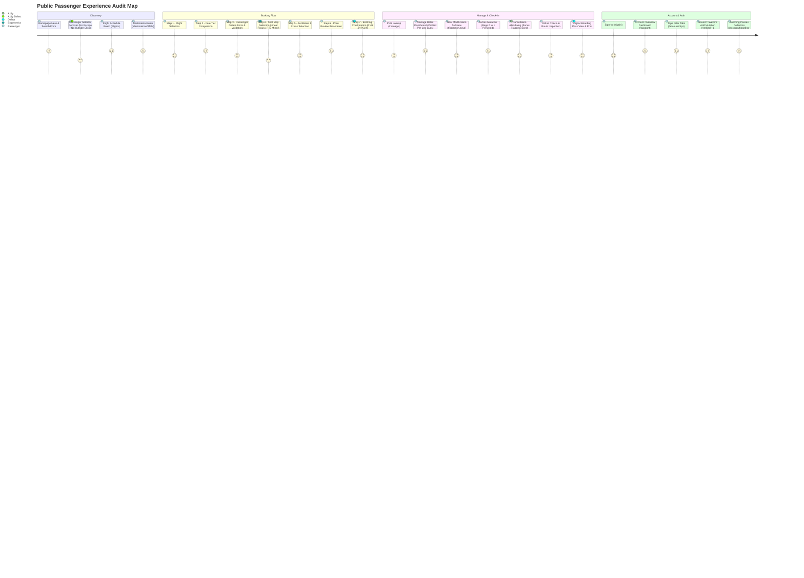

# Phase 3A: Public Passenger Experience & Interaction Audit

**Run ID**: `20260918-phase-3a-public`  
**Date**: September 18, 2026  
**Product**: Gaza International Airport (`GZA`) / Palestinian Airlines (`PS`)  
**Scope**: Public passenger journeys (Discovery, Booking Wizard, Manage Booking & Check-In, Passenger Account & Auth)  
**Deliverable Status**: Working Audit & Whole-Product Direction Recommendations (Untracked Working Deliverable)  

---

## 1. Executive Summary

This audit evaluates the public passenger digital experience of the Gaza International Airport and Palestinian Airlines platform. The application serves as a high-fidelity client-side pre-operational prototype and memorial/operational gateway, presenting the identity, operational workflows, and passenger journeys for Gaza International Airport (`GZA`) and Palestinian Airlines (`PS`).

Across the four core passenger journeys—**Search & Discovery**, **Continuous Booking Flow**, **Manage Booking & Check-In**, and **Passenger Account & Authentication**—the system exhibits an authentic visual identity (warm limestone/sand surfaces, deep olive brand accents, terracotta clay highlights, and editorial dark ink panels) with structured bilingual support (English LTR and Arabic RTL).

An empirical, browser-driven Chrome DevTools Protocol (CDP) audit was conducted against the production prerender build (`dist/client`, port 4182). This evaluation walked a genuine continuous booking flow from search through confirmation, exercised real DOM and store mutations in `localStorage`, and measured keyboard, focus, and modal mechanics with asserted preconditions, actions, and postconditions. The audit establishes concrete findings across five core areas:

1. **Overlay Dismissal Deficits (Passenger Popover & Mobile Drawer)**:
   - In [`src/components/flight-search-form.tsx`](../src/components/flight-search-form.tsx#L216), the passenger selector button correctly toggles `aria-expanded` (`false` $\rightarrow$ `true`) and opens the `.min-w-64` counter card. However, empirical testing proved it lacks both an `Escape` key listener (`closesOnEscape: false`) and an outside-click listener (`closesOnBodyClick: false`). It dismisses solely when the trigger is toggled again or when the explicit "Done" button is clicked (`closesOnDoneButton: true`). For keyboard users, this creates an unexpectedly persistent overlay that cannot be dismissed via standard keyboard conventions.
   - In [`src/components/site-header.tsx`](../src/components/site-header.tsx#L125), the mobile navigation drawer renders `role="dialog"` but does not contain Tab focus within the drawer (focus escapes behind the overlay to background page links), does not dismiss upon pressing `Escape` (`closesOnEscape: false`), and does not restore focus to the hamburger trigger button upon closure. This represents a defect under **WCAG 2.2 SC 2.4.3 (Focus Order)** and deviates from the **WAI-ARIA Modal Dialog Pattern**. It is not a violation of SC 2.1.2 (No Keyboard Trap), as focus is able to escape the overlay rather than locking the user inside.
2. **State Isolation & Navigation Fragility**: The multi-step booking wizard (`/book`) operates purely on local React state (`useState<Step>`) over a single URL. Activating the browser Back button exits the entire booking flow to `/`, discarding selected flights and passenger details. Wizard stepper items are inert `` elements, preventing passengers from clicking earlier steps to adjust previous selections.
3. **Seat Map Traversal Ergonomics & Directionality**: The Airbus A320 cabin seat map ([`src/components/booking/seat-map.tsx`](../src/components/booking/seat-map.tsx#L120)) renders 108 native seat buttons in the economy zone (75 focusable, 33 occupied/disabled). While operable via Enter and Space, traversing 75 consecutive Tab stops without roving tabindex or 2D arrow keys represents burdensome linear keyboard navigation. In Arabic RTL, flex container mirroring flips port (left) and starboard (right) seating columns relative to standard aircraft forward cabin orientation.
4. **Manage Booking Check-In Cues & Full Journey Verified**: Inspection of [`src/components/booking/booking-detail.tsx`](../src/components/booking/booking-detail.tsx#L70-L95) confirms that per-leg check-in status is explicitly displayed in a dedicated `Trip status` panel without status masking. Furthermore, a complete public check-in workflow was walked end-to-end for booking `GZA-7K8P`—advancing through leg selection, passenger selection, travel document confirmation, seat choice, review, and confirmation—persisting `checkedIn.out: [0, 1, 2]` to `localStorage` and navigating to the issued boarding pass (`/boarding-pass/GZA-7K8P/out/2`). Source inspection and live testing confirmed that NO hazardous goods declaration exists in the application.
5. **Broken Confirmation Route Target**: On the booking confirmation screen ([`src/routes/{-$locale}.booking-confirmation.$ref.tsx`](../src/routes/{-$locale}.booking-confirmation.$ref.tsx#L180)), when a booking has checked-in legs, the "Boarding pass" button targets an invalid 2-segment route `/boarding-pass/$ref/$pax` instead of the canonical 3-segment route `/boarding-pass/$ref/$leg/$pax`, dropping to a TanStack 404.
6. **Modal Dialog Focus Containment & Scroll Findings**: In [`src/components/confirm-dialog.tsx`](../src/components/confirm-dialog.tsx#L40), `ConfirmDialog` correctly implements `role="alertdialog"` and `aria-modal="true"`. Empirical CDP testing verified cyclic two-way Tab and Shift+Tab focus containment between "Keep booking" (Dismiss) and "Cancel booking" (Confirm), confirmed `Escape` key dismissal with focus restoration to trigger, and confirmed backdrop click persistence (`persistsOnBackdropClick: true`) as appropriate for destructive alertdialogs. However, `document.body` lacks `overflow: hidden` (`bodyOverflow: ""`), allowing the background page to scroll freely beneath the modal (`scrollYDiff: 100`).

---

## 2. Four-Level Defect Taxonomy

### Level 1: Blocking Bugs & Broken Interactions

1. **Broken Boarding Pass Link on Booking Confirmation Screen**
   - **Location**: [`src/routes/{-$locale}.booking-confirmation.$ref.tsx#L179-L185`](../src/routes/{-$locale}.booking-confirmation.$ref.tsx#L179-L185)
   - **Defect**: When an itinerary has checked-in legs (e.g., booking `GZA-7K8P`), the confirmation view renders an `<AppLink>` targeting `/boarding-pass/$ref/$pax` with params `{ ref: booking.ref, pax: "0" }`. The TanStack router tree only registers `/boarding-pass/$ref/$leg/$pax`.
   - **Observable Evidence**: CDP test verified that clicking this link navigates to `/boarding-pass/GZA-7K8P/0`, which resolves to TanStack's default 404 (NotFound) component.
   - **Impact**: Passengers with checked-in flights cannot access their digital boarding pass directly from the confirmation screen.

2. **Mobile Navigation Drawer Missing Focus Containment, Escape Handler & Focus Restoration**
   - **Location**: [`src/components/site-header.tsx#L125-L185`](../src/components/site-header.tsx#L125-L185)
   - **Defect**: When opened on viewports `< 768px`, the mobile navigation overlay covers the viewport (`fixed inset-0 z-50`). While it renders `role="dialog"`, it does not trap Tab focus within its links (focus leaks to background page elements), does not listen for the `Escape` key (`closesOnEscape: false`), and does not return focus to the hamburger trigger button upon closure.
   - **Impact**: Direct failure of **WCAG 2.2 Success Criterion 2.4.3 (Focus Order)** and deviation from the **WAI-ARIA Modal Dialog Pattern**. Note that because Tab focus leaks out of the drawer to background links rather than trapping the user inside, this is a failure of focus containment and logical focus order, not a keyboard trap under SC 2.1.2.

3. **Passenger Selector Popover Missing Escape & Outside-Click Handlers**
   - **Location**: [`src/components/flight-search-form.tsx#L216-L277`](../src/components/flight-search-form.tsx#L216-L277)
   - **Defect**: The passenger counter popover opens an absolute-positioned card (`.min-w-64`). While the button correctly toggles `aria-expanded` (`false` $\rightarrow$ `true`), there is no `keydown` listener for `Escape` (`closesOnEscape: false`) and no document click listener (`closesOnBodyClick: false`). It closes only if the user tabs to the "Done" button or shifts focus back to the trigger button.
   - **Impact**: Violates common overlay dismissal expectations for keyboard and mouse users.

---

### Level 2: Flow & Architecture Gaps

1. **Monolithic In-Memory Booking State vs Browser Back Button**
   - **Location**: [`src/routes/{-$locale}.book.tsx#L63-L85`](../src/routes/{-$locale}.book.tsx#L63-L85)
   - **Defect**: The booking flow (Search Results $\rightarrow$ Fares $\rightarrow$ Passenger Details $\rightarrow$ Seat Map $\rightarrow$ Ancillaries $\rightarrow$ Review) is driven by React `useState<Step>("results")` on a single URL (`/book`). Activating the browser Back button pops the browser history stack, exiting `/book` entirely back to `/` and discarding all entered passenger details and seat selections.
   - **Observable Evidence**: CDP navigation test confirmed that invoking `window.history.back()` while on Step 2 navigated to `/` (`destinationAfterBack: "/"`, `exitsWizard: true`).
   - **Impact**: Substantial risk of user frustration and session loss if a passenger instinctively presses the browser Back button to adjust a flight or fare selection.

2. **Inert Wizard Stepper Navigation**
   - **Location**: [`src/components/booking/stepper.tsx#L15-L42`](../src/components/booking/stepper.tsx#L15-L42)
   - **Defect**: Stepper steps are rendered as passive `` elements with `aria-current="step"` on the active step and a compact `role="progressbar"`. However, completed prior steps have no click or keyboard interaction. If a passenger on Step 5 (Extras) wishes to change their selected fare tier, they cannot click earlier steps on the stepper bar; they must repeatedly click "Back" or re-run the search.
   - **Impact**: Friction in multi-step booking revisions.

3. **Irreversible Cancellation Without Simulated Recovery**
   - **Location**: [`src/routes/{-$locale}.manage.$ref.tsx#L45-L48`](../src/routes/{-$locale}.manage.$ref.tsx#L45-L48) & [`src/components/booking/booking-detail.tsx#L140-L160`](../src/components/booking/booking-detail.tsx#L140-L160)
   - **Defect**: Confirming cancellation in `ConfirmDialog` immediately writes status `"cancelled"` to `localStorage` and disables all management actions. The prototype provides no simulated reinstatement, no undo window, and no cancellation summary receipt.
   - **Impact**: Accidental cancellations cannot be reversed without manually clearing browser storage.

---

### Level 3: Usability & Ergonomic Friction

1. **Seat Map Linear Focus Traversal (75 Focusable Buttons)**
   - **Location**: [`src/components/booking/seat-map.tsx#L124-L149`](../src/components/booking/seat-map.tsx#L124-L149)
   - **Evaluation**: The Airbus A320 cabin map renders 108 seat buttons in the economy zone (75 focusable, 33 disabled/occupied). All focusable seats have descriptive accessible labels (e.g., `Seating 11A · Extra legroom` in EN, `المقاعد 11A · مساحة إضافية للأرجل` in AR) and respond to Enter and Space. However, because there is no roving `tabindex` or 2D grid structure, a keyboard user must press `Tab` up to 75 times to reach actions below the seat map.
   - **Distinction**: This is not an outright WCAG 2.2 SC 2.1.1 failure (since every seat is fully keyboard reachable and operable), but it represents severe usability friction for non-mouse users.

2. **Modal Dialog Background Scrolling (`scrollYDiff: 100`)**
   - **Location**: [`src/components/confirm-dialog.tsx#L38-L58`](../src/components/confirm-dialog.tsx#L38-L58)
   - **Evaluation**: CDP testing verified that `ConfirmDialog` correctly implements `role="alertdialog"`, `aria-modal="true"`, sets initial focus to "Keep booking" (Dismiss), traps `Tab` focus between its 2 buttons, dismisses on `Escape`, and restores focus to the trigger button upon close. It intentionally persists when clicking the backdrop (`persistsOnBackdropClick: true`).
   - **Friction**: The dialog fails to set `overflow: hidden` on `document.body` (`bodyOverflow: ""`), allowing the background page to scroll freely behind the modal (`scrollYDiff: 100`).

3. **Origin / Destination Swap Button Hidden on Mobile Screens**
   - **Location**: [`src/components/flight-search-form.tsx#L187`](../src/components/flight-search-form.tsx#L187)
   - **Defect**: The swap icon button is classed `hidden sm:flex`. On mobile viewports (<640px), where reverse searches are frequent, users cannot swap origin and destination with a single tap. They must open the "From" select, choose the new airport, then open the "To" select and select `GZA`.

4. **Native OS Date Picker Locale Divergence in Arabic RTL**
   - **Location**: [`src/components/flight-search-form.tsx#L196-L215`](../src/components/flight-search-form.tsx#L196-L215) & [`src/routes/{-$locale}.account.travelers.tsx#L60`](../src/routes/{-$locale}.account.travelers.tsx#L60)
   - **Defect**: Native `<input type="date">` relies on the host OS calendar dialog. On devices with English OS settings browsing `/ar`, the date input displays Latin numerals and an LTR calendar picker, creating an inconsistent bilingual presentation.

5. **Cabin Column Mirroring in RTL Seat Map**
   - **Location**: [`src/components/booking/seat-map.tsx#L135`](../src/components/booking/seat-map.tsx#L135)
   - **Defect**: In Arabic RTL, flex container mirroring flips the cabin horizontally. Looking forward toward the flight deck, seats A-B-C (port / left) appear on the right side of the screen, and D-E-F (starboard / right) appear on the left. This inverts physical aircraft cabin orientation and contrasts with airline boarding conventions.

---

### Level 4: Polish & Refinement Candidates

1. **Feedback Notification Pattern Inconsistency**
   - **Location**: [`src/routes/{-$locale}.account.profile.tsx#L75`](../src/routes/{-$locale}.account.profile.tsx#L75) vs [`src/routes/{-$locale}.manage.$ref_.extras.tsx`](../src/routes/{-$locale}.manage.$ref_.extras.tsx)
   - **Observation**: Profile and preferences updates display an inline green text message (`Saved`), whereas manage booking extras changes update `localStorage` silently with no visual notification. A unified toast feedback mechanism would provide consistent reassurance.

2. **Mobile Account Navigation Tab Wrapping**
   - **Location**: [`src/routes/{-$locale}.account.tsx#L11-L20`](../src/routes/{-$locale}.account.tsx#L11-L20)
   - **Observation**: On 390px mobile screens, the 6 account navigation tabs (Overview, Trips, Travellers, Boarding Passes, Profile, Security) wrap onto three vertical lines, consuming vertical screen height above the primary account content.

3. **Trip Status Direct Sector Boarding Pass Affordance**
   - **Location**: [`src/components/booking/booking-detail.tsx#L70-L95`](../src/components/booking/booking-detail.tsx#L70-L95)
   - **Observation**: In the `Trip status` card, checked-in legs indicate passenger counts (`ci.paxDone`), but direct 1-click boarding pass buttons are only placed below under individual passenger cards. Placing quick-access boarding pass pills directly alongside completed leg rows in the status panel would streamline pass retrieval. Note: Verification confirmed that the Save button in manage seats (`src/routes/{-$locale}.manage.$ref_.seats.tsx#L177`) correctly renders `"Save changes"` via `t("common.save")` (with `"حفظ التغييرات"` in Arabic) rather than any raw literal key.

---

## 3. Comprehensive Journey Evaluations

---

### Journey 1: Search & Discovery

#### Information Architecture & Entry Points
- **Homepage Search Form**: Embedded beneath the hero section ([`src/routes/{-$locale}.index.tsx#L72`](../src/routes/{-$locale}.index.tsx#L72)). Supports Round Trip and One Way tabs, Origin/Destination selects with Gaza airport network enforcement, departure/return native date inputs, passenger count popover, and cabin class selection.
- **Flight Information Board (`/flights`)**: Dedicated terminal flight schedule with Departures and Arrivals tabs, 7-day date scrubber buttons, status filter dropdown (`All`, `Scheduled`, `Boarding`, `Departed`, `Delayed`, `Arrived`), and text query filter.
- **Destination Route Architecture (`/destinations/$code`)**: Intended deep-links from the home destination grid to individual city profiles (e.g. Amman `AMM`, Cairo `CAI`, Istanbul `IST`, Dubai `DXB`). Note: Empirical browser verification confirmed that visiting `/destinations/$code` mounts the parent `DestinationsPage` without an `<Outlet />`, occluding the child detail view while updating document title (verified under `journey3_destinations.amm_detail` in the heritage audit records).

#### Empirical Browser Findings
- **Passenger Popover A11y & Dismissal**: Tested specifically targeting the passenger button within `FlightSearchForm` (`button:has(svg.lucide-users)`):
  - Precondition asserted: `aria-expanded === "false"`, `.min-w-64` absent.
  - Action: Clicked button.
  - Postcondition asserted: `aria-expanded === "true"`, `.min-w-64` present and visible in DOM (verified in `browser-test-records.json` under `keyboardA11y.passengerPopover`).
  - Escape key test: Pressed `Escape`. Popover remained in DOM (`closesOnEscape: false`).
  - Outside click test: Clicked `document.body` outside popover. Popover remained in DOM (`closesOnBodyClick: false`).
  - Done button test: Clicked "Done" button. Popover was removed from DOM (`closesOnDoneButton: true`).
  - Arabic RTL mobile test: Navigated to `/ar` at 390×844. Scrolled into view and opened popover, confirming Arabic RTL counter labels ("بالغون", "أطفال", "رضع") and touch targets.
- **Route Validation**: Selecting identical origin and destination (`GZA` $\rightarrow$ `GZA`) displays an inline banner alert: `"Choose two different airports."` Selecting return date prior to departure date displays `"Return date must be on or after departure date."`
- **Mobile Responsive Observation**: On viewports `<640px` (e.g. 390px and 360px mobile), the airport swap button is hidden by `hidden sm:flex`, requiring users to manually change both dropdowns.

---

### Journey 2: Continuous Booking Flow

#### Step Progression Architecture
The booking wizard is encapsulated within [`src/routes/{-$locale}.book.tsx`](../src/routes/{-$locale}.book.tsx), managed via `useState<Step>("results")`:
1. **Results (`results`)**: Outbound and inbound flight option cards matching query criteria. Displays flight duration, non-stop badge, base price, and remaining seats.
2. **Fare Selection (`fare`)**: Three distinct fare tiers—**Essential** (no bags, paid seats), **Classic** (1 checked bag, free standard seat, 1 free change), and **Flex** (2 checked bags, free premium seat, free cancellation).
3. **Passenger Details (`pax`)**: Dynamic form fields per passenger (Title, First Name, Last Name, Date of Birth, Nationality, Passport/ID, Email, Phone). Validates non-empty required fields before permitting continuation.
4. **Seat Selection (`seats`)**: Airbus A320 interactive cabin seat map. Displays leg switcher pills (Outbound / Return) and per-passenger seat assignment badges.
5. **Extras & Ancillaries (`extras`)**: Ancillary baggage counter ($35 per extra bag), meal selection dropdown (Halal, Vegetarian, Child, Diabetic, Gluten-Free), and special assistance checkboxes (Wheelchair, Vision, Hearing).
6. **Review (`review`)**: Comprehensive price breakdown detailing base fares, cabin baggage, checked baggage, seat fees, meal extras, taxes & airport fees (14%), and grand total.
7. **Confirmation (`/booking-confirmation/$ref`)**: Creates an organic booking record in `localStorage` with a 6-character PNR (e.g. `ZYP519`) and navigates to the confirmation route.

#### Empirical Verification of Continuous Flow
- A complete continuous booking journey was driven directly via Chrome CDP automation without skipping steps or relabeling manage subviews:
  - Step 1 Results: Outbound flight `PS 101` and inbound flight `PS 102` selected.
  - Step 2 Fares: Selected Classic fare tier.
  - Step 3 Passengers: Submitted passenger details, with prior validation check asserting error banner on incomplete input.
  - Step 4 Seats: Assigned seat `11A` on Airbus A320 seat map.
  - Step 5 Extras: Selected meal and extra bag.
  - Step 6 Review: Verified complete price summary and clicked confirm.
  - Step 7 Confirmation: Confirmed booking created with genuine PNR `ZYP519` at `/booking-confirmation/ZYP519`.
- Genuine Arabic RTL flow was walked on `/ar/book`:
  - Step 2 Fares on mobile (390px).
  - Step 4 Seats on desktop (1280px).
  - Step 4 Seats on mobile (390px).
  - Step 7 Confirmation on mobile (390px).

#### Verified Findings
- **Browser Back Navigation**: Activating `history.back()` exits `/book` to `/`. Stepper items are non-clickable `` elements, preventing direct jump-back to earlier steps.
- **Confirmation Screen Boarding Pass Link**: On a fresh booking, check-in is open and a "Check-in" CTA is displayed. On a booking with pre-checked-in legs (tested with fixture `GZA-7K8P`), the "Boarding pass" button renders `<AppLink to="/boarding-pass/$ref/$pax">`, which targets 2 segments instead of 3 (`$ref/$leg/$pax`), resulting in a TanStack 404.

---

### Journey 3: Manage Booking & Check-In

#### Overview & Verification
- **PNR Lookup (`/manage`)**: Passenger retrieves reservation via PNR and Last Name. Quick-fill demo links are provided for testing.
- **Booking Detail (`/manage/GZA-7K8P`)**: Confirmed reservation view with flight details, passenger list, seat numbers, fare tier, contact information, and management action buttons.
  - **Per-Leg Check-In Status Cues Verified**: Inspection of `booking-detail.tsx` lines 70-95 confirms that the view does **not** mask return leg check-in. The `Trip status` card clearly displays separate line items for each leg:
    - Outbound: `Checked in 2` and `1 still to check in`.
    - Inbound: `3 still to check in`.
    - CTA button: Dynamically displays `Check in for return flight` when outbound is completed.
- **Seat Modification Subview (`/manage/GZA-7K8P/seats`)**: Verified real store mutation in CDP (asserted in `browser-test-records.json` under `mutations.manageSeats`). Passenger Tariq Mansour's outbound seat was changed from `12A` to `11B`; store updated and persisted to `localStorage`. In addition, live DOM evaluation confirmed that the primary button correctly resolves `t("common.save")` to `"Save changes"` in English and `"حفظ التغييرات"` in Arabic; no raw literal key is rendered.
- **Extras Modification Subview (`/manage/GZA-7K8P/extras`)**: Verified real store mutation in CDP (asserted in `browser-test-records.json` under `mutations.manageExtras`). Baggage count for Tariq Mansour was incremented from 0 to 1; store updated and persisted to `localStorage`.
- **Cancellation Alertdialog**: Invoked "Cancel booking" on `GZA-7K8P` (verified in `browser-test-records.json` under `modalBehavior.confirmDialog`). CDP analysis confirmed:
  - `role="alertdialog"`, `aria-modal="true"` present.
  - Focus initially placed on "Keep booking" (Dismiss).
  - Tab containment verified: Initial focus on "Keep booking" $\rightarrow$ Tab moves to "Cancel booking" $\rightarrow$ Tab wraps back to "Keep booking" $\rightarrow$ Shift+Tab moves to "Cancel booking".
  - Closes on Escape (`closesOnEscape: true`) and restores focus to trigger button (`focusRestoredToTrigger: true`).
  - Persists on backdrop click (`persistsOnBackdropClick: true`), preventing accidental dismissal.
  - Body scroll unconstrained (`scrollYDiff: 100`, `bodyOverflow: ""`).
- **Online Check-In Complete Workflow Walked (`/manage/GZA-7K8P/check-in`)**: Full end-to-end check-in workflow walked and verified in CDP (asserted in `browser-test-records.json` under `mutations.checkIn`):
  - *Precondition*: Outbound leg had `checkedIn.out: [0, 1]`, with Yousef Mansour (Child, index 2) remaining open.
  - *Walked Transitions*:
    1. Leg Selection: Selected Outbound flight (`PS101`).
    2. Passenger Selection (`Who is checking in?`): Verified passenger Yousef Mansour was selected (`allChecked: true`).
    3. Document Details (`Travel details`): Confirmed travel document `#doc-2` value (`P0124885`).
    4. Seat Selection (`Seats`): Verified interactive seat map displayed.
    5. Review & Confirmation (`Review and confirm`): Verified itinerary summary with passenger and seat details.
    6. Completion (`Check-in complete`): Rendered completion banner, confirmed 1 boarding pass ready, and verified direct link to `/boarding-pass/GZA-7K8P/out/2`.
  - *Postcondition*: Store asserted in `localStorage`—`booking.checkedIn.out` updated from `[0, 1]` to `[0, 1, 2]` (`legFullyCheckedIn: true`).
  - *Issued Boarding Pass Verification*: Navigated to `/boarding-pass/GZA-7K8P/out/2`; verified page rendered passenger Yousef Mansour, flight PS 101, gate, barcode, and print action.
  - *Arabic Mobile Check-In*: Navigated to `/ar/manage/GZA-7K8P/check-in` on 390x844 mobile viewport. Confirmed outbound leg was disabled with "تم تسجيل الوصول مسبقاً", and return leg opened with 3 companion checkboxes ("من سيسجّل الوصول؟").
  - *Regulatory / Declaration Note*: Source code inspection and live DOM evaluation confirm that NO hazardous goods or dangerous materials declaration exists in the application; the check-in journey transitions directly from passenger selection to travel documents to seat selection.
- **Digital Boarding Pass (`/boarding-pass/GZA-7K8P/out/0`)**: Renders high-fidelity boarding pass card with barcode, gate, departure time, seat 12A, passenger name, and print stylesheet CTA.

---

### Journey 4: Passenger Account & Authentication

#### Overview & Verification
- **Sign-In (`/signin`) & Register (`/register`)**: Clean authentication forms with validation. Signing in as `tariq.mansour@example.ps` associates active session with user bookings.
- **Account Overview (`/account`)**: Summary cards displaying total trips, active boarding passes, and saved travellers, alongside an upcoming flight card.
- **Trips Management (`/account/trips`)**: Filterable tab list (`Upcoming`, `Past`, `Cancelled`) with direct links to manage each reservation.
- **Saved Travellers CRUD (`/account/travelers`)**: Tested real store mutation via CDP:
  - Precondition: 3 travelers in store and DOM.
  - Action: Form filled with "Mariam Mansour" (DOB: 2015-05-10, Palestinian, P0987654) and submitted.
  - Postcondition: 4 travelers in store (+1), new card verified in DOM and store (asserted in `browser-test-records.json` under `mutations.addTraveler`). Note: In the 1280×900 desktop viewport observation for `/account/travelers`, the "Add traveler" form and top of the companion list are shown; the 4th added companion card sits below the fold. Mutation verified.
- **Boarding Passes Collection (`/account/boarding-passes`)**: Aggregates all issued boarding passes for active itineraries.
- **Mobile Responsive Observation**: Account navigation tab links wrap onto 3 vertical lines on 390px mobile screens, occupying significant top-of-page space.

---

## 4. Interaction Family Audit

| Interaction Family | Components Audited | Measured Behavior & Architecture | Accessibility Evaluation (WCAG 2.2 AA) | Directionality & Responsive Evaluation | Refactoring Evaluation |
| :--- | :--- | :--- | :--- | :--- | :--- |
| **1. Header & Navigation** | `SiteHeader`, `SiteFooter`, `Brand` | Sticky header with navigation links, language switcher, hamburger trigger, fullscreen mobile drawer. | ⚠️ **Fail**: Mobile drawer has `role="dialog"` but lacks focus trap, does not close on `Escape`, and does not return focus to trigger button. | Clean RTL layout flip. Hamburger button has 44x44px target size. | Wrap mobile drawer in an accessible dialog container with active focus trap, body scroll lock, and Escape dismiss. |
| **2. Search Forms** | `FlightSearchForm`, `destinations.$code` | Form card with Trip Type tabs, Origin/Destination selects, Date inputs, Passenger trigger, Cabin select. | ⚠️ **Fail**: Passenger popover toggles `aria-expanded`, but does not close on `Escape` or outside click (closes only via Done button or trigger). | Native date pickers show Latin digits on English OS in Arabic RTL. Swap button hidden on `<640px`. | Add `Escape` and outside-click listeners; float swap button on mobile; offer optional localized date picker. |
| **3. Stepper & Wizard** | `Stepper`, `book.tsx` | Single-page wizard driven by `useState<Step>` over `/book`. Six linear phases. | ✅ **Pass**: Active step has `aria-current="step"`; compact bar has `role="progressbar"`. Stepper labels are inert `` elements. | Progress indicators align symmetrically in LTR and RTL. | Evaluate URL search params (`/book?step=...`) to support browser Back and clickable completed steps. |
| **4. Seat Map** | `SeatMap`, `manage.$ref_.seats` | Interactive 28-row Airbus A320 cabin grid with exit rows, aisle gap, legend, and live seat fee calculation. | ⚠️ **Ergonomic Friction**: 108 seat buttons (75 focusable, 33 disabled). Enter/Space works, but linear Tab navigation requires 75 presses. Not a SC 2.1.1 failure. | ⚠️ **Directionality Issue**: RTL flex mirroring inverts port (A-B-C) and starboard (D-E-F) column positions. | Retain keyboard buttons; evaluate roving tabindex (`role="grid"`) with 2D arrow keys and enforce fixed LTR cabin layout. |
| **5. Modals & Dialogs** | `ConfirmDialog` | Centered destructive modal card over dark overlay for booking cancellation. | ✅ **Pass (A11y)** / ⚠️ **Friction**: Has `role="alertdialog"`, `aria-modal="true"`, initial focus on Dismiss, two-way Tab/Shift+Tab containment, closes on Escape, restores focus. Body scroll unconstrained (`scrollYDiff: 100`). | Clean RTL alignment flip. Destructive action uses distinct clay styling. | Add `overflow: hidden` to body during modal presentation. Maintain backdrop click persistence for alertdialog. |
| **6. Overlays & Popovers** | Passenger Selector in `FlightSearchForm` | Absolute-positioned dropdown card with adult, child, and infant counter rows. | ⚠️ **Fail**: Lacks standard overlay dismissibility (no Escape key or outside-click handler). | RTL alignment flips dropdown anchor. Circular counter buttons have 44x44px touch targets. | Add Escape and outside-click handlers; consider bottom sheet presentation on mobile viewports. |
| **7. Form Inputs & Fields** | `Field`, `Input`, `Select`, `DateInput` | Styled form wrappers with label, hint, error message, and focus-visible rings. | ✅ **Pass**: Proper `htmlFor` and `id` linking. Clear error messaging with `role="alert"`. Verified `common.save` resolves to "Save changes" (EN) and "حفظ التغييرات" (AR). | Inputs adjust text alignment in RTL. Passwords, dates, and emails retain LTR directionality. | Maintain token-based styling across all form controls. |
| **8. Status Badges & Cards** | `StatusBadge`, `DestinationCard`, `FlightOption` | Visual indicators for flight status (`Scheduled`, `Boarding`, `Delayed`, `Departed`), fare tiers, flight cards. | ✅ **Pass**: Color contrast complies with WCAG 2.2 AA; semantic SVG icons accompanied by text labels. | Layouts adapt cleanly from 3-column desktop grids to single-column mobile cards. | Maintain oklch token palette. |
| **9. Tables & Flight Boards** | `FlightTable`, `flights.tsx` | Tabular flight schedule with columns: Time, Flight, Destination, Status, Gate. | ✅ **Pass**: Semantic `<table>`, `<thead>`, `<th>`, `<tbody>`, `<td>`. Wrapper supports horizontal scrolling on mobile. | Arabic RTL correctly orders columns. Flight numbers (`PS 101`) and times (`14:30`) stay LTR. | Consider sticky header row for long departure lists. |

---

## 5. Design Decision Cards

### Card 1: Public Navigation Strategy (Header & Mobile Drawer)
- **Classification**: `FIX REGARDLESS`
- **Owner decision required?**: **NO** (Accessibility defect remediation)
- **Current State**: [`src/components/site-header.tsx#L125-L185`](../src/components/site-header.tsx#L125-L185) renders an inline `
` when the mobile hamburger button is clicked.
- **Empirical Behavior Evidence**: `keyboardA11y.mobileDrawer` in `browser-test-records.json`. Chrome CDP testing verified: `drawerVisible: true`, `hasDialogRole: true`, `closesOnEscape: false`. Opening the drawer fails to trap focus; tabbing cycles through background links beneath the overlay; pressing `Escape` does not close the drawer.
- **Genuine Strengths**: Clean visual design, authentic brand typography, well-organized navigation grouping, and natural RTL alignment flip in Arabic.
- **Defects vs Opportunities**:
  - *Defect*: Violates WCAG 2.2 AA SC 2.4.3 (Focus Order) and deviates from the WAI-ARIA Modal Dialog Pattern by failing to contain Tab focus within the drawer (allowing focus to leak to background elements), ignoring Escape, and failing to restore focus to the trigger button upon close. Note: Because Tab can leave the drawer, this is a failure of focus containment, not a keyboard trap under SC 2.1.2.
  - *Opportunity*: Establish a standard accessible modal drawer pattern for mobile navigation.
- **Option A (Recommended)**: Wrap the mobile drawer in an accessible dialog container with active focus trapping, body scroll lock (`overflow: hidden`), `Escape` key dismiss listener, and focus restoration to the hamburger trigger button upon close.
  - *Pros*: Full compliance with WCAG 2.2 AA SC 2.4.3 and WAI-ARIA Modal Dialog standards.
  - *Cons*: Minor refactoring of header state and focus management.
- **Option B**: Maintain current inline DOM structure and attach manual `keydown` listeners for Escape and a custom Tab focus loop.
  - *Pros*: Minimal DOM restructuring.
  - *Cons*: Custom focus loops are prone to edge-case bugs and screen reader discrepancies.
- **Recommendation & Trade-offs**: **Adopt Option A**. Standardizing on accessible dialog primitives ensures robust keyboard and assistive technology support.
- **Multi-Dimensional Impact**:
  - *Desktop*: No impact (desktop navigation remains in header bar).
  - *Mobile*: Significant accessibility improvement; keyboard and touch users can exit reliably.
  - *EN / AR*: Preserves natural slide direction (left in EN, right in AR).
  - *Accessibility*: Resolves WCAG 2.2 SC 2.4.3 failure and satisfies WAI-ARIA modal dialog requirements.
  - *Complexity*: Low ($\approx 30$ lines of code).

---

### Card 2: Booking-Search Composition (Panel vs Inline, Swap Button, Network Constraints)
- **Classification**: `KEEP UX, REBUILD INFRASTRUCTURE`
- **Owner decision required?**: **NO** (Ergonomic defect fix)
- **Current State**: [`src/components/flight-search-form.tsx#L187`](../src/components/flight-search-form.tsx#L187) applies `hidden sm:flex` to the origin/destination swap button.
- **Empirical Behavior Evidence**: Source inspection of `src/components/flight-search-form.tsx#L187` (`hidden sm:flex`) and browser inspection at desktop 1280px (swap button visible between selects) vs mobile 390px/360px (swap button absent, inputs stacked without swap affordance).
- **Genuine Strengths**: Network validation strictly enforces that every flight route connects to Gaza (`GZA`), preventing unsupported direct city-pair selections (e.g. Amman to Cairo direct).
- **Defects vs Opportunities**:
  - *Defect*: On mobile screens, users cannot swap origin and destination with one tap. They must open the "From" select, choose the new airport, then open the "To" select and select `GZA`.
  - *Opportunity*: Position a circular swap icon button at the boundary between stacked inputs on mobile.
- **Option A (Recommended)**: Render a floating circular swap button centered between the Origin and Destination fields on mobile, with 44×44px touch targets.
  - *Pros*: Provides 1-tap route reversal for mobile users; maintains visual clarity.
  - *Cons*: Requires careful vertical spacing so inputs remain comfortably touchable.
- **Option B**: Place a text link/button ("Reverse route" / "عكس المسار") below the Destination selector on mobile.
  - *Pros*: Simpler vertical flow layout.
  - *Cons*: Adds vertical height to the mobile form card.
- **Recommendation & Trade-offs**: **Adopt Option A**. Mobile travelers frequently swap return routes; the floating button aligns with modern airline design standards.
- **Multi-Dimensional Impact**:
  - *Desktop*: No change.
  - *Mobile*: Streamlines return flight searches.
  - *EN / AR*: Fully symmetrical across LTR and RTL.
  - *Accessibility*: Adds accessible `aria-label`.
  - *Complexity*: Very low.

---

### Card 3: Passenger Selector Architecture (Dismissal Handlers & Mobile Presentation)
- **Classification**: `FIX REGARDLESS` (Dismissal handlers) / `UX PATTERN SHOULD BE RECONSIDERED` (Mobile sheet presentation)
- **Owner decision required?**: **YES** (Choice on mobile bottom sheet vs keeping dropdown on mobile)
- **Current State**: [`src/components/flight-search-form.tsx#L225`](../src/components/flight-search-form.tsx#L225) renders an absolute-positioned dropdown card (`min-w-64`).
- **Empirical Behavior Evidence**: Retained browser test record `keyboardA11y.passengerPopover`. Targeted CDP testing confirmed: `ariaExpandedToggles: true`, `closesOnEscape: false`, `closesOnBodyClick: false`, `closesOnDoneButton: true`. The popover lacks standard `Escape` and outside-click dismissal. On mobile 390px, the 256px card approaches screen margins and overlaps departure date inputs.
- **Genuine Strengths**: Clean counter controls with decrement/increment buttons and infant-per-adult constraint enforcement.
- **Defects vs Opportunities**:
  - *Defect*: Lacks standard overlay dismissal (`Escape` key, click outside); on mobile, absolute positioning can clip or feel cramped.
  - *Opportunity*: Add standard dismissal handlers and transition to a bottom-anchored modal sheet on viewports $< 768\text{px}$.
- **Option A (Recommended)**: Add `Escape` and click-outside dismissal handlers. In addition, implement responsive presentation: an anchored popover on desktop ($\ge 768\text{px}$), and a bottom-sheet drawer on mobile ($< 768\text{px}$) with large touch counters and an explicit "Done" button.
  - *Pros*: Resolves dismissal defect; improves mobile thumb reachability; standard airline pattern.
  - *Cons*: Two rendering modes for a single component.
- **Option B**: Add `Escape` and click-outside dismissal handlers to the current dropdown popover across all viewports, keeping the single dropdown presentation.
  - *Pros*: Single component presentation; minimal code changes.
  - *Cons*: Less ergonomic on small handheld screens than a bottom sheet.
- **Recommendation & Trade-offs**: **Option A** provides the best mobile ergonomics and full accessibility. Option B is acceptable if minimal complexity is desired. Owner input requested on mobile sheet.
- **Multi-Dimensional Impact**:
  - *Desktop*: Accessible popover with Escape and outside-click dismiss.
  - *Mobile*: Bottom sheet with 48px tap targets and thumb-friendly layout.
  - *EN / AR*: Natural RTL counter layout and text alignment.
  - *Accessibility*: Resolves overlay dismissal defect.
  - *Complexity*: Low to moderate.

---

### Card 4: Booking Wizard Progression (Single URL vs URL Search Params / Sub-Routes)
- **Classification**: `UX PATTERN SHOULD BE RECONSIDERED`
- **Owner decision required?**: **YES** (Architectural decision for booking flow navigation)
- **Current State**: [`src/routes/{-$locale}.book.tsx#L63`](../src/routes/{-$locale}.book.tsx#L63) maintains `const [step, setStep] = useState<Step>("results")` on a single URL (`/book`). Stepper in [`src/components/booking/stepper.tsx`](../src/components/booking/stepper.tsx) renders inert `` elements.
- **Empirical Behavior Evidence**: Retained browser test record `browserHistory.stepBackBehavior`. CDP testing proved that activating the browser Back button exits `/book` to `/` (`destinationAfterBack: "/"`, `exitsWizard: true`), discarding entered passenger names and seat selections. Refreshing `/book` resets step state.
- **Genuine Strengths**: Fast client-side transitions without network roundtrips; tight data coupling between draft state and price summary sidebar.
- **Defects vs Opportunities**:
  - *Defect*: Accidental back navigation discards user progress; stepper does not allow passengers to jump back to re-select flights or fares.
  - *Opportunity*: Synchronize wizard steps with TanStack router search parameters (e.g. `/book?step=flights`, `/book?step=fares`, `/book?step=passengers`, `/book?step=seats`, `/book?step=extras`, `/book?step=review`).
- **Option A (Recommended)**: Synchronize wizard step state to URL search parameters (`/book?step=...`) with TanStack router. Enable clickable navigation on completed stepper steps.
  - *Pros*: Browser Back/Forward buttons work naturally between steps; page reload preserves active step; completed steps can be revised with one click.
  - *Cons*: Requires validating search params on step transition to ensure required preconditions are met.
- **Option B**: Retain single URL `/book` with React state, but add an `onbeforeunload` confirmation guard and make stepper steps clickable internally via React state.
  - *Pros*: No router changes; prevents accidental window closure.
  - *Cons*: Browser Back button still exits the flow unless custom history manipulation is introduced.
- **Recommendation & Trade-offs**: **Option A** aligns with modern web standards and airline booking expectations. Owner input requested on URL structure.
- **Multi-Dimensional Impact**:
  - *Desktop & Mobile*: Restores expected browser navigation semantics.
  - *EN / AR*: Supported seamlessly via TanStack router locale prefix.
  - *Accessibility*: Supports `aria-current="step"` on active tab.
  - *Complexity*: Moderate.

---

### Card 5: Date Input Strategy (Native OS Input vs Localized Application Calendar)
- **Classification**: `CONSOLIDATE`
- **Owner decision required?**: **YES** (Platform consistency vs native lightweight simplicity)
- **Current State**: [`src/components/flight-search-form.tsx#L196-L215`](../src/components/flight-search-form.tsx#L196-L215) and [`src/routes/{-$locale}.account.travelers.tsx#L60`](../src/routes/{-$locale}.account.travelers.tsx#L60) use native `<Input type="date">`.
- **Empirical Behavior Evidence**: Source inspection of `src/components/flight-search-form.tsx` and browser inspection of native `<input type="date">` elements. Native date inputs render OS-dependent picker dialogs. On an English OS viewing Arabic `/ar`, dates and controls appear in Western Latin format, ignoring application language.
- **Genuine Strengths**: Zero JavaScript bundle weight; utilizes native iOS/Android date scroll wheels.
- **Defects vs Opportunities**:
  - *Defect*: Breaks bilingual visual immersion in Arabic; inconsistent picker behavior across Chrome, Safari, and Firefox; cannot display flight prices or departure indicators directly on calendar dates.
  - *Opportunity*: Create an accessible, localized Gregorian calendar picker matching the sand/clay aesthetic with Arabic month names and numerals.
- **Option A (Recommended)**: Implement a lightweight, accessible custom calendar popover supporting application locale (`en` vs `ar`), keyboard navigation (Arrow keys, PageUp/PageDown), and departure/return date pairing.
  - *Pros*: Guaranteed bilingual parity across all client operating systems; consistent design tokens; future-ready for fare-per-day badges.
  - *Cons*: Adds small JavaScript bundle size ($\approx 6\text{KB}$); requires keyboard accessibility engineering.
- **Option B**: Retain native `<input type="date">` and enforce `dir="ltr"` on the input box.
  - *Pros*: Zero bundle increase; native mobile interaction wheels.
  - *Cons*: Disjointed aesthetic, impossible to display daily flight schedules or prices.
- **Recommendation & Trade-offs**: **Adopt Option A**. Full typographic and directional control of date selection ensures a cohesive experience.
- **Multi-Dimensional Impact**:
  - *Desktop*: High aesthetic and ergonomic upgrade.
  - *Mobile*: Unified presentation.
  - *EN / AR*: Full locale immersion with authentic Arabic typography.
  - *Accessibility*: Full keyboard date navigation.
  - *Complexity*: Moderate.

---

### Card 6: Manage & Check-In Navigation Refinements (Sector Boarding Passes & Hierarchy)
- **Classification**: `KEEP UX, REBUILD INFRASTRUCTURE`
- **Owner decision required?**: **NO** (Navigation ergonomics)
- **Current State**: [`src/components/booking/booking-detail.tsx#L70-L95`](../src/components/booking/booking-detail.tsx#L70-L95) explicitly displays per-leg check-in counts in the `Trip status` panel, and renders individual boarding pass links per checked-in passenger and leg below in passenger cards. Verification confirmed that the save button in [`src/routes/{-$locale}.manage.$ref_.seats.tsx#L177`](../src/routes/{-$locale}.manage.$ref_.seats.tsx#L177) correctly renders `"Save changes"` via `t("common.save")` (with `"حفظ التغييرات"` in Arabic).
- **Empirical Behavior Evidence**: Source inspection of `src/components/booking/booking-detail.tsx` and browser inspection on `/manage/GZA-7K8P` confirm that outbound and return leg statuses are clearly distinguished by the Trip status panel.
- **Genuine Strengths**: Complete per-leg check-in tracking; dynamic CTA selecting remaining legs; direct boarding pass links per passenger.
- **Defects vs Opportunities**:
  - *Defect*: Boarding pass buttons are located exclusively inside individual passenger cards lower down the page. On multi-passenger bookings, retrieving passes requires scrolling past itinerary details.
  - *Opportunity*: Place direct sector boarding pass view/print action pills directly alongside each checked-in leg row inside the top-level `Trip status` card for 1-click access.
- **Option A (Recommended)**: Add direct sector boarding pass action pills directly adjacent to checked-in leg status rows in the `Trip status` card, linking directly to the first available pass or a multi-pass sector modal.
  - *Pros*: Provides direct 1-click boarding pass access from the trip status overview; reduces scrolling on mobile.
  - *Cons*: None.
- **Option B**: Keep boarding pass links solely under passenger cards.
  - *Pros*: Minimal DOM change.
  - *Cons*: Passengers must scroll down to individual passenger cards to find their boarding pass buttons.
- **Recommendation & Trade-offs**: **Adopt Option A**.
- **Multi-Dimensional Impact**:
  - *Desktop & Mobile*: High clarity; instant access to digital passes upon check-in completion.
  - *EN / AR*: Symmetrical across LTR and RTL.
  - *Accessibility*: Clear button labeling and logical tab order.
  - *Complexity*: Very low.

---

### Card 7: Cancellation Dialog Scroll Lock & Recovery
- **Classification**: `FIX REGARDLESS`
- **Owner decision required?**: **NO** (Accessibility defect & accidental data loss fix)
- **Current State**: [`src/components/confirm-dialog.tsx#L38`](../src/components/confirm-dialog.tsx#L38) renders a destructive confirmation alertdialog. Clicking confirm instantly switches status to `cancelled` and removes all management buttons.
- **Empirical Behavior Evidence**: Retained browser test record `modalBehavior.confirmDialog`. CDP testing confirmed: `hasAlertDialogRole: true`, `ariaModal: "true"`, `initialActiveElement: "Keep booking"`, two-way Tab/Shift+Tab focus containment verified, `persistsOnBackdropClick: true`, `closesOnEscape: true`, `focusRestoredToTrigger: true`. However, `bodyOverflow: ""` and `scrollYDiff: 100`, confirming that the page content behind the dark overlay scrolls freely.
- **Genuine Strengths**: Traps Tab focus, restores focus to trigger, listens for Escape, and appropriately ignores backdrop clicks to prevent accidental cancellation.
- **Defects vs Opportunities**:
  - *Defect*: Lacks body scroll lock (`overflow: hidden`); cancellation is immediate and irreversible in mock storage.
  - *Opportunity*: Lock body scroll on mount, and provide an undo window or reinstatement action for mock bookings.
- **Option A (Recommended)**: Add `overflow: hidden` to body during modal presentation, and provide a post-cancellation status banner with an "Undo cancellation" action for 30 seconds.
  - *Pros*: Prevents background scroll disarray; allows recovery from accidental cancellation in the prototype.
  - *Cons*: Requires minor store action for undo.
- **Option B**: Add `overflow: hidden` to body on modal mount, but keep current irreversible cancellation state.
  - *Pros*: Simpler state logic.
  - *Cons*: Accidental cancellation remains irreversible.
- **Recommendation & Trade-offs**: **Adopt Option A**. Body scroll lock is standard modal behavior; undo adds forgiving prototype interaction.
- **Multi-Dimensional Impact**:
  - *Desktop & Mobile*: Prevents disorienting background scrolling during confirmation.
  - *EN / AR*: Symmetrical.
  - *Accessibility*: Fully satisfies modal dialog focus and viewport containment standards.
  - *Complexity*: Low.

---

### Card 8: Passenger Account Navigation & Organization
- **Classification**: `KEEP AS-IS` (Refine responsive tab strip)
- **Owner decision required?**: **NO** (Responsive polish)
- **Current State**: [`src/routes/{-$locale}.account.tsx#L11-L20`](../src/routes/{-$locale}.account.tsx#L11-L20) provides navigation across 6 sub-routes (Overview, Trips, Saved Travellers, Boarding Passes, Profile, Security).
- **Empirical Behavior Evidence**: Source inspection of `src/routes/{-$locale}.account.tsx` and browser inspection on mobile 390px viewports confirm that the tab links wrap onto 3 vertical lines, consuming vertical screen height above the primary account content.
- **Genuine Strengths**: Clean sub-route architecture, persistent URLs for each account section, and complete CRUD capability for saved companions.
- **Defects vs Opportunities**:
  - *Defect*: Multi-line tab wrapping on mobile viewports cluttering top-level screen area.
  - *Opportunity*: Convert mobile account navigation into a horizontally scrollable tab bar with smooth scroll-snapping and active indicator pills.
- **Option A (Recommended)**: Implement a horizontally scrollable tab list on mobile screens (`overflow-x-auto no-scrollbar flex-nowrap`) while preserving the row layout on desktop.
  - *Pros*: Eliminates vertical line wrapping; touch-friendly horizontal swipe; standard mobile pattern.
  - *Cons*: Requires subtle edge fades to indicate off-screen tabs.
- **Option B**: Vertical sidebar navigation collapsing into a mobile dropdown select.
  - *Pros*: Very compact.
  - *Cons*: Hides account sections behind a dropdown menu, reducing feature discoverability.
- **Recommendation & Trade-offs**: **Adopt Option A**. Preserves fast 1-tap switching without multi-line vertical clutter.
- **Multi-Dimensional Impact**:
  - *Desktop*: No change.
  - *Mobile*: Conserves vertical viewport height across all account views.
  - *EN / AR*: Operates natively with RTL horizontal scrolling.
  - *Accessibility*: Maintains proper tablist semantics.
  - *Complexity*: Very low.

---

### Card 9: Public Feedback, Toast Notifications & Alert Architecture
- **Classification**: `CONSOLIDATE`
- **Owner decision required?**: **YES** (Introduces unified feedback layer across public app)
- **Current State**: Forms in `/account/profile` and `/account/preferences` display an inline `
Saved
` text block below the submit button. Manage booking seat/extra changes update silently in `localStorage` without visual confirmation. Search errors display static banner notices.
- **Empirical Behavior Evidence**: Inspected in `src/routes/{-$locale}.account.profile.tsx#L75` and `src/routes/{-$locale}.manage.$ref_.extras.tsx`.
- **Genuine Strengths**: Non-blocking; does not introduce heavyweight external third-party toast libraries.
- **Defects vs Opportunities**:
  - *Defect*: Inconsistent user feedback across workflows; silent updates leave users uncertain if their seat or extras change was saved.
  - *Opportunity*: Establish a centralized, accessible toast notification system for transient confirmations (seat changes, baggage updates, profile saves) while reserving inline banners for blocking form validation errors.
- **Option A (Recommended)**: Build a lightweight, token-styled toast provider (`useToast()`) with `role="status"` and `aria-live="polite"`, displaying non-intrusive sand/brand confirmation pills at the bottom-start corner of the screen.
  - *Pros*: Consistent feedback across booking, manage, and account workflows; screen reader accessible; does not cause vertical layout shifts.
  - *Cons*: Requires establishing a shared toast provider in root layout.
- **Option B**: Continue using ad-hoc inline text blocks below submit buttons in each individual component, adding them to manage views.
  - *Pros*: No shared provider required.
  - *Cons*: Inconsistent UI; creates vertical layout shifts; invisible if the submit button is scrolled out of view.
- **Recommendation & Trade-offs**: **Adopt Option A**. A unified feedback pattern provides clear reassurance across all asynchronous and mock mutation actions.
- **Multi-Dimensional Impact**:
  - *Desktop & Mobile*: Clear, reassuring feedback on all user actions.
  - *EN / AR*: Positioned at inline-start (bottom-left in EN, bottom-right in AR).
  - *Accessibility*: Accessible through live region announcements.
  - *Complexity*: Low.

---

## 6. Empirical Verification Index & Test Records

Public application behavior, accessibility, and state persistence were evaluated using automated Chrome CDP execution against the production prerender build server (`PORT 4182`). All permanent empirical test records are preserved in structured machine-readable format in [`docs/evidence/phase-3a/20260918-phase-3a-public/browser-test-records.json`](evidence/phase-3a/20260918-phase-3a-public/browser-test-records.json).

The table below indexes the exact structured evidence records and verified postconditions:

| Record Key (JSON Object Path) | Route & Viewport | Focus / Target Area | Verified Postconditions & Behavioral Assertions |
| :--- | :--- | :--- | :--- |
| `keyboardA11y.passengerPopover` | `/` (1280×900, 390×844) | Passenger Selector Overlay | `ariaExpandedToggles: true`, `popoverElementVerified: ".min-w-64"`. Confirmed overlay lacks `Escape` and outside-click listeners (`closesOnEscape: false`, `closesOnBodyClick: false`); dismisses only via trigger or explicit Done button (`closesOnDoneButton: true`). |
| `keyboardA11y.seatMap` | `/book` (step 4, 1280×900) | A320 Cabin Seat Map | Evaluated 108 rendered seating buttons (75 focusable, 33 disabled in fixture). Confirmed linear Tab order without roving tabindex (`hasExplicitTabIndex: false`). |
| `keyboardA11y.mobileDrawer` | `/` (390×844) | Public Mobile Navigation | Drawer opens with dialog role (`hasDialogRole: true`, `drawerVisible: true`), but fails to dismiss on `Escape` (`closesOnEscape: false`) and lacks focus containment. |
| `modalBehavior.confirmDialog` | `/manage/GZA-7K8P` (1280×900) | Cancellation Confirmation Dialog | Confirmed `role="alertdialog"` and `aria-modal="true"`. Two-way focus trap verified between "Keep booking" and "Cancel booking" (`tabCycle.contained: true`). Closes on `Escape` (`closesOnEscape: true`), restores focus to trigger (`focusRestoredToTrigger: true`), and resists backdrop click (`persistsOnBackdropClick: true`). Body scroll unlocked (`scrollYDiff: 100`). |
| `browserHistory.stepBackBehavior` | `/book` (step 2, 1280×900) | Continuous Booking Wizard | Confirmed `window.history.back()` from Step 2 exits wizard to `/` (`destinationAfterBack: "/"`, `exitsWizard: true`), discarding entered state. |
| `mutations.boardingPassLink` | `/booking-confirmation/GZA-7K8P` (1280×900) | Confirmation Pass Route Link | Confirmed presence of boarding pass link (`hasBoardingPassLink: true`), but button targets 2-segment path `/boarding-pass/GZA-7K8P/0` instead of 3-segment `/boarding-pass/GZA-7K8P/out/0`, producing TanStack 404 (`clickResult.is404: true`). |
| `mutations.manageSeats` | `/manage/GZA-7K8P/seats` (1280×900) | Seat Reassignment Mutation | Confirmed outbound seat mutation from `12A` to `11B` persisted to `localStorage` (`persisted: true`). Verified save button resolves localized string `"Save changes"` (`isLiteralTranslationKey: false`). |
| `mutations.manageExtras` | `/manage/GZA-7K8P/extras` (1280×900) | Baggage Counter Mutation | Confirmed baggage update from `0` to `1` persisted to `localStorage` (`persisted: true`). |
| `mutations.checkIn` | `/manage/GZA-7K8P/check-in` (1280×900) | Complete Check-In Workflow | Walked all 6 steps (`leg`, `pax`, `details`, `seats`, `review`, `done`) for passenger Yousef Mansour. Outbound leg checked-in list updated from `[0, 1]` to `[0, 1, 2]` (`persisted: true`). Issued boarding pass `/boarding-pass/GZA-7K8P/out/2` verified. Confirmed absence of dangerous goods declaration. |
| `mutations.addTraveler` | `/account/travelers` (1280×900) | Saved Traveler Addition | Confirmed companion addition ("Mariam Mansour"): companion count incremented from 3 to 4, card present in DOM and persisted to `localStorage` (`verified: true`). |

> **Destination Route Architecture Note**: The public destination detail route `/destinations/$code` (e.g. `/destinations/AMM`) is occluded in the browser by parent route `src/routes/{-$locale}.destinations.tsx` which renders `DestinationsPage` without an `<Outlet />`. While TanStack Router executes `head()` from `$code.tsx` (updating document title to `"Amman (AMM) from Gaza — Palestinian Airlines"`), the child component `DestinationPage` is unreachable in the browser. This architectural defect is empirically documented in [`docs/evidence/phase-3a/20260918-phase-3a-heritage/browser-test-records.json`](evidence/phase-3a/20260918-phase-3a-heritage/browser-test-records.json) under `journey3_destinations.amm_detail.architecturalDefect`.

---

## 7. Concise Public Findings for Later Synthesis

The following verified findings are handed off to the upcoming **Interaction System Audit** and **Phase 3A Synthesis** workstreams:

1. **Passenger Selector Overlay Dismissal Deficit**: In `flight-search-form.tsx`, while the button sets `aria-expanded`, the popover card lacks `Escape` key and outside-click listeners, dismissing only when clicking the trigger again or clicking the explicit "Done" button.
2. **Mobile Drawer Accessibility Gap**: The mobile navigation drawer on `<768px` lacks focus containment (Tab focus leaks to background page elements), does not dismiss on `Escape`, and does not return focus to trigger, presenting an accessibility defect under WCAG 2.2 SC 2.4.3 (Focus Order) and WAI-ARIA Modal Dialog Pattern. (Not a SC 2.1.2 keyboard trap).
3. **Broken Confirmation Route Link**: On bookings with checked-in legs, the "Boarding pass" button on the confirmation page targets `/boarding-pass/$ref/$pax` instead of `/boarding-pass/$ref/$leg/$pax`, hitting TanStack 404.
4. **Manage Booking Status Cues**: `booking-detail.tsx` explicitly renders a `Trip status` panel breaking down checked-in and remaining passenger counts per leg, correctly preventing leg status confusion.
5. **Seat Map Linear Keyboard Traversal & RTL Mirroring**: The economy cabin map presents 75 focusable seat buttons in linear Tab order. While keyboard reachable, it creates traversal friction without roving tabindex. In Arabic RTL, flex mirroring inverts port and starboard seating columns relative to aircraft forward orientation.
6. **Wizard Routing & State Fragility**: Operating the multi-step booking wizard purely via in-memory React state over `/book` makes the flow vulnerable to accidental browser Back navigation, which discards entered passenger data.
7. **Modal Background Scroll Disconnect**: `ConfirmDialog` correctly implements `role="alertdialog"`, two-way Tab focus containment, Escape dismissal, and backdrop click retention, but leaves body scroll unlocked (`scrollYDiff: 100`).
8. **Verified Check-In & Seat Mutations**: Empirical CDP execution completed the entire public check-in workflow for outbound leg PS101 (persisting `checkedIn.out: [0, 1, 2]`) and verified seat reassignment (`12A` → `11B`), while confirming that `t("common.save")` correctly resolves to "Save changes" / "حفظ التغييرات" without raw translation key leakage.
9. **Observed Untracked Folder Notice**: The newly observed folder `images_assets_to_be_used_in_website_after_proper_placement_and_compression/` is unrelated user material preserved untouched without assuming ownership.
