# Relational Data Model & Concurrency Specification

Status: Phase 12 design complete / awaiting independent GitHub review
**Date**: 2026-10-09
**Database Engine**: PostgreSQL 17
**Schema Version**: `1.0.0` (Targeting Phase 13 Foundation)

---

## 1. Entity-Relationship Overview (ERD)

```mermaid
erDiagram
    %% IDENTITY, SESSIONS & CREDENTIALS
    users ||--o{ passenger_profiles : "has"
    users ||--o{ saved_travelers : "manages"
    users ||--o{ bookings : "owns"
    users ||--o{ passenger_sessions : "maintains"
    users ||--o{ user_email_verifications : "receives_verification"
    users ||--o{ user_password_resets : "receives_reset"
    users ||--o{ booking_claim_proofs : "claims"

    staff_users ||--o{ flight_overrides : "creates"
    staff_users ||--o{ contact_notes : "writes"
    staff_users ||--o{ content_revisions : "authors"
    staff_users ||--o{ site_settings : "manages"
    staff_users ||--o{ staff_sessions : "maintains"
    staff_users ||--o{ staff_pending_auth : "authenticates_preauth"
    staff_users ||--o{ staff_invitations : "receives_invitation"
    staff_users ||--o{ staff_password_resets : "receives_reset"
    staff_users ||--o{ staff_mfa_credentials : "configures_mfa"
    staff_users ||--o{ staff_mfa_recovery_codes : "holds"
    staff_directory_control ||--o{ staff_users : "locks_sentinel"

    %% AVIATION REFERENCE & OPERATIONS
    airports ||--o{ schedules : "origin/dest"
    aircraft ||--o{ seat_layouts : "configured_with"
    aircraft ||--o{ schedules : "assigned_to"
    schedules ||--o{ dated_services : "materializes"
    dated_services ||--o{ flight_overrides : "receives"
    dated_services ||--o{ capacity_hold_items : "holds_capacity"
    dated_services ||--o{ booking_legs : "satisfies"

    %% COMMERCIAL CATALOG
    fare_products ||--o{ bookings : "selected_fare"
    commercial_options ||--o{ booking_passenger_extras : "selected_extra"

    %% BOOKING & PASSENGER CORE
    bookings ||--|{ booking_legs : "contains"
    bookings ||--|{ booking_passengers : "includes"
    booking_legs ||--|{ booking_leg_passengers : "allocates"
    booking_passengers ||--|{ booking_leg_passengers : "assigned_to"
    booking_passengers ||--o{ booking_passenger_extras : "purchases"
    bookings ||--o{ payment_intents : "paid_by"
    payment_intents ||--o{ payment_refunds : "refunds"
    bookings ||--o{ booking_guest_challenges : "challenged_by"
    bookings ||--o{ booking_guest_grants : "grants_access"
    bookings ||--o{ booking_claim_proofs : "proven_for"
    bookings ||--o{ booking_receipt_grants : "receipt_confirmed_by"

    %% CMS, ARCHIVE & MEDIA
    content_documents ||--|{ content_revisions : "has"
    static_releases ||--|{ static_release_memberships : "contains"
    media_assets ||--o{ archive_records : "illustrates"
    archive_sources ||--o{ archive_records : "evidences"

    %% CONTACT & INBOX
    contact_messages ||--o{ contact_notes : "annotated_by"
    contact_messages ||--o{ contact_replies : "replied_with"
```

---

## 2. Relational Entity Dictionary

### 2.1 Identity, access and passenger metadata

identity-lifecycle.v1.json defines all 20 identity tables, columns, nullability, FK targets, unique keys and CHECK expressions. PostgreSQL migrations are Phase 13 work. Direct purpose/realm proof tables replace polymorphic identity_tokens. Ten server permissions and admin/editor/viewer mappings preserve src/lib/admin.ts; see auth-rbac.md. No mock credential seed.

Current staff MFA pointer is nullable for invitation/enrollment. Insert staff with NULL mfa_version, create staged credential, then set the composite FK pointer under staff_directory_control sentinel lock. Never disable FK enforcement. Hash session lookup keys; encrypt payloads. Anonymous session rows have no principal. Full session validity requires exact principal/realm/epoch, active verified account, expiry and unrevoked authority; staff also requires confirmed current MFA.

passenger_profiles: user_id UUID PK/FK users; first/last names and phone TEXT; nullable seat/meal preferences; newsletter BOOLEAN; updated_at. saved_travelers: internal UUID PK, owner_user_id FK users, external_id TEXT unique per owner, names, dob DATE nullable, free-text nationality/document, timestamps. Empty saved DOB maps to NULL and round-trips empty. At least one trimmed name; no email mutation. Encrypt document data with bounded retention.

### 2.2 Aviation Reference & Flight Operations

#### `airports` (Network Airports Authority)

- `code` (VARCHAR(3), PK): 3-letter IATA code (`GZA`, `AMM`, `CAI`, `IST`, `DOH`, `DXB`, `JED`, `RUH`). (Note: `LHR` is not an active route).
- `name_en` (VARCHAR(128), NOT NULL): English official name.
- `name_ar` (VARCHAR(128), NOT NULL): Arabic official name.
- `city_en` (VARCHAR(64), NOT NULL): City name English.
- `city_ar` (VARCHAR(64), NOT NULL): City name Arabic.
- `country_en` (VARCHAR(64), NOT NULL): Country name English.
- `country_ar` (VARCHAR(64), NOT NULL): Country name Arabic.
- `timezone` (VARCHAR(64), NOT NULL): IANA timezone identifier (e.g. `Asia/Gaza`, `Asia/Amman`).
- `is_active` (BOOLEAN, NOT NULL, DEFAULT TRUE): Commercial operation status.
- `block_minutes` (INTEGER, NOT NULL, DEFAULT 60): Default flight block turnaround time in minutes.
- `created_at` (TIMESTAMPTZ, NOT NULL, DEFAULT clock_timestamp()).

#### `aircraft` (Fleet Registry)

- `id` (VARCHAR(64), PK): Fleet identifier (`a320neo`, `a321neo`, `b737800`, or arbitrary UUID).
- `model` (VARCHAR(120), NOT NULL): Bounded model string 1-120 characters (e.g. `Airbus A320neo`, `Boeing 737-800`).
- `registration` (VARCHAR(32), NOT NULL, UNIQUE): Official tail registration (e.g. `PS-GZA`, `PS-GZB`, `PS-GZC`).
- `is_active` (BOOLEAN, NOT NULL, DEFAULT TRUE): Active fleet airframe status.
- `created_at` (TIMESTAMPTZ, NOT NULL, DEFAULT clock_timestamp()).

#### `seat_layouts` (Physical Aircraft Geometry)

- `id` (VARCHAR(64), PK): Layout identifier (keyed by `aircraft_id`).
- `aircraft_id` (VARCHAR(64), NOT NULL, FK -> `aircraft.id` ON DELETE RESTRICT).
- `rows` (INTEGER, NOT NULL): Number of seating rows (1..60).
- `letters` (TEXT[], NOT NULL): Column designations (e.g. `['A', 'B', 'C', 'D', 'E', 'F']`).
- `aisle_after` (INTEGER, NOT NULL): Seat letter index after which central aisle is placed (e.g. 3).
- `capacity` (INTEGER, NOT NULL): Total physical seat count (`rows * cardinality(letters) - cardinality(unavailable_seats)`).
- `zones_json` (JSONB, NOT NULL): Cabin zone definitions (`firstRow`, `lastRow`, `id: 'economy' | 'premium' | 'business'`).
- `extra_legroom_rows` (INTEGER[], NOT NULL, DEFAULT '{}'): Row indices offering extra legroom.
- `unavailable_seats` (TEXT[], NOT NULL, DEFAULT '{}'): Structurally blocked seat codes (e.g. `['33B', '33E']`).
- **Constraints**:
  - `chk_layout_rows`: `CHECK (rows >= 1 AND rows <= 60)`.
  - `chk_layout_capacity`: `CHECK (capacity >= 0 AND capacity <= rows * cardinality(letters))`.

#### `schedules` (Recurring Flight Authority)

Replaces `gza.schedule.v1` recurring planning authority.

- `id` (TEXT, PK): Exact schedule ID string up to 160 characters (e.g. `sch-AMM-out`). Stored as `TEXT` with exact equality; NEVER trimmed or normalized.
- `number` (VARCHAR(16), NOT NULL): Technical flight number (`PS100`, `PS101`, LTR).
- `direction` (VARCHAR(8), NOT NULL): Route direction (`out` = GZA -> destination; `in` = destination -> GZA).
- `destination_code` (VARCHAR(3), NOT NULL, FK -> `airports.code`): Destination airport.
- `depart_time` (TIME, NOT NULL): Scheduled local departure time (`HH:MM`).
- `arrive_time` (TIME, NOT NULL): Scheduled local arrival time (`HH:MM`).
- `days_of_week` (INTEGER[], NOT NULL): Days active `[0..6]` where **0 = Sunday and 6 = Saturday** (matching `src/lib/schedules/types.ts`).
- `aircraft` (VARCHAR(120), NOT NULL): Aircraft model display string (1..120 chars).
- `aircraft_id` (VARCHAR(64), NULL, FK -> `aircraft.id`): Optional assigned fleet airframe.
- `from_date` (DATE, NOT NULL): Validity start date.
- `until_date` (DATE, NOT NULL): Validity end date.
- `is_active` (BOOLEAN, NOT NULL, DEFAULT TRUE): Operating status.
- `exceptions_json` (JSONB, NOT NULL, DEFAULT '[]'::jsonb): Structured planning exceptions (`id`, `date`, `detail`, `kind`, optional `effect`).
- `created_at` (TIMESTAMPTZ, NOT NULL, DEFAULT clock_timestamp()).
- `updated_at` (TIMESTAMPTZ, NOT NULL, DEFAULT clock_timestamp()).
- **Constraints**:
  - `chk_schedule_days`: `CHECK (0 <= ALL(days_of_week) AND 6 >= ALL(days_of_week))`.

#### `dated_services` (Materialized Flight Services)

Authoritative entity for passenger booking and operations.

- `id` (TEXT, PK): Public compatibility ID format: `svc1-<base64url schedule ID>-YYYY-MM-DD`. Stored as `TEXT` with exact equality; can exceed 128 characters due to long schedule IDs.
- `schedule_id` (TEXT, NOT NULL, FK -> `schedules.id`): Originating schedule.
- `service_date` (DATE, NOT NULL): Departure calendar date in origin station local time.
- `flight_number` (VARCHAR(16), NOT NULL): Operating flight identifier (`PS 204`).
- `origin_code` (VARCHAR(3), NOT NULL, FK -> `airports.code`): Origin IATA.
- `destination_code` (VARCHAR(3), NOT NULL, FK -> `airports.code`): Destination IATA.
- `scheduled_departure` (TIMESTAMPTZ, NOT NULL): Exact scheduled departure instant in UTC.
- `scheduled_arrival` (TIMESTAMPTZ, NOT NULL): Exact scheduled arrival instant in UTC.
- `aircraft_id` (VARCHAR(64), NOT NULL, FK -> `aircraft.id`): Operating aircraft.
- `status` (VARCHAR(32), NOT NULL, DEFAULT 'scheduled'): Base service status (`scheduled`, `delayed`, `cancelled`, `departed`, `arrived`).
- `created_at` (TIMESTAMPTZ, NOT NULL, DEFAULT clock_timestamp()).
- **Constraints / Indexes**:
  - `idx_dated_service_lookup`: UNIQUE `(origin_code, destination_code, service_date, flight_number)`.
  - `idx_dated_service_dep`: `CREATE INDEX idx_dated_service_dep ON dated_services (origin_code, destination_code, scheduled_departure);`.

#### `flight_overrides` (Daily Operational Control Overrides)

Replaces `flightOverrides` inside `gza.repo.v1`.

- `id` (UUID, PK): Override record identifier.
- `dated_service_id` (TEXT, NOT NULL, UNIQUE, FK -> `dated_services.id` ON DELETE CASCADE): Bound flight service.
- `status_override` (VARCHAR(32), NULL): Operational status (`on-time`, `delayed`, `boarding`, `departed`, `arrived`, `cancelled`).
- `departure_override` (TIMESTAMPTZ, NULL): Revised UTC departure.
- `arrival_override` (TIMESTAMPTZ, NULL): Revised UTC arrival.
- `gate` (VARCHAR(16), NULL): Assigned departure gate.
- `terminal` (VARCHAR(16), NULL): Terminal identifier.
- `aircraft_id_override` (VARCHAR(64), NULL, FK -> `aircraft.id`): Operational tail-swap aircraft.
- `notes` (TEXT, NULL): Operational dispatcher notes.
- `updated_by_staff_id` (UUID, NOT NULL, FK -> `staff_users.id`): Staff author.
- `updated_at` (TIMESTAMPTZ, NOT NULL, DEFAULT clock_timestamp()).

---

### 2.3 Commercial Products & Pricing

#### `fare_products` (Commercial Fare Families)

- `id` (VARCHAR(32), PK): Product identifier (`essential`, `classic`, `flex`).
- `name_en` (VARCHAR(64), NOT NULL): English commercial title.
- `name_ar` (VARCHAR(64), NOT NULL): Arabic commercial title.
- `multiplier` (NUMERIC(4,2), NOT NULL, DEFAULT 1.00): Fare price multiplier.
- `checked_bags` (INTEGER, NOT NULL): Included checked bags count.
- `seat_selection_en` (VARCHAR(128), NOT NULL): English seat selection terms.
- `seat_selection_ar` (VARCHAR(128), NOT NULL): Arabic seat selection terms.
- `changes_en` (VARCHAR(128), NOT NULL): English flight change terms.
- `changes_ar` (VARCHAR(128), NOT NULL): Arabic flight change terms.
- `refund_en` (VARCHAR(128), NOT NULL): English refund terms.
- `refund_ar` (VARCHAR(128), NOT NULL): Arabic refund terms.
- `flexibility_en` (VARCHAR(128), NOT NULL): English flexibility summary.
- `flexibility_ar` (VARCHAR(128), NOT NULL): Arabic flexibility summary.
- `allowed_cabins` (TEXT[], NOT NULL): Cabins allowed (`['economy', 'premium', 'business']`).
- `order_index` (INTEGER, NOT NULL): Display sequence.
- `is_active` (BOOLEAN, NOT NULL, DEFAULT TRUE): Sellable status.
- `created_at` (TIMESTAMPTZ, NOT NULL, DEFAULT clock_timestamp()).

#### `cabin_pricing` (Cabin Multipliers)

- `id` (VARCHAR(16), PK): Cabin identifier (`economy`, `premium`, `business`).
- `multiplier` (NUMERIC(4,2), NOT NULL): Cabin price multiplier (e.g. 1.00, 1.60, 2.60).

#### `baggage_policies` (Baggage Allowances)

- `id` (INTEGER, PK, CHECK (id = 1)): Singleton active policy.
- `cabin_kg` (INTEGER, NOT NULL, DEFAULT 7): Cabin bag limit.
- `cabin_dims` (VARCHAR(32), NOT NULL, DEFAULT '55 × 40 × 20 cm'): Cabin bag dimensions.
- `checked_kg` (INTEGER, NOT NULL, DEFAULT 23): Checked bag standard weight.
- `extra_bag_price_minor` (INTEGER, NOT NULL, DEFAULT 3500): Price per additional bag in integer minor cents (maps to source `extraBagPrice` $35 via lossless major/minor decimal adapter).
- `currency` (VARCHAR(3), NOT NULL, DEFAULT 'USD'): Configured currency code.
- `note_en` (TEXT, NOT NULL): English policy note.
- `note_ar` (TEXT, NOT NULL): Arabic policy note.

#### `commercial_options` (Meals & Special Assistance)

- `id` (VARCHAR(32), PK): Stable option code (e.g. `standard`, `vegetarian`, `diabetic`, `child`, `wheelchair`, `visual`, `hearing`, `minor`).
- `category` (VARCHAR(16), NOT NULL): `'meal'` or `'assistance'`.
- `label_en` (VARCHAR(64), NOT NULL): English display label.
- `label_ar` (VARCHAR(64), NOT NULL): Arabic display label.
- `sort_order` (INTEGER, NOT NULL): Display sequence order.
- `is_active` (BOOLEAN, NOT NULL, DEFAULT TRUE): Active/sellable status (retirement sets `is_active = FALSE`; never destructive source deletion).
- `is_default` (BOOLEAN, NOT NULL, DEFAULT FALSE): Singleton default meal flag (exactly one active meal has `is_default = TRUE`).

#### `commercial_catalog_state` (Catalog Optimistic Revision Tracking)

- `id` (INTEGER, PK, CHECK (id = 1)): Singleton catalog state anchor.
- `revision` (INTEGER, NOT NULL, DEFAULT 1): Monotonically increasing revision counter for optimistic concurrency control (`expectedRevision`).
- `updated_at` (TIMESTAMPTZ, NOT NULL, DEFAULT clock_timestamp()).

---

### 2.4 Quotes, bookings, global inventory and boarding

inventory-payment.v1.json defines mandatory FK/unique/CHECK constraints; the following columns complete its dictionary. All money is BIGINT bounded to safe nonnegative minor units; currency USD.

| Table                    | Columns / authority                                                                                                                                                                                                                                                                                                                                  |
| ------------------------ | ---------------------------------------------------------------------------------------------------------------------------------------------------------------------------------------------------------------------------------------------------------------------------------------------------------------------------------------------------- |
| quotes                   | UUID PK; checkout_session_id FK passenger_sessions; fare_id FK fare_products; cabin; pax_count; infant_count; seat_count = pax_count - infant_count; service_ids TEXT[]; base_minor/total_minor; pricing_snapshot JSONB; issued_at/expires_at. Five-minute immutable quote.                                                                          |
| capacity_holds           | UUID PK; quote_id FK quotes; checkout_session_id FK passenger_sessions; cabin/seat_count; state active/attached/converted/released/expired; issued_at/expires_at. Ten-minute absolute TTL.                                                                                                                                                           |
| capacity_hold_items      | Composite PK (hold_id, dated_service_id), both FKs; cabin; seat_count. Exact quote itinerary/count.                                                                                                                                                                                                                                                  |
| bookings                 | UUID PK; pnr TEXT unique; hold_id UUID unique FK; quote_id FK; checkout_session_id FK; nullable owner_user_id FK users; security_epoch; channel web/desk; status pending_payment/confirmed/compensation_pending/cancelled; contact fields; fare/cabin; immutable pricing_snapshot_json/seat_layouts_snapshot_json; total_minor/currency; timestamps. |
| booking_legs             | UUID PK; booking_id FK; dated_service_id FK; leg_type; immutable flight_snapshot_json; state. Unique booking/service and id/booking/service.                                                                                                                                                                                                         |
| booking_passengers       | UUID PK; booking_id FK; mapped request-local identity; passenger_index; type adult/child/infant; names/title; dob DATE nullable; nationality TEXT; encrypted document metadata; same-booking composite adult FK.                                                                                                                                     |
| booking_leg_passengers   | PK (leg_id, passenger_id); booking_id; dated_service_id; nullable seat_code; check_in_status/checked_in_at; nullable boarding_pass_id; masked document metadata. Composite FKs prevent cross-booking/leg/service linkage.                                                                                                                            |
| service_seat_claims      | Global PK (dated_service_id, seat_code); hold_id; state held/booked; booking_id/leg_id/passenger_id nullable until conversion; held expiry. Composite FKs bind hold/service, booking/hold and passenger/leg/service.                                                                                                                                 |
| booking_passenger_extras | Same-booking passenger FK; meal and assistance commercial option IDs; bag count; authoritative money snapshot. No generic ancillary authority. Preserve commercial option category and type invariants.                                                                                                                                              |
| boarding_passes          | UUID; leg/passenger composite FK; token_digest unique; issued_at/revoked_at; versioned minimal signed barcode. No full document data in QR.                                                                                                                                                                                                          |
| inventory_conflicts      | UUID; service FK; staff actor FK; requested layout/equipment/capacity; bounded commitments; blocked_shrink_conflict; created_at. Rejection persists its conflict receipt separately while preserving operative equipment.                                                                                                                            |

Quote/hold/booking/payment-intent commands require a live server passenger checkout session; identity never comes from request JSON. Match quote itinerary, cabin and seated count. Pre-booking selections use datedServiceId and request-local passengerId; no persisted leg UUID exists yet. Lap infants have no seat, must link an adult on this booking, and at most one infant per adult (partial unique index plus type validation under locks). Children occupy seats without linkedAdultPassengerId.

A pending booking attaches its hold, with UNIQUE bookings.hold_id. Only verified payment converts a live attached hold into confirmed inventory. Capacity counts confirmed seated bookings plus live active/attached holds once, both total and cabin. Deadline equality is expired; delete expired held claims under service locks before new reservations. Seat/layout snapshots remain immutable; operative seat availability is global service_seat_claims.

Derive capacity from authentic physical geometry and unavailable seats. Layout edits lock every affected dated service; equipment changes validate all commitments, cabin compatibility and named claims. Reject 409 rather than displacing passengers. Rejected conflicts are committed independently of the rolled-back equipment change.

### 2.5 CMS, Historical Archive & Media Management

#### `content_documents` (CMS Document Entities)

- `id` (VARCHAR(64), PK): The 8 canonical ContentMap keys (`home`, `travel`, `airport.past`, `airport.present`, `airport.future`, `destinations.presentation`, `destinations.editorial`, `pages.information`).
- `kind` (VARCHAR(64), NOT NULL): Discriminated kind matching document key.
- `schema_version` (INTEGER, NOT NULL, DEFAULT 1): Schema version (currently 1).
- `status` (VARCHAR(16), NOT NULL, DEFAULT 'published'): `'draft'`, `'published'`, `'archived'`.
- `current_revision_number` (INTEGER, NOT NULL, DEFAULT 1).
- `updated_at` (TIMESTAMPTZ, NOT NULL, DEFAULT clock_timestamp()).

#### `content_revisions` (Immutable Document Revision History)

- `id` (UUID, PK): Revision identifier.
- `document_id` (VARCHAR(64), NOT NULL, FK -> `content_documents.id` ON DELETE CASCADE).
- `revision_number` (INTEGER, NOT NULL): Monotonically increasing revision sequence.
- `payload_json` (JSONB, NOT NULL): Full document content payload matching the exact discriminated schema from `src/content/types.ts` (including `seo`, per-key structured facts/sections/timeline, localized text).
- `author_staff_id` (UUID, NOT NULL, FK -> `staff_users.id`): Staff editor.
- `created_at` (TIMESTAMPTZ, NOT NULL, DEFAULT clock_timestamp()).
- **Constraints**:
  - `uq_document_revision`: `UNIQUE (document_id, revision_number)`.

#### Immutable release and evidence relations

publication-lifecycle.v1.json defines sealed static_releases/memberships, append-only build/file/deployment receipts, environment publication_control CAS pointer and activation events. Payloads never mutate on activation. See deployment-topology.md.

#### `archive_records` (Historical Archive Catalog)

Losslessly preserves all domain fields from `src/lib/archive/types.ts`.

- `id` (TEXT, PK): Canonical archive ID (e.g. `gza-photo-1998-runway`).
- `slug` (TEXT, NOT NULL, UNIQUE): URL-friendly unique slug.
- `medium` (VARCHAR(32), NOT NULL): `'photograph'`, `'document'`, `'video'`, `'illustration'`.
- `historical_phase` (VARCHAR(32), NOT NULL): `'planning-construction'`, `'opening-golden-era'`, `'closure-destruction'`, `'post-destruction-ruins'`, `'contemporary-status'`.
- `subjects` (TEXT[], NOT NULL, DEFAULT '{}'): Array of domain subjects (`airport-architecture`, `operations-services`, `interior-passenger-spaces`, `aircraft-fleet`, `crew-staff`, `passengers-pilgrimage`, `humanitarian-aviation`, `official-visits`, `damage-ruins`, `documents-ephemera`, `illustrations`).
- `title_en` (TEXT, NOT NULL): English title.
- `title_ar` (TEXT, NOT NULL): Arabic title.
- `caption_en` (TEXT, NOT NULL): English caption.
- `caption_ar` (TEXT, NOT NULL): Arabic caption.
- `alt_en` (TEXT, NOT NULL): English accessible alt description.
- `alt_ar` (TEXT, NOT NULL): Arabic accessible alt description.
- `date_text` (TEXT, NULL): Optional historical date label (nullable for undated intake records).
- `date_precision` (VARCHAR(16), NOT NULL): `'exact'`, `'month'`, `'year'`, `'circa'`, `'unknown'`.
- `people` (TEXT[], NOT NULL, DEFAULT '{}'): Identified individuals.
- `location` (TEXT, NULL): Spatial or architectural location description.
- `media_id` (TEXT, NULL): Associated approved media identifier from `src/lib/media.ts`.
- `youtube_id` (TEXT, NULL): External verified YouTube embed reference.
- `evidence_status` (VARCHAR(32), NOT NULL): `'verified'`, `'partially-verified'`, `'unverified'`.
- source_refs: ordered wire projection of archive_record_sources(record_id FK archive_records, source_id FK archive_sources, ordinal), PK(record_id, source_id), UNIQUE(record_id, ordinal).
- `rights_json` (JSONB, NOT NULL): Rights metadata (`status`: `'owner-cleared' | 'public-domain' | 'licensed' | 'attribution-license' | 'rights-managed' | 'unknown'`, optional `license`, `licenseUrl`, `credit`, `holder`, `statementUri`, `modificationNote`).
- `publication_state` (VARCHAR(32), NOT NULL, DEFAULT 'hold-provenance'): `'published'`, `'staging'`, `'hold-rights'`, `'hold-provenance'`, `'excluded'`. (Defaults strictly to `'hold-provenance'`; NEVER default published!).
- `publication_basis` (VARCHAR(32), NULL): Optional publication ground (`rights-cleared`, `product-owner-directed-display`, `external-embed`).
- `curator_publication_status` (TEXT, NULL): Internal curation note.
- `related_timeline_event_ids` (TEXT[], NOT NULL, DEFAULT '{}'): Historical timeline links.
- related_record_ids: ordered projection of archive_record_relations with both record FKs; duplicate_of is a nullable self FK.
- `featured` (BOOLEAN, NOT NULL, DEFAULT FALSE): Featured archive item flag.
- `original_filename` (TEXT, NULL): Provenance filename.
- `intake_reference` (TEXT, NULL): Ingestion provenance batch tracking code.
- `duplicate_of` (TEXT, NULL): Pointer to deduplicated master record.
- `fact_check_notes` (TEXT, NULL): Reviewer fact-checking audit trail.
- `created_at` (TIMESTAMPTZ, NOT NULL, DEFAULT clock_timestamp()).
- `updated_at` (TIMESTAMPTZ, NOT NULL, DEFAULT clock_timestamp()).
- **Constraints**:
  - `chk_archive_medium`: `CHECK (medium IN ('photograph', 'document', 'video', 'illustration'))`.
  - `chk_archive_phase`: `CHECK (historical_phase IN ('planning-construction', 'opening-golden-era', 'closure-destruction', 'post-destruction-ruins', 'contemporary-status'))`.
  - `chk_archive_precision`: `CHECK (date_precision IN ('exact', 'month', 'year', 'circa', 'unknown'))`.
  - `chk_archive_evidence`: `CHECK (evidence_status IN ('verified', 'partially-verified', 'unverified'))`.
  - `chk_archive_state`: `CHECK (publication_state IN ('published', 'staging', 'hold-rights', 'hold-provenance', 'excluded'))`.

#### `archive_sources` (Primary Documentary Sources Registry)

Losslessly preserves all domain fields from `src/lib/archive/sources.ts`.

- `id` (TEXT, PK): Unique source code (e.g. `src-oslo-ii-1995`, `src-ap-1998-opening`).
- `title` (TEXT, NOT NULL): Primary citation title.
- `title_ar` (TEXT, NULL): Optional Arabic citation title.
- `publisher` (TEXT, NOT NULL): Issuing body, treaty signatory, publisher, or news organization.
- `type` (VARCHAR(32), NOT NULL): `'treaty'`, `'official-record'`, `'press'`, `'archive'`, `'academic'`, `'video'`.
- `url` (TEXT, NOT NULL): Verified external documentary URL.
- `language` (VARCHAR(16), NOT NULL): Document language scalar (`'en'`, `'ar'`, `'he'`, `'multilingual'`).
- `publication_date` (TEXT, NULL): Citation publication date text.
- `event_date` (TEXT, NULL): Evidenced event date text.
- `accessed_at` (TEXT, NULL): Verification access timestamp.
- `archival_status` (VARCHAR(32), NULL): Optional archival status (`'primary'`, `'secondary'`, `'derivative'`, `'unverified'`, `'live'`, `'archived-wayback'`, `'official-repository'`, `'print-record'`). Defaults to NULL/unknown.
- `notes` (TEXT, NULL): Contextual English commentary.
- `notes_ar` (TEXT, NULL): Contextual Arabic commentary.
- `created_at` (TIMESTAMPTZ, NOT NULL, DEFAULT clock_timestamp()).
- `updated_at` (TIMESTAMPTZ, NOT NULL, DEFAULT clock_timestamp()).
- **Constraints**:
  - `chk_source_type`: `CHECK (type IN ('treaty', 'official-record', 'press', 'archive', 'academic', 'video'))`.
  - `chk_source_language`: `CHECK (language IN ('en', 'ar', 'he', 'multilingual'))`.
  - `chk_source_status`: `CHECK (archival_status IS NULL OR archival_status IN ('live', 'archived-wayback', 'official-repository', 'print-record'))`.

#### Media and derivative authority

media_assets.id is TEXT, preserving approved catalog media IDs (new upload UUIDs are opaque text IDs). archive_records.media_id is a nullable TEXT FK to media_assets.id. Store private object key, optional original name, validated MIME/byte length, SHA-256, declared truth class and rights metadata. media_variants uses PK(media_id, variant), FK media_assets, validated dimensions, immutable public object key and checksum. Media catalog approval and target truth policy are required before public use; upload does not create provenance or reproduction rights.

---

### 2.6 Payments, idempotency, outbox and audit

| Table                  | Columns / authority                                                                                                                                                                                                                                                                                                                         |
| ---------------------- | ------------------------------------------------------------------------------------------------------------------------------------------------------------------------------------------------------------------------------------------------------------------------------------------------------------------------------------------- |
| payment_intents        | UUID; booking FK; provider/account; provider_reference nullable until accepted; amount_minor/currency; status created/requires_action/processing/succeeded/failed; timestamps. Unique provider/account/reference; partial unique booking_id for created/requires_action/processing. Historical terminal attempts remain for reconciliation. |
| payment_events         | UUID; provider/event ID unique; matched intent FK nullable; verified raw-body digest; received_at; signature_verified; normalized event/outcome. Event-supplied booking ID is never matching authority.                                                                                                                                     |
| payment_refunds        | UUID; intent FK; provider/refund ID unique; reason; amount/currency; status requested/processing/succeeded/failed; timestamps. Unique late-compensation reason per intent.                                                                                                                                                                  |
| reconciliation_records | UUID; intent FK nullable; event FK; provider/account/reference; expected/observed money; issue/state/reviewer/timestamps. Discrepancies cannot confirm bookings.                                                                                                                                                                            |
| idempotency_records    | UUID; realm; server actor_id; operation_id; key; canonical body+path hash; state processing/completed; response_status; encrypted_response; resource ID; created_at/expires_at. Unique realm/actor/operation/key; 24 hours.                                                                                                                 |
| transactional_outbox   | UUID; aggregate_type/id; event_key; state queued/processing/accepted/failed; encrypted bounded payload; attempts/deadline/provider receipt. Unique aggregate/event key.                                                                                                                                                                     |
| audit_events           | UUID; nullable staff/user FKs or system actor (exactly one); request ID; target/action/time; bounded redacted metadata. Append-only DB role; application cannot UPDATE/DELETE. Retention/erasure is a production owner gate.                                                                                                                |

Payment-intent creation requires that exact live checkout booking/hold session. Resolve money from server snapshots, never caller price/account/status. Native provider signature verifies original raw bytes, timestamp and merchant before normalization. OpenAPI PaymentEventDto is the adapter event, not a claim about any gateway's native wire payload. Phase 13F pins the onboarded native schema and verifies official sandbox events. Never store PAN/CVV/card data.

Live held success confirms and converts atomically. Late success enters compensation_pending, releases expired held claims and creates a unique durable refund/outbox without reacquisition. Only verified full settlement sets cancelled; refund failure stays pending with retry/reconciliation. Older failures cannot regress succeeded state. Excess successful capture on another intent creates a unique excess_payment refund while preserving the originally confirmed booking. A reused event ID with a changed body conflicts and enters reconciliation. Cancellation uses the same service locks, revokes boarding authority and applies server refund policy.

Idempotency reserves and stores domain outcomes transactionally. Same actor/key/body replays a non-secret receipt; body mismatch is 409. Processing and expired outcomes cannot resurrect holds. Do not cache plaintext credentials or replay expired receipt grants; reauthorize PII outcomes. External mail/refunds execute after transaction commit through durable outbox.

### 2.7 Customer Enquiries & Contact Inbox

#### `contact_messages` (Public Enquiries & Message Threads)

Losslessly stores customer support submissions and inbound inquiries from `src/lib/contact/types.ts`.

- `id` (UUID, PK): Message identifier.
- `submission_id` (VARCHAR(128), NOT NULL, UNIQUE): Client idempotent submission tracking UUID.
- `sender_name` (VARCHAR(128), NOT NULL): Submitting person's name.
- `email` (VARCHAR(255), NOT NULL): Submitter contact email.
- `topic` (VARCHAR(32), NOT NULL): Support category (`'booking'`, `'baggage'`, `'accessibility'`, `'archive'`, `'media'`, `'other'`).
- `message` (TEXT, NOT NULL): Inbound inquiry message body.
- `language` (VARCHAR(2), NOT NULL): Language code (`'en'`, `'ar'`).
- `booking_ref` (VARCHAR(8), NULL): Optional PNR reference (e.g. `'GZA-7K8P'`).
- `status` (VARCHAR(16), NOT NULL, DEFAULT 'new'): Workflow status (`'new'`, `'open'`, `'resolved'`, `'spam'`).
- `source` (VARCHAR(32), NOT NULL, DEFAULT 'public-contact'): Intake source (`'public-contact'`, `'seed'`).
- `assigned_staff_id` (UUID, NULL, FK -> `staff_users.id` ON DELETE SET NULL): Assigned staff member.
- `reply_draft` (TEXT, NULL): Unsent draft response body.
- `created_at` (TIMESTAMPTZ, NOT NULL, DEFAULT clock_timestamp()): Ingestion timestamp.
- `updated_at` (TIMESTAMPTZ, NOT NULL, DEFAULT clock_timestamp()): Last update timestamp.
- **Constraints**:
  - `chk_contact_topic`: `CHECK (topic IN ('booking', 'baggage', 'accessibility', 'archive', 'media', 'other'))`.
  - `chk_contact_language`: `CHECK (language IN ('en', 'ar'))`.
  - `chk_contact_status`: `CHECK (status IN ('new', 'open', 'resolved', 'spam'))`.
  - `chk_contact_source`: `CHECK (source IN ('public-contact', 'seed'))`.

#### `contact_notes` (Staff Internal Notes)

Internal staff commentary and audit trail for customer enquiries.

- `id` (UUID, PK): Note identifier.
- `message_id` (UUID, NOT NULL, FK -> `contact_messages.id` ON DELETE CASCADE): Parent message.
- `staff_id` (UUID, NOT NULL, FK -> `staff_users.id` ON DELETE RESTRICT): Authoring staff member.
- `body` (TEXT, NOT NULL): Internal note text.
- `created_at` (TIMESTAMPTZ, NOT NULL, DEFAULT clock_timestamp()): Note creation timestamp.

#### `contact_replies` (Outbound Customer Responses)

Historical or future provider-verified outbound reply receipts. Current API exposes drafts only; never record a draft as sent.

- `id` (UUID, PK): Reply identifier.
- `message_id` (UUID, NOT NULL, FK -> `contact_messages.id` ON DELETE CASCADE): Parent message.
- `staff_id` (UUID, NOT NULL, FK -> `staff_users.id` ON DELETE RESTRICT): Replying staff member.
- `body` (TEXT, NOT NULL): Sent reply content.
- `sent_to_email` (VARCHAR(255), NOT NULL): Destination email.
- provider_accepted_at and delivered_at (nullable TIMESTAMPTZ): separate actual provider evidence, no default invented delivery time.

---

### 2.8 Site Settings & Brand Configuration

#### `site_settings` (Authoritative Site Settings & Drafts)

Stores authoritative published configuration and uncommitted staff drafts for site contact channels and visual appearance from `src/lib/settings/types.ts`.

- `key` (VARCHAR(64), PK): Settings domain identifier (`'contact'`, `'appearance'`).
- `published_payload_json` (JSONB, NOT NULL): Authoritative published configuration matching `ContactSettingsDto` or `AppearanceSettingsDto`.
- `draft_payload_json` (JSONB, NULL): Optional uncommitted working draft payload modified by staff editors. Null when no draft is pending.
- `revision` (INTEGER, NOT NULL, DEFAULT 1): Monotonically increasing revision counter incremented on every draft save or discard.
- `updated_at` (TIMESTAMPTZ, NOT NULL, DEFAULT clock_timestamp()): Timestamp of last mutation.
- `updated_by_staff_id` (UUID, NOT NULL, FK -> `staff_users.id`): Staff administrator who authored the draft or publication.
- **Constraints**:
  - `chk_site_settings_key`: `CHECK (key IN ('contact', 'appearance'))`.

---

## 3. Transaction ordering and proof boundaries

Use READ COMMITTED with explicit locks and uniqueness for inventory. Materialize dated services first. Lock exact service IDs ASC COLLATE C (bytewise UTF-8; never trim/case-fold), then capacity_holds IDs, bookings IDs, payment_intents IDs and service seat codes ascending. Never acquire services after bookings. Discover itinerary before locking, re-read under locks and abort/retry from the start on topology drift. All writers in inventory-payment.v1.json follow this order, including expiry/shrink/payment/refunds/check-in. Airframe layout edits lock every affected service. Expiry rechecks deadlines under locks, deletes only held claims and is idempotent.

In one transaction: expire due holds, inspect current geometry/commitments, validate candidate seat claims, mutate aggregates, append audit/outbox, commit. Unique-seat failure rolls back all legs. Bounded deadlock/serialization retries reuse idempotency scope. Identity writers separately lock staff_directory_control(id=1) FOR UPDATE, ascending staff IDs, then proof/session IDs; count eligible administrators after the proposal. Authorize before inventory transactions to avoid inverted cross-domain locks.

Publication seals a repeatable-read snapshot after locking publication_control(environment), document keys and settings in deterministic order and comparing all expected revisions. Activation CAS changes the pointer and appends evidence without mutating sealed payload.

Development models prove sequential outcomes only. Phase 13 requires two-connection PostgreSQL tests for competing seats/capacity, opposite leg order, expiry-vs-payment, shrink-vs-booking, duplicate conversion, proof replay and last-admin mutations. No real database, mail/provider verification or restore drill ran in Phase 12.

## 4. Data Transfer Objects & Wire Contracts (DTOs)

The API boundary enforces strict, typed Data Transfer Objects (DTOs) to mediate between client requests and internal storage models. All wire envelopes enforce explicit schema boundaries and reject arbitrary client overrides (`additionalProperties: false`).

Canonical data transformation flow:
`Source Domain Model -> Named Type Adapter -> Wire DTO Envelope -> Planned Database Table`

### 4.1 Site Settings & Brand Configuration DTOs

- **`ContactSettingsDto`**: Wire representation of site contact channels and social profiles.
  - `phone` (string): Primary contact phone number.
  - `email` (string, email format): Primary support inbox.
  - `addressEn` (string): Physical headquarters address in English.
  - `addressAr` (string): Physical headquarters address in Arabic.
  - `socialInstagram` (string): Official Instagram profile handle/URL.
  - `socialX` (string): Official X (Twitter) profile handle/URL.
  - `socialFacebook` (string): Official Facebook profile URL.
  - `socialYouTube` (string): Official YouTube channel URL.
  - _Source & Adapter_: Source domain type `ContactSettings` from `src/lib/settings/types.ts` is already a flat structure with top-level address and social fields (not a nested object). The adapter `sourceContactSettingsToWire` trims string fields and normalizes empty strings; `wireContactSettingsToSource` round-trips it losslessly.
- **`AppearanceSettingsDto`**: Surface skins and authentic 6-family design system grammar.
  - `publicCanvas` (`SurfaceSkinConfigDto`): Public site surface configuration (`pattern`, `intensity`, `scale`).
  - `sandSection` (`SurfaceSkinConfigDto`): Editorial warm sand section canvas.
  - `adminCanvas` (`SurfaceSkinConfigDto`): Administrative console surface canvas.
  - `surfaceGrammar` (`SurfaceGrammarConfigDto`, optional): Six authentic surface families (`operational`, `fare`, `dossier`, `form-sheet`, `guide`, `editorial`), strictly bounded token allowlists (`frame`, `tone`, `accent`, `radius`, `elevation`, `patternPlacement`), media truth constraints, and registered component target overrides (`targetOverrides`). Target truth policy overrides family truth policy per `src/lib/media-policy.ts`.
  - _Quarantine & Aliasing_: Legacy `cards` is strictly quarantined and rejected on wire commands (`additionalProperties: false`). Visual pattern alias `"gza-geometric"` canonicalizes to `"pie-factory"` across canvases, families, and overrides.
- **`SettingsDraftReceiptDto`**: Structural receipt returned upon saving or discarding a settings draft.
  - `domain` (`"contact"` | `"appearance"`): Settings domain identifier.
  - `changed` (boolean): `true` if draft state mutated; `false` on identical no-op.
  - `revision` (integer, minimum 0): Monotonic server revision number.

### 4.2 CMS Document Revisions & Discard DTOs

- **`PutCmsDocumentDraftRequest`**: Working draft payload submitted by staff editor.
  - `expectedRevision` (integer, minimum: 0): Concurrency gate. Must match current document revision.
  - `payload` (`ContentDocument`): Discriminated content document matching `src/content/types.ts`. Contextually validated against route `{slug}`: `payload.id === slug` and `payload.kind === slug`.
- **`DiscardCmsDraftRequest`**: Request envelope for draft discard.
  - `expectedRevision` (integer, minimum: 0): Concurrency guard.
- **`CmsDraftReceiptDto`**: Structural mutation receipt emitted on draft save or discard.
  - `slug` (string): Target document slug (`home`, `travel`, `airport.past`, `airport.present`, `airport.future`, `destinations.presentation`, `destinations.editorial`, `pages.information`).
  - `changed` (boolean): `true` if draft content changed; `false` on identical no-op or clean discard.
  - `revision` (integer, minimum 0): Resulting active revision number.
  - `changes` (object, optional): Structural change summary derived from `src/content/changes.ts`.

### 4.3 Customer Contact & Support Inbox DTOs

- **`CreateContactMessageRequest`**: Public customer enquiry submission payload.
  - `submissionId` (string): Client-generated deduplication identifier.
  - `senderName` (string, minLength: 1): Full customer name.
  - `email` (string, email format): Submitter contact email.
  - `topic` (`"booking"` | `"baggage"` | `"accessibility"` | `"archive"` | `"media"` | `"other"`): Enquiry classification.
  - `message` (string, minLength: 1): Message body.
  - `language` (`"en"` | `"ar"`): Submitter interface language.
  - `bookingRef` (string, optional): Booking reference (PNR).
  - _Invariant_: Callers cannot inject workflow `status`, internal notes, or staff assignees.
- **`ContactSubmissionReceiptDto`**: Minimal public acknowledgement receipt.
  - `id` (string): Generated internal message tracking identifier (`cmsg-...`).
  - `submissionId` (string): Echoed idempotent client submission ID.
  - `receivedAt` (string, date-time format): Server intake timestamp.
  - _Privacy Invariant_: Public receipts strictly omit internal notes, reply drafts, and submitter email PII.
- **`PatchContactStatusRequest`**: Administrative ticket status mutation.
  - `status` (`"new"` | `"open"` | `"resolved"` | `"spam"`): New workflow state.
- **`ContactStatusReceiptDto`**: Receipt confirming status transition.
  - `changed` (boolean): `true` if status changed; `false` on no-op.
  - `beforeStatus` (`"new"` | `"open"` | `"resolved"` | `"spam"`): Prior status.
  - `message` (`ContactMessageDto`): Updated message record.
  - `revision` (integer, minimum 0): Monotonic server message revision.
  - _Adapter & Revision Distinction_: Adapted via `adaptContactStatusReceiptToWire`. The designed server wire receipt carries monotonic `revision` for optimistic concurrency; in-memory mock receipts reflect client state. Does not include a fictional top-level `id` (message ID is accessed via `message.id`).
- **`PatchContactAssigneeRequest`**: Ticket staff assignment mutation.
  - `staffId` (string | null): Assigned staff UUID, or `null` to unassign.
- **`ContactAssigneeReceiptDto`**: Receipt confirming assignment change.
  - `changed` (boolean): `true` if assignee changed; `false` on no-op.
  - `beforeAssignee` (string | null): Prior assigned staff ID.
  - `message` (`ContactMessageDto`): Updated message record.
  - `revision` (integer, minimum 0): Monotonic server message revision.
  - _Adapter & Revision Distinction_: Adapted via `adaptContactAssigneeReceiptToWire`. Carries monotonic `revision`; does not include a fictional top-level `id` (message ID is accessed via `message.id`).
- **`PutContactReplyDraftRequest`**: Working reply draft payload.
  - `replyDraft` (string): Pending reply draft text. Passing empty string `""` clears the stored draft.
  - _Response_: Returns `ContactMessageDetailResponse` (`{ success: true, data: ContactMessageDto, meta: ... }`).
- **`ContactInboxListResponse`**: Staff ticket queue response.
  - `items` (array of `ContactMessageDto`): Filtered message collection.
  - `total` (integer, minimum 0): Total matched messages.
  - `countNew` (integer, minimum 0): Count of unhandled tickets in `"new"` status.

### 4.4 Commercial Products & Pricing DTOs

- **`CommercialCatalogWireDto`**: Full commercial catalog wire model.
  - `fares` (array of `FareProductDto`): Commercial fare families with unitless price `multiplier` (e.g. 1.00, 1.25, 1.60), included checked bags, cabin allowances, and localized terms. Fares do not use a separate `priceMinorUsd` field.
  - `cabins` (array of `CabinPricingDto`): Cabin class pricing with unitless `multiplier`.
  - `baggage` (`BaggagePolicyWireDto`): Baggage limits (`cabinKg`, `cabinDims`, `checkedKg`) and additional bag price in integer minor cents (`extraBagPriceMinor: 3500`, currency `"USD"`). Adapted losslessly from source `extraBagPrice: 35` via `majorToMinorUsd`. No `baggageTiers` collection exists.
  - `meals` (array of `CatalogOptionDto`): Available inflight meal options.
  - `defaultMealId` (string): Default meal selection ID (e.g. `"meal-standard"`).
  - `assistance` (array of `CatalogOptionDto`): Special assistance service options. No separate `assistanceOptions` key exists.
- **`PublicCommercialCatalogWireDto`**: Active-only public projection. Inactive fares, disabled meals, and inactive assistance options are stripped via `projectPublicCommercialCatalog`.
- **`CommercialCatalogReceiptDto`**: Snapshot receipt returned by catalog-level mutations: `{ changed: boolean, result: { revision: number, catalog: CommercialCatalogWireDto } }`.
- **`CatalogOptionReceiptDto`**: Option receipt returned by granular option mutations: `{ changed: boolean, result: CatalogOptionDto }`.

### 4.5 Passenger Profile & Saved Traveler DTOs

- **`PassengerProfileDto`**: Passenger personal details, contact information, and preferences (`email`, `firstName`, `lastName`, `phone`, `seatPreference`, `mealPreference`, `newsletter`). `account.email` is immutable and cannot be patched.
- **`TravelerDto`**: Companion traveler model (`id`, `firstName`, `lastName`, `dob`, `nationality`, `document`). Supports single-name passengers (either `firstName` or `lastName`), free-text `nationality` (e.g. `"Palestinian"`), opaque client IDs (`trv-...`), and ISO calendar date string `dob` (`YYYY-MM-DD`). An empty saved string `""` for `dob` remains explicitly permitted.
- **`PassengerProfileReceiptDto`**: Authoritative receipt for passenger profile mutations: `{ changed: boolean, account: PassengerProfileDto }` (no revision on account receipt).
- **`SavedTravelerResponse`**: Wrapped response returned on companion traveler creation (`POST /auth/passenger/travelers`) or update (`PATCH /auth/passenger/travelers/{id}`), delivering `{ success: true, data: TravelerDto, meta: ... }`.
- **`DeleteTravelerResponse`**: Response returned on traveler deletion (`DELETE /auth/passenger/travelers/{id}`), delivering `{ success: true, data: { deleted: true }, meta: ... }`.
