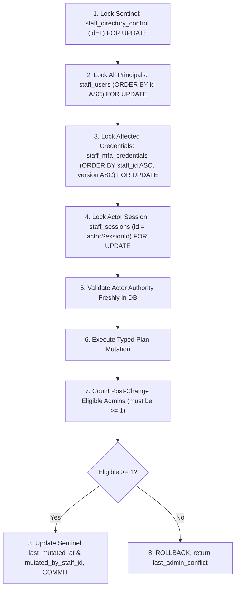

# Phase 13B Staff Directory Invariant & Transaction Guard

## 1. Overview & Architectural Boundary

The **Staff Directory Transaction Guard** (`App\Identity\Directory\DirectoryTransactionGuard`) provides a bounded, single shared transaction authority for any mutation that can impact staff directory membership, roles, status, or credentials. It enforces the invariant that the system must **always retain at least one fully eligible active administrator**.

### Architectural Invariants
- **Single Transaction Authority**: Establishes one authoritative lock hierarchy across all directory mutations. Downstream lifecycle writers (initial enrollment, password reset/change, invitation acceptance, role demotion, status changes, deactivation, MFA replacement/recovery, and offline recovery) must reuse this guard rather than inventing independent sentinel implementations.
- **Closed Typed Mutation Plans**: Rather than accepting arbitrary caller callables or exposing raw database connections, mutations are specified via typed `DirectoryMutationPlan` instances (`demoteRole`, `changeStatus`, `revokeMfa`, `invalidatePassword`, `noop`). Target IDs, locked rows, and column updates are strictly derived and whitelisted by the guard. Callers cannot commit early, roll back independently, or execute unvetted SQL.
- **Pre-Existing Outer Transaction Rejection**: The guard requires full ownership of the transaction lifecycle. If an outer transaction is already active (`transactionLevel() > 0`), the guard rejects cleanly with `DirectoryErrorCode::TRANSACTION_ACTIVE` without executing any writes and without rolling back the caller's outer transaction.
- **Fail-Closed on Missing Sentinel**: The guard requires `staff_directory_control` row `id = 1`. If the sentinel row is missing, the guard fails closed (`sentinel_missing`) and never automatically repairs or recreates state.
- **PostgreSQL Row Locks vs Gap Locks**: PostgreSQL row-level locks (`FOR UPDATE`) lock existing physical tuple rows only. They are not gap locks and do not lock key ranges or prevent raw uncooperating direct SQL inserts. Sentinel row `staff_directory_control id = 1` serializes all cooperating writers in the application boundary, ensuring no two directory mutations evaluate eligibility or mutate staff state concurrently.
- **Fresh Authority Evaluation**: The mutating actor's authority, live session, credential epoch, MFA confirmation, and step-up authentication are evaluated **after** database locks are acquired, directly against database truth.
- **Bounded Eligibility Predicate**: Eligibility requires role `admin`, status `active`, verified email, valid native Argon2id password hash structure, and confirmed unrevoked current MFA credential. Role alone never confers eligibility. Eligible directory is **not live-session dependent**: logged-out configured administrators remain eligible.
- **Atomic Rollback & Fixed Denial**: Mutations that would leave fewer than 1 eligible admin are rolled back entirely, leaving the directory unchanged, and return the fixed code `last_admin_conflict`.
- **Zero Credential / Data Leaks**: Outcome objects (`DirectoryMutationResult`) contain only safe, typed scalar properties (`success`, `errorCode`, `errorMessage`, `eligibleAdminCount`, `mutatedAt`). Arbitrary mixed data payloads are completely excluded. Error codes are canonicalized to a finite closed dictionary (`DirectoryErrorCode`); unknown codes are sanitized to `unknown_error` without echoing supplied values. Deserialization is strictly prohibited.
- **Bounded Offline Authority**: `executeAsOfflineSystem` is explicitly restricted to non-HTTP environments (CLI scripts, migrations, isolated test fixtures). When invoked in a Laravel HTTP request context, it rejects immediately with `context_forbidden`.
- **Deferred Lifecycle Paths**: The initial package is authorized for `admin.manage` directory mutations and offline maintenance. Self-service password changes, MFA rotation, invitation acceptance, and pending enrollment are explicitly deferred to future Phase 13B packages; those future paths will define typed passenger-free staff-self plans and will not route through offline bypass or require `admin.manage`.

---

## 2. Reusable API Specification

The directory authority is contained in namespace `App\Identity\Directory`:

### `DirectoryTransactionGuard`
```php
namespace App\Identity\Directory;

final class DirectoryTransactionGuard
{
    public const SENTINEL_ID = 1;
    public const STEP_UP_MAX_AGE_SECONDS = 300; // 5 minutes

    public function __construct(
        ConnectionInterface $db,
        ?RbacPolicy $rbacPolicy = null,
        ?StaffEligibilityPredicate $eligibilityPredicate = null
    );

    /**
     * Guarded directory mutation initiated by an authenticated staff member.
     */
    public function executeAsStaff(
        string $actorStaffId,
        string $actorSessionId,
        DirectoryMutationPlan $plan
    ): DirectoryMutationResult;

    /**
     * Guarded directory mutation throwing LastAdminConflictException or DirectoryGuardException on failure.
     */
    public function executeAsStaffOrThrow(
        string $actorStaffId,
        string $actorSessionId,
        DirectoryMutationPlan $plan
    ): DirectoryMutationResult;

    /**
     * Guarded directory mutation executed via trusted offline system authority.
     * Strictly restricted to non-HTTP environments (CLI / test fixtures).
     */
    public function executeAsOfflineSystem(
        DirectoryMutationPlan $plan
    ): DirectoryMutationResult;

    /**
     * Guarded offline mutation throwing on failure.
     */
    public function executeAsOfflineSystemOrThrow(
        DirectoryMutationPlan $plan
    ): DirectoryMutationResult;
}
```

### `DirectoryMutationPlan`
Closed typed value object specifying the mutation intent:
```php
namespace App\Identity\Directory;

final class DirectoryMutationPlan
{
    public const INTENT_DEMOTE_ROLE = 'demote_role';
    public const INTENT_CHANGE_STATUS = 'change_status';
    public const INTENT_REVOKE_MFA = 'revoke_mfa';
    public const INTENT_INVALIDATE_PASSWORD = 'invalidate_password';
    public const INTENT_NOOP = 'noop';

    public static function demoteRole(string $targetStaffId, string $newRole): self;
    public static function changeStatus(string $targetStaffId, string $newStatus): self;
    public static function revokeMfa(string $targetStaffId, int $mfaVersion): self;
    public static function invalidatePassword(string $targetStaffId): self;
    public static function noop(string $targetStaffId): self;

    public readonly string $intent;
    public readonly string $targetStaffId;
    public readonly ?string $newRole;
    public readonly ?string $newStatus;
    public readonly ?int $mfaVersion;
}
```

### `DirectoryErrorCode`
Finite closed enumeration of error codes:
- `LAST_ADMIN_CONFLICT = 'last_admin_conflict'`
- `SENTINEL_MISSING = 'sentinel_missing'`
- `TRANSACTION_ACTIVE = 'transaction_active'`
- `CONTEXT_FORBIDDEN = 'context_forbidden'`
- `TARGET_NOT_FOUND = 'target_not_found'`
- `ACTOR_NOT_FOUND = 'actor_not_found'`
- `ACTOR_NOT_ACTIVE = 'actor_not_active'`
- `ACTOR_UNVERIFIED = 'actor_unverified'`
- `PASSWORD_UNUSABLE = 'password_unusable'`
- `STALE_ACTOR = 'stale_actor'`
- `MFA_VERSION_MISMATCH = 'mfa_version_mismatch'`
- `SESSION_NOT_FOUND = 'session_not_found'`
- `SESSION_REVOKED = 'session_revoked'`
- `SESSION_INVALID = 'session_invalid'`
- `SESSION_MISMATCH = 'session_mismatch'`
- `SESSION_EXPIRED = 'session_expired'`
- `SESSION_IDLE_EXPIRED = 'session_idle_expired'`
- `INSUFFICIENT_PERMISSIONS = 'insufficient_permissions'`
- `MFA_UNCONFIRMED = 'mfa_unconfirmed'`
- `MFA_REVOKED = 'mfa_revoked'`
- `STEP_UP_EXPIRED = 'step_up_expired'`
- `STEP_UP_FUTURE = 'step_up_future'`
- `UNKNOWN_ERROR = 'unknown_error'`

### `DirectoryMutationResult`
Safe immutable result object:
- `bool $success`: Whether the mutation succeeded and committed.
- `?string $errorCode`: Canonical code string from `DirectoryErrorCode`.
- `?string $errorMessage`: Safe fixed human-readable explanation.
- `int $eligibleAdminCount`: Non-negative number of eligible administrators remaining post-change.
- `?CarbonImmutable $mutatedAt`: ISO-8601 mutation timestamp recorded in `staff_directory_control`.
- Implements `JsonSerializable`. Only safe properties (`success`, `error_code`, `eligible_admin_count`, `mutated_at`) are serialized.
- `__serialize()` and `__debugInfo()` exclude raw payloads and secrets.
- `__unserialize()` throws `\LogicException` to prohibit deserialization tampering.

---

## 3. Ordered Transaction Ownership & Lock Hierarchy

To prevent deadlocks and lock order inversion across concurrent transactions, all directory-affecting writers strictly acquire locks in the following sequence:



### Lock Hierarchy Rules
1. **Level 0 (Sentinel)**: `staff_directory_control WHERE id = 1 FOR UPDATE`.
   Every cooperating directory transaction blocks here first. This serializes concurrent mutations and prevents race windows during count calculation.
2. **Level 1 (Staff Users)**: `staff_users ORDER BY id ASC FOR UPDATE`.
   All staff user rows in the directory are locked in deterministic UUID ascending order. This guarantees that concurrent transactions lock principals in identical order.
3. **Level 2 (Credentials & Sessions)**:
   - `staff_mfa_credentials` ordered by `staff_id ASC, version ASC FOR UPDATE`.
   - `staff_sessions` ordered by `id ASC FOR UPDATE`.
4. **Compatibility with Core Session Stores**:
   `StaffSessionStore` locks `staff_users (id)` then `staff_sessions (id)`.
   Because `DirectoryTransactionGuard` locks `staff_directory_control` (Level 0), then `staff_users` (Level 1), then `staff_sessions` (Level 2), the lock hierarchy is strictly monotonic.
   The guard **never** calls `StaffSessionStore::read()` inside the guarded transaction, avoiding nested transaction restarts and lock inversions.

---

## 4. Fresh Actor Revalidation Under Locks

Detached DTOs or earlier middleware authorization guards must never be trusted alone. Once locks are held, the guard performs fresh re-evaluation against database truth:

| Check | Failure Code | Description |
|---|---|---|
| Active Outer Tx | `transaction_active` | Guard rejects if `$db->transactionLevel() > 0` before any writes without rollback. |
| Offline HTTP Check | `context_forbidden` | Guard rejects `executeAsOfflineSystem` if running under a Laravel HTTP request. |
| Target Existence | `target_not_found` | Target staff member specified in plan must exist in `staff_users`. |
| Session Existence | `session_not_found` | Session record must exist in `staff_sessions`. |
| Session Revocation | `session_revoked` | `revoked_at` must be `NULL`. |
| Session Auth Level | `session_invalid` | `auth_level` must be `'full'`. |
| Principal Binding | `session_mismatch` | `staff_id` must match `$actorStaffId`. |
| Session Expiry | `session_expired` / `session_idle_expired` | `$now < absolute_expires_at` and `$now < idle_expires_at`. |
| Actor Existence | `actor_not_found` | Record in `staff_users` must exist. |
| Actor Status | `actor_not_active` | `status` must be `'active'`. |
| Email Verification | `actor_unverified` | `email_verified_at` must be non-null. |
| Usable Password | `password_unusable` | `password_hash` must pass `Argon2idPasswordHasher::isValidStoredHashStructure()`. |
| Credential Epoch | `stale_actor` | Principal `credential_epoch` must exactly equal session `credential_epoch`. |
| MFA Version | `mfa_version_mismatch` | Principal `mfa_version` must equal session `mfa_version`. |
| Permission | `insufficient_permissions` | `RbacPolicy::hasPermission($staff->role, 'admin.manage')` must be `true`. |
| MFA Credential | `mfa_unconfirmed` / `mfa_revoked` | `staff_mfa_credentials` must be confirmed and not revoked. |
| Step-Up Future | `step_up_future` | `$session->mfa_verified_at` must not be in the future (`$mfaVerifiedAt <= $now`). |
| Step-Up Expiry | `step_up_expired` | Step-up age must be `< 300` seconds (`$now < $mfaVerifiedAt + 300s`). Boundary `age >= 300` is expired. |

---

## 5. Exact Administrator Eligibility Predicate

A staff user is counted as an **eligible administrator** if and only if **all seven criteria** are simultaneously satisfied:

1. **Role**: `role === 'admin'`. Roles `editor` and `viewer` do not count.
2. **Status**: `status === 'active'`. Statuses `invited`, `pending_enrollment`, `suspended`, and `deactivated` do not count.
3. **Email Verification**: `email_verified_at IS NOT NULL`.
4. **Usable Password**: `password_hash` is non-null and conforms to canonical native Argon2id structure:
   - Algorithm `v=19`, memory 1024..262144 KiB, time 1..10, threads 1..4.
   - Salt decodes to exactly 16 bytes (22 base64 characters) without non-canonical tail bits.
   - Digest decodes to exactly 32 bytes (43 base64 characters) without non-canonical tail bits.
5. **MFA Version**: `mfa_version IS NOT NULL` and `>= 1`.
6. **MFA Confirmed**: In `staff_mfa_credentials`, the row matching `(staff_id, mfa_version)` has `confirmed_at IS NOT NULL`.
7. **MFA Unrevoked**: In `staff_mfa_credentials`, the row matching `(staff_id, mfa_version)` has `revoked_at IS NULL`.

> **Note on Live Sessions**: Eligibility is property of the configured administrator principal and credentials, not active web sessions. A configured administrator with zero live sessions in `staff_sessions` remains fully eligible.

---

## 6. Integration Guide for Downstream Lifecycle Writers

Future Phase 13B packages must execute all eligibility-affecting writes via `DirectoryTransactionGuard` and typed `DirectoryMutationPlan`:

### Example: Demoting a Staff Member
```php
$plan = DirectoryMutationPlan::demoteRole($targetStaffId, 'editor');

$result = $guard->executeAsStaff(
    actorStaffId: $actorSession->staffId,
    actorSessionId: $actorSession->sessionId,
    plan: $plan
);

if (!$result->success) {
    if ($result->errorCode === DirectoryErrorCode::LAST_ADMIN_CONFLICT) {
        // Standard conflict response
    }
}
```

### Example: Offline Recovery Action
```php
$plan = DirectoryMutationPlan::changeStatus($adminId, 'active');

$result = $guard->executeAsOfflineSystem($plan);
```

### Deferred Self-Service Lifecycle Operations
Self-service operations (password change by self, MFA rotation by self, invitation acceptance, and pending enrollment) will be addressed in future Phase 13B packages:
- These will introduce typed plans for passenger-free staff-self actions.
- They will not require the `admin.manage` permission.
- They will not bypass guards via `executeAsOfflineSystem`.

---

## 7. Real Concurrency & PostgreSQL Race Evidence

The guard was verified against PostgreSQL 17 using independent operating system child processes:

1. **Two-Process Competing Demotions**:
   - Initial state: 2 active eligible administrators (Admin 1 and Admin 2).
   - Process 1 attempts to demote Admin 1 to `editor`.
   - Process 2 attempts to demote Admin 2 to `editor`.
   - Both processes race simultaneously across an exclusive OS file barrier.
   - Observed outcome:
     - Exactly **one** process succeeds (`success: true`).
     - Exactly **one** process fails with fixed code `last_admin_conflict` (`success: false`).
     - Database post-change inspection confirms **at least one eligible admin** remains active in PostgreSQL.
2. **Two-Process Competing Suspensions**:
   - Initial state: 2 active eligible administrators.
   - Process 1 attempts to suspend Admin 1 (`status: 'suspended'`).
   - Process 2 attempts to suspend Admin 2 (`status: 'suspended'`).
   - Observed outcome: exactly one succeeds; exactly one fails with `last_admin_conflict`; >=1 eligible admin preserved.
3. **Competing Password Invalidation Race**:
   - Initial state: 2 active eligible administrators.
   - Process 1 attempts to invalidate password of Admin 1 (`invalidate_password`).
   - Process 2 attempts to invalidate password of Admin 2 (`invalidate_password`).
   - Observed outcome: exactly one succeeds; exactly one fails with `last_admin_conflict`; >=1 eligible admin preserved.
4. **Competing MFA Revocation Race**:
   - Initial state: 2 active eligible administrators.
   - Process 1 attempts to revoke MFA of Admin 1 (`revoke_mfa`).
   - Process 2 attempts to revoke MFA of Admin 2 (`revoke_mfa`).
   - Observed outcome: exactly one succeeds; exactly one fails with `last_admin_conflict`; >=1 eligible admin preserved.
5. **Observed PostgreSQL Lock Wait Contention**:
   - Parent transaction acquires row lock on `staff_directory_control id=1 FOR UPDATE`.
   - Child process starts and attempts directory mutation.
   - Child is confirmed blocked in PostgreSQL runtime telemetry:
     `pg_stat_activity` where `wait_event_type = 'Lock'` and `pg_blocking_pids(child) = parent`.
6. **Freshness Re-evaluation on Lock Release**:
   - While child is blocked on the lock wait:
     - **Session Revocation Test**: Parent marks child session `revoked_at = NOW()`.
     - Parent releases the lock. Child unblocks, re-evaluates database truth, fails with `session_revoked`, and rolls back. Stale actor does not commit.
     - **Step-Up Expiry Test**: Parent advances clock across the 300s boundary (`+301s`).
     - Parent releases the lock. Child unblocks, derives fresh post-lock time, fails with `step_up_expired`, and rolls back.
     - **Epoch Invalidation Test**: Parent increments actor `credential_epoch`.
     - Parent releases the lock. Child unblocks, detects epoch mismatch, fails with `stale_actor`, and rolls back.
7. **Execution Context Classification**:
   - Competing demotions, suspensions, password invalidations, and MFA revocations in `ConcurrentDirectoryRacesTest` execute via `executeAsOfflineSystem` fixtures running in isolated OS child processes.
   - Fresh actor re-evaluations (revocation, step-up expiry, epoch change) execute via `executeAsStaff` with authentic staff session fixtures.

Codex independent bounded review (2026-10-10): final focused47 tests/200 assertions on PHP8.4.26/PostgreSQL17 passed after correcting unapproved reactivation/status transitions, fixed plan validation messages, strict process/configured/live disposable fixture/probe guards and safe CLI errors. Closed plan rejects deserialization; no arbitrary callback can execute or commit. Status intent permits active->suspended/deactivated and pending_enrollment->deactivated, with same-state no-ops; no invited/suspended/deactivated transition or reactivation authority is introduced. Frozen accepted core unchanged. Initial admin/offline-only plans remain insufficient for future authenticated-self/pending/proof credential writers; those require reviewed typed extensions before downstream integration. This bounded acceptance is not Phase13B completion or remote readiness.
